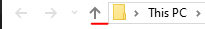

# Instrukcja do zajęć zdalnych

## Zadania

W mailu dostałeś link do testu oraz treść zadania wraz z materiałami. Pamiętaj aby czytać dokument krok po kroku i stosować się do instrukcji. Jeżeli coś jest niezrozumiałe pamiętaj, że możesz zadać pytanie.

Po wykonaniu testu przejdź do praktycznej części zajęć i wykonaj zadanie. Czytaj uważnie materiały które otrzymałeś a nie powinieneś mieć problemów z rozwązaniem zadania.

Jeżeli pojawiają się pytania i wątpliwości zawsze możesz je zadać za pomocą maila lub na slacku. Wszystko zostało opisane poniżej.

---

## Wysyłanie zadania

### Wysyłanie projektu aplikacji konsolowej

1. Zaloguj się do poczty akademii.
2. Utwórz wiadomość.
3. Jako odbiorcę wiadomości podaj adres: <pawel.woloszyn@akademiamlodychprogramistow.pl>
4. Jako temat wiadomości wstaw: *temat zajęć* - rozwiązanie.
5. Wejdź do stworzonego przez Ciebie rozwiazania zadań.
6. Zaznacz cały plik z kodem aplikacji.
7. Skopiuj.
8. Wklej do treści wiadomości.
9. Wyślij.
10. Po wysłaniu, sprawdź czy nie przyszła wiadomość z błędem, jeżeli przyszła spróbuj wykonać powyższe kroki ponownie.

### Wysyłanie projektu aplikacji okienkowej

1. Klikamy prawym przyciskiem w zakładce *Projects* na projekt:

2. Wbieramy opcje *Open Folder in Explorer*

3. Usuwamy katalogi `bin` i `obj`

4. Wchodzimy do katalogu *wyżej*:

5. Na ekranie widzimy plik `*.sln` oraz katalog z projektem:

6. Zaznaczamy wszystko
7. Klikamy prawym przyciskiem myszy: *Wyślij do*->*Folder skompresowany ZIP*
8. Stworzył się plik ze skompresowanym projektem:

9. Pozostaw otwarte okno Eksploratora Plików
10. Zaloguj się do poczty akademii.
11. Utwórz wiadomość.
12. Jako odbiorcę wiadomości podaj adres: <pawel.woloszyn@akademiamlodychprogramistow.pl>
13. Jako temat wiadomości wstaw: *temat zajęć* - rozwiązanie.
14. Wróc do okna Eksploratora Plików.
15. Wybierz skompresowany plik z projektem (to ten, który został utworzony w poprzednich krokach)
16. Przeciągnij i upuść plik na okno przeglądarki z tworzoną wiadomością
17. Wyślij.
18. Po wysłaniu, sprawdź czy nie przyszła wiadomość z błędem, jeżeli przyszła spróbuj wykonać powyższe kroki ponownie.

---

## Pytania - Email

Wszelkie pytania proszę wysyłać na maila z Akademii: <pawel.woloszyn@akademiamlodychprogramistow.pl>

W tytule wiadomości napisz, że chodzi o zajęcia zdalne a w treści opisz w czym dokładnie masz problem. Załącz w treści lub jako załącznik fragmenty kodu aplikacji (lub cały jej projekt). 

Pamiętaj na maila odpisuję raz na jakiś czas. Częściej jestem na Slacku.

## Pytania - Slack

Pytania możesz również wysyłać na kanale slack, o którym wspominałem na zajęciach. Zaproszenie do niego dostałeś na swoją pocztę Akademii. 

Link do slacka: [https://amlodychprogramistow.slack.com](https://amlodychprogramistow.slack.com)

### Zasady postępowania na slacku
1. Pamiętaj aby nie wysyłać żadnych wiadomości nie majacych związku z rozwiazaniem zadań.
2. Jeżeli chcesz zadać pytanie pisz na KANALE - zawsze odpowiedź na Twoje pytanie może przydać się innej osobie.
3. Nie będę odpowiadał na prywatne wiadomości z pytaniami - patrz punkt 2.
4. Nie pisz do innych osób na slacku.
5. Nie twórz dodatkowych kanałów i grup - każda próba tworzenia tego typu grup będzie skutowała deaktywacją konta - pozostanie Ci tylko kontakt mailowy.
6. Nie rozsyłaj spamu za pomocą kanałów na slacku.
7. Pamiętaj o stosowaniu się do [Netykiety](https://fundacja.orange.pl/blog/wpis/netykieta)