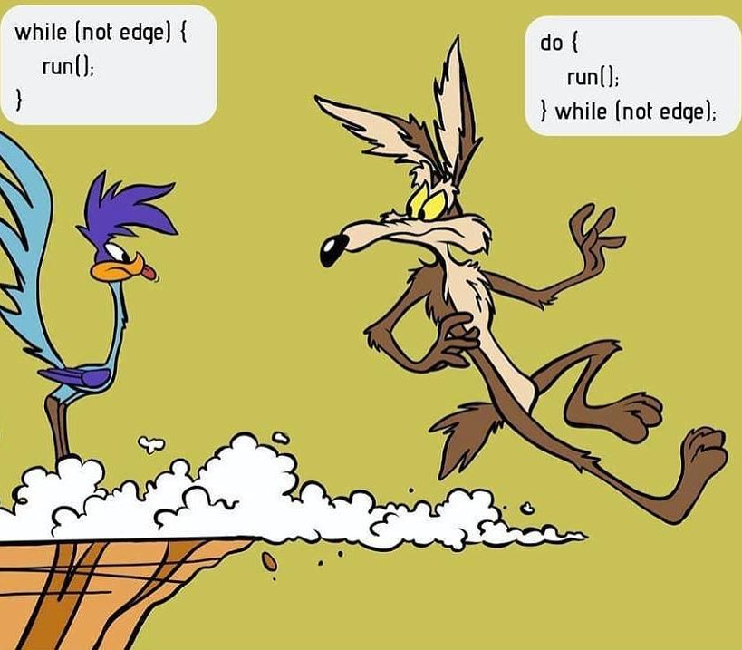

# Pętle While

## [Materiały](T15_Materiały.pdf)

## Zajęcia

Na zajęciach poznaliśmy zasadę działania pętli `while` w oparciu o [filmik](https://www.youtube.com/watch?v=Bg_gb2-01CM): 

```csharp
public static void Main(string[] args)
{
	Console.WriteLine(" Symulator podróży do zasiedmiogórogrodu!");
	int odleglosc = 100;
	while(odleglosc > 0)
	{
		int przejechane = Zapytaj(odleglosc);
		odleglosc -= przejechane;
	}
}

static int Zapytaj(int odleglosc)
{
	Console.WriteLine("------------------------------");
	Console.WriteLine("- Daleko jeszcze?");
	Console.WriteLine("- Zostało nam {0} km.", odleglosc);
	Console.WriteLine("- A ile właśnie przejechaliśmy?");
	Console.Write("Podaj przejechaną odległość:");
	int ilePrzejechano = 0;
	do
	{
		Console.Write("Podaj przejechaną odległość:");
		ilePrzejechano = int.Parse(Console.ReadLine());
	}while(ilePrzejechano > odleglosc);
	return ilePrzejechano;
}
```

Oraz pętli `do {} while`:


```csharp
public static void Main(string[] args)
{
	Console.WriteLine(" Symulator podróży do zasiedmiogórogrodu!");
	int odleglosc = 100;
	while(odleglosc > 0)
	{
		Console.WriteLine("------------------------------");
		int przejechane = Zapytaj(odleglosc);
		odleglosc -= przejechane;
	}
	Console.WriteLine("Hurra! dojechaliśmy!");
	Console.ReadKey(true);
}

static int Zapytaj(int aktualnaOdleglosc)
{
	int podanaOdleglosc = 0;
	Console.WriteLine("- Daleko jeszcze?");
	Console.WriteLine("- Zostało nam {0} km.", aktualnaOdleglosc);
	Console.WriteLine("- A ile właśnie przejechaliśmy?");
	do
	{
		Console.Write("Podaj przejechaną odległość - nie większą od tualnej:");
		podanaOdleglosc = int.Parse(Console.ReadLine());
	}
	while(aktualnaOdleglosc < podanaOdleglosc);
	return podanaOdleglosc;
}
```

Najlepiej różnicę między tymi pętlami obrazuje poniższa grafika:

