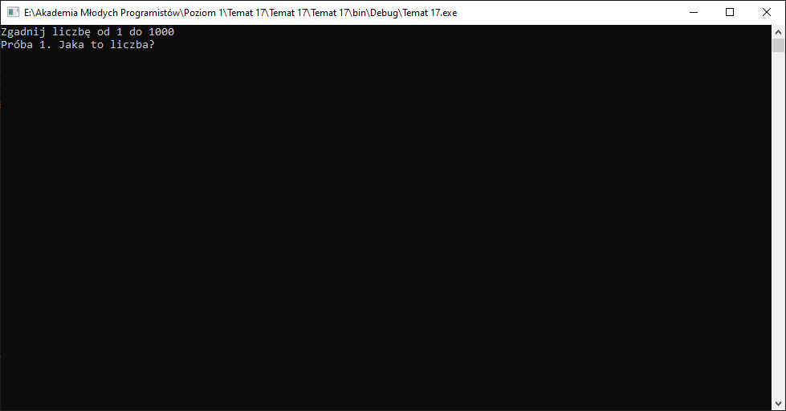
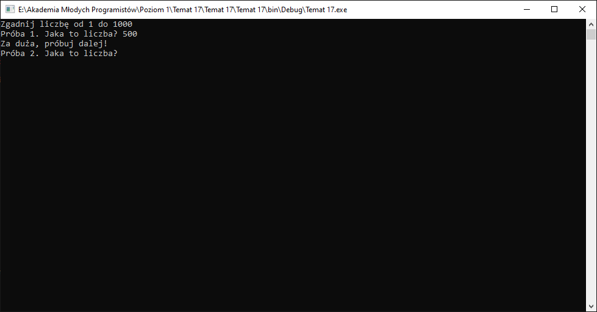
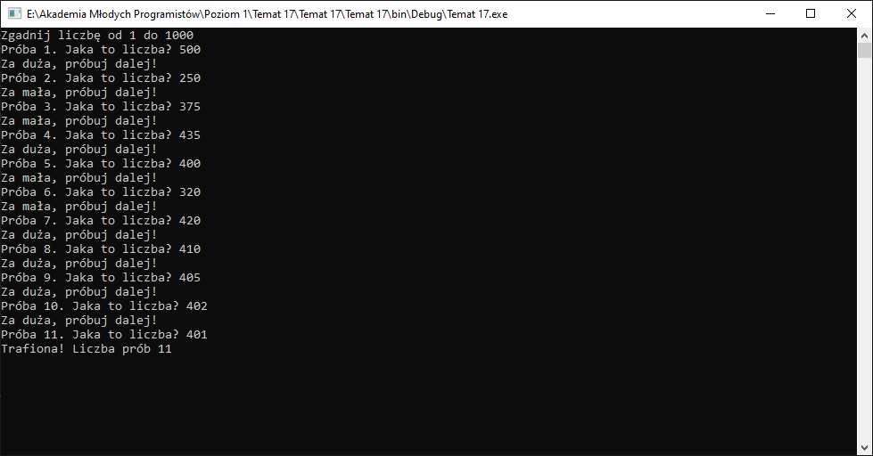

# Opis rozwiązania zadania - zgadywanie liczby.

[Przykładowe rozwiazanie](Download/T17_Rozwiazanie.zip)

## Analiza działania dostępnej wersji aplikacji

Po uruchomieniu programu użytkownik widzi poniższy ekran:



Na górze znajduje się komunikat: `Zgadnij liczbę od 1 do 1000`

A pod spodem: `Próba 1. Jaka to liczba?`

Po wpisaniu liczby pojawia się informacja o tym czy liczba jest większa od/mniejsza od/rówa wylosowanej przez komputer. Oraz kolejne pytanie z kolejnym numerem próby.



Po kolejnej próbe, znowu na ekranie widnieje komunikat o tym czy liczba wybrana przez użytkownika jest wieksza od/mniejsza od/równa wylosowanej przez komputer.

Jak łatwo można zauważyć program powtarza dwie  operacje:
1. Pytanie o liczbę
2. Wyświetlanie informacji o tym, jak ma się ona względem wylosowanej. 

Powtarzanie danego zestawu operacji to nic innego w programowaniu jak wykonywanie ich w pętli.

Po kilku powtórzeniach i odgadnięciu wylosowanej cyfry pojawia się dodatkowy komunikat:



Warto zauważyć, że pojawia się on dopiero po odgadnięciu przez użytkownika wylosowanej przez komputer liczby. Możemy w ten sposób założyć, że ta operacja odbędzie się poza pętlą.


## Kroki wykonywane przez program

1. Wyświetlenie informacji `Zgadnij liczbę od 1 do 1000`
2. Wylosowanie liczby i zapamiętanie jej.
3. W pętli, która powinna się wykonywać tak długo jak podana przez użytkownika liczba jest **INNA** niż wylosowana przez komputer (jeżeli będzie równa pętla powinna zakończyć działanie):
   1. Wyświetlanie informacji o aktualnej próbie z pytaniem: `Próba X. Jaka to liczba?`, gdzie `X` to aktualna próba
   2. Pobranie od użytkownika liczby
   3. Sprawdzenie wylosowanej względem podanej przez użytkownika. Jeśli podana przez użytkownika liczba jest:
      1. Większa - pokazujemy komunikat `Za duża, próbuj dalej!`, bez przerwania pętli.
      2. Mniejsza - pokazujemy komunikat `Za Mała, próbuj dalej!`, bez przerwania pętli.
4. Jeśli liczba jest odgadnięta przez użytkownika to kończymy program z komunikatem: `Trafiona! Liczba prób X`, gdzie `X` jest liczbą wykonanych prób.

Liczba prób - co się z nią dzieje:
1. Zwiększa się przy każdej próbie podania przez użytkownika jakiejś liczby.
2. Wyświetla się przy pytaniu o ową liczbę.
3. Wyświetla się na końcu po odgadnięciu.

Łatwo zauważyć że zmienną przechowująca aktualną liczbę prób powinna zostać zainicjalizowana (stworzona w kodzie) poza pętlą, ponieważ:
1. Stworzenie jej wewnątrz pętli z domyślną wartością nie spowoduje efektu zwiększania się liczby prób
2. Poza pętlą liczba prób jest potrzebna do wyświetlenia w ostatnim kroku programu.

## Implementacja.

Patrząc na kroki wykonywane przez program zaimplementujmy go:

1. Wyświetlenie informacji `Zgadnij liczbę od 1 do 1000`

```sharp
Console.WriteLine("Zgadnij liczbę od 1 do 1000");
```

2. Wylosowanie liczby i zapamiętanie jej.

```csharp
Random rnd = new Random();
int wylosowana = rnd.Next(1, 1001);
```

Ten krok jest ostatni przed pętlą, wypadałoby stworzyć tutaj również zmienną z liczbą prób:
```csharp
int proba = 0;
```

3. W pętli, która powinna się wykonywać tak długo jak podana przez użytkownika liczba jest **INNA** niż wylosowana przez komputer (jeżeli będzie równa pętla powinna zakończyć działanie)

Jak widać, aby móc stworzyć warunek wykonywania pętli potrzebna jest zmienna przechowująca liczbę podaną przez użytkownika:

```csharp
int liczbaUzytkownika = 0;
```

stwórzmy pustą pętlę, powinna sie ona wykonywać tak długo jak `liczbaUzytkownika` jest różna od (`!=`) `wylosowana`:
```csharp
do
{

}while(liczbaUzytkownika != wolosowana);
```

To co dzieje się wewnątrz pętli zaimplementujemy w kolejnym kroku.

4. Jeśli liczba podana przez użytkownika jest równa wylosowanej to kończymy program z komunikatem: `Trafiona! Liczba prób X`, gdzie `X` jest liczbą wykonanych prób.

```csharp
Console.WriteLine("Trafiona! Liczba prób {0}", proba);
```


## Kroki pętli:

Wróćmy do pętli. 

1. Wyświetlanie informacji o aktualnej próbie z pytaniem: `Próba X. Jaka to liczba?`, gdzie `X` to aktualna próba.

Zmienna `proba` ma wartość `0`, jak widać na pierwszym screenie (patrz wyżej) próby numeowane są od `1`. Każda pętla powinna wyświetlać kolejny numer, więc możemy jako pierwszy krok przed wyświetleniem informacji zwiększyć liczbę prób o `1`. Tym samym przy pierwszym przebiegu programu domyślnie ustawione `0` zmieni się na `1` a przy każdym kolejnym przebiegu pętli będzie to kolejno `2`, `3` itd. Tym samym:

```csarp
proba++;
```

Krok ten dotyczy jednak wyświetlania informacji na ekranie. Użytkownik podaje informacje w tej samej linijce co wyświetlane pytanie, więc **nie powinniśmy** tutaj używać funkcji z przejściem do nowej linii:

```csharp
Console.Write("Próba {0}. Jaka to liczba?", proba);
```

2. Pobranie od użytkownika liczby.

Zmienna przechowująca liczbę została stworzona przed pętlą: `liczbaUzytkownika`. Wystarczy do niej zapisać to, co użytkownik wpisał w konsoli, pamiętając o operacji parsowania:

```csharp
liczbaUzytkownika = int.Parse(Console.ReadLine());
```

3. Sprawdzenie wylosowanej względem podanej przez użytkownika. Jeśli podana przez użytkownika liczba jest:
    1. Większa - pokazujemy komunikat `Za duża, próbuj dalej!`, bez przerwania pętli.
        ```csharp
        if(liczbaUzytkownika > wylosowana)
        {
            Console.WriteLine("Za duża, próbuj dalej!");
        }
        ```
    2. Mniejsza - pokazujemy komunikat `Za Mała, próbuj dalej!`, bez przerwania pętli.
        ```csharp
        if(liczbaUzytkownika > wylosowana)
        {
            Console.WriteLine("Za mała, próbuj dalej!");
        }
        ```

Jak widać nie ma tu kroku dotyczącego sytuacji gdy `liczbaUżytkownika` jest równa `wylosowana`. Jest warunek ten zachodzi kiedy zakończy się pętla, nie musi być implementowany. 

## [GOTOWE](T17_5_kod_rozwiazania)

TEMAT MAILA: POPRAWKA - ZDALNE

Po wykonaniu zadania wyślij według [TEJ INSTRUKCJI](../ZdalneInstrukcja#wysyłanie-zadania) powstały kod na maila: [pawel.woloszyn@akademiamlodychprogramistow.pl](mailto:pawel.woloszyn@akademiamlodychprogramistow.pl)