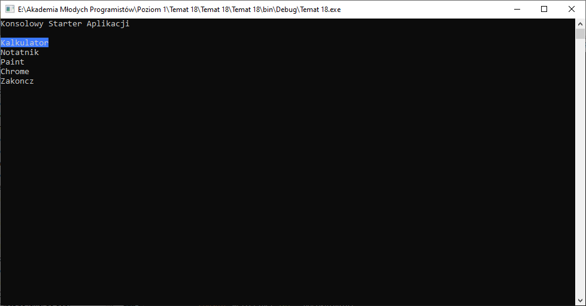

# Temat 18 - Konsolowy starter aplikacji

## TEORIA - Jak uruchamiamy inne aplikacje?

Język C# dostarcza nam narzędzia, które umożliwiają uruchomienie zewnętrnych aplikacji. Do tego calu należy użyć modułu `System.Diagnostics`, przez dodanie na początku programu, w bloku `using` niniejszy fragment:
```csharp
using System.Diagnostics;
```

W tym module można znaleźć wiele ciekawych narzędzi, jednak aby uruchomić aplikacje zewnętrze użyjemy klasy `Process` i jej metody `Start()`. Wywołanie metody wygląda następująco:

```csharp
Process.Start("program.exe");
```

Jako argument funkcji `Start()` podajemy nazwę programu w `" "`. W przypadku programu wpisanego do głównych ścieżek systemowych PATH podajemy tylko nazwę (np. `"notepad"` - dla notatnika) lub bezpośrednią ściężkę do programu (np. `"C:\jakasAplikacja.exe"`). 

Najszybszym sposobem na sprawdzenie czy aplikacja jest wpisana w ścieżki systemowe (PATH) jest wpisanie jej nazwy w konsoli (CMD).

## Zadanie 1 - Sprawmy aby nasz program uruchomił notatnik.

Tak jak zostało to wcześniej wspomniane aby uruchomić program trzeba wpisać jego nazwę lub ścieżkę.
Aby uruchomić notatnik z konsoli systemowej (CMD) należy w niej wpisać polecenie:

`notepad` lub `notepad.exe`

Utwórzmy nowy projekt projekt, wyczyść zbędne linijki kodu, a następnie:
1. Dodaj w bloku using, na samej górze:
  ```csharp
  using System.Diagnostics;
  ```
2. W funkcji `main()` przed `ReadKey` wpiszmy uruchomienie programu notatnik:
  ```csharp
  Process.Start("notepad");
  ```
3. Uruchom program. Powinien otworzyć się notatnik.

## Zadanie 2 - Napiszmy aplikację: Konsolowy Starter Aplikacji



[Przykładowa aplikacja do pobarania](Download/T18_StarterAplikacji.zip) (Należy rozpakować i uruchomić)

### Założenia:
1. Na ekranie pojawia się menu z lista programów, które chcemyuruchomić.
   + Kalkulator
   + Notatnik
   + Paint
   + Chrome
2. Ostatnia opcja w menu to Zakończ, która kończy program.
3. Sterowanie w menu jest za pomocą klawiszy `w górę` / `w dół`. 
4. Zatwierdzenie uruchomienia wybranej opcji w menu za pomocą przycisku `Enter`.
5. Wybrana w menu opcja powinna zostać wyróżniona na ekranie.
6. Po wybraniu konkretnego programu na ekranie pojawia się informacja o uruchamianym programie i zostaje on uruchomiony.
7. Stwórzmy enum, który będzie reprezentował nasze menu. Poza funkcją `main`:

### Implementacja

Stwórz nowy projekt aplikacji konsolowej. Usuń zbędne linijki kodu i komentarze.

#### Enum - Menu

Menu widoczne na ekranie składa się z kilku opcji, znów musielibyśmy zapamiętać mnóstwo liczb, które reprezntują wybrane elementy z menu. My znamy jednak już strukturę, która 
```csharp
public enum Menu
{
	Kalkulator,
	Notatnik,
	Paint,
	Chrome,
	Zakoncz
}
```

#### Infomracja o wybranej opcji w menu

Mamy reprezenację menu, powinno się ono wyświetlać tak długo aż użytkownik wybierze opcję: Zakończ. Najpierw więc musimy zapamiętać na czas działania całego programu to co wybrał użytkownik. 

Stwórzmy zatem zmienną, wewnątrz funkcji `Main`, która przechowa informację z enuma `Menu` o wybranej funkcji do uruchomienia:

```csharp
Menu funkcjaDoUruchomienia = Menu.Kalkulator;
```

Zmienna ma domyślnie wpisaną wartość `Kalkulator`, jest to pierwsza opcja w menu, która jest wybrana domyślnie. 

#### Pętla główna programu

Program powinien pozwolić na uruchomienie programu i czekać na wybranie kolejnej opcji w menu, aż do wybrania zakończ. Stwórzmy zatem taką pętlę:

```csharp
do
{

}while(funkcjaDoUruchomienia != Menu.Zakoncz);
```

Pętla będzie się tak długo wykonywać jak zmienna `funkcjaDoUruchomienia` będzie miała wartość inną niż `Zakończ`. Zatem jeśli użytkownik wybierze jakiś program do uruchomienia to:
1. Powinniśmy go zapisać do naszej zmiennej.
2. Uruchomić odpowiedni program.

W ten sposób powstała lista kroków, która zostanie wykonana w pętli.

#### Wyświetlanie menu z wyborem programu

Pierwszy krok na liście powyżej to zapisanie do zmiennej wybranej z menu funkcji do uruchomienia. W tym celu stworzymy funkcję, która wyświetli nam menu i zwróci informację o tym co powinno być uruchominone, która opcja z enuma `Menu` została wybrana. 
Musimy do programu głównego zwrócić wybrany element z enuma `Menu`, więc funkcja musi zwracać ten typ danych. Oprócz tego powinna ona również wyróżnić odpowiednio aktualnie wybraną opcję, zatem jej definicja będzie następująca:

```csharp
static Menu WyswietlMenu(Menu wybranaFunkcja)
{

}
```

Funkcja jako parametr przyjmuje typ danych `Menu` w celu oznaczenia odpowiednio wybranej w menu opcji, a także ustalenia opcji do oznaczenia jako kolejna (zależnie od wciśniętych strzałek).

Menu powinno wyświetlać się tak długo i zmieniać zaznaczenia aż użytkownik wciśnie Enter, czym zatwierdzi swój wybór.

Znów można dostrzec, że coś się będzie działo tak długo jak, zatem przychodzi nam na myśl pętla, tym razem `do-while`. Jednak zanim to zrobimy, powinniśmy stworzyć zmienną, którą użyjemy do przerwania wspomnianej pętli. W tym przypadku będzie to zmienna, która przechowa informację o wciśniętym klawiszu, która ma typ danych `ConsoleKeyInfo`, stwórzmy ją wewnątrz funkcji `WyswietlMenu`:

```csharp
ConsoleKeyInfo klawisz = new ConsoleKeyInfo();
```

Nowa zmienna, `klawisz`, ma swoje właściwości i można z niej odczytać informację o wciśniętym klawiszu w postaci enuma, który jest dostepny w naszym języku programowania (`ConsoleKey`). Wykorzystując to możemy stworzyć pętle, która będzie wyświetlała menu tak długo aż użytkownik wciśnie `Enter`:

```csharp
do{

}while(klawisz.Key != ConsoleKey.Enter);
```

obecny wygląd funkcji `WyswietlMenu`:

```csharp
static Menu WyswietlMenu(Menu wybranaFunkcja)
{
	ConsoleKeyInfo klawisz = new ConsoleKeyInfo();
	do{
		
	}while(klawisz.Key != ConsoleKey.Enter);
}
```

Jak zauważyłeś w przykładowym programie możemy wciskać klawisze w górę i dół, a menu zawsze wyświetla się w tym samym miejscu. W tym celu, wewnątrz pętli, będziemy najpierw czyścic ekran:

```csharp
Console.Clear();
```

Nastepnie wyświetlimy napis `Konsolowy starter aplikacji`:

```csharp
Cosnole.WriteLine("Konsolowy starter aplikacji");
```

Poniżej powinny znaleźć sie kolejne opcje z naszego menu. W tym jedna z opcji, aktualnie wybrana, powinna zostać wyróżniona innym kolorem tła. 

W tym celu stworzymy funkcję `PokazOpcjeMenu`, która posłuży do wyświetlenia pojedynczej opcji i jeśli aktualnie wybrana opcja to opcja do wyświetlenia to wyróżni ją odpowiednim kolorem tła. Obecnie jednak Wywołamy ją tylko (będzie znaznaczała się na czerwono - jako błedna, jej implementacje stworzymy na dalszych etapach).

Wywołajmy funkcję `PokazOpcjeMenu` dla każdej opcji dostępnej w menu w kolejności podanej wcześniej i przekażmy jej dodatkowo informację o aktualnie wybranej opcji:

```csharp
PokazOpcjeMenu(Menu.Kalkulator, wybranaFunkcja);
PokazOpcjeMenu(Menu.Notatnik, wybranaFunkcja);
PokazOpcjeMenu(Menu.Paint, wybranaFunkcja);
PokazOpcjeMenu(Menu.Chrome, wybranaFunkcja);
PokazOpcjeMenu(Menu.Zakoncz, wybranaFunkcja);
```

Kolejnym krokiem działania naszego menu to oczekiwanie na wciśniecie klawisza przez użytkownika, musimy go zapamiętać do wcześniej stworzonej zmiennej `klawisz`. 

```csharp
klawisz = Console.ReadKey(true);
```

Mamy już informację o tym co wcisnął użytkownik pora zareagować na to jeśli użytkownik wciśnie którąś ze strzałek. Tak jak podczas warunku wykonywania pętli while używaliśmy enum `ConsoleKey` tak tutaj również to wykorzystamy. 

Jeżeli uzytkownik wciśnie klawisz strzałki w dół `ConsoleKey.DownArrow` powinniśmy zwiększyść o 1 wartość wybranej funkcji, dzięki temu z wybranej opcji `Kalulator` zmieni się ona na kolejną w enumie, czyli `Notatnik`, dodawanie ma się wykonywać tylko wtedy kiedy wartość wybranej funkcji jest inna niż `Zakończ` wtedy jeśli użytkownik wciśnie klawisz w dół nie powinno się nic zadziać. Zatem zapiszmy to za pomocą IF'a: 

```csharp
if(klawisz.Key == ConsoleKey.DownArrow && wybranyProgra!= Menu.Zakoncz)
{
    wybranaFunkcja++;
}
```

W przypadku wciskania klawisza strzałki w górę `ConsoleKey.UpArrow` powinniśmy poruszać się po enumie w kierunku niższych wartości, więc będziemy pomniejszać wartość zaznaczonego elementu o 1 aż do momentu gdy użytkownik dojdzie do opcji `Kalkulator`, która jest pierwszą opcją w menu. Zatem warunek będzie wyglądał bardzo podobnie:

```csharp
if(klawisz.Key == ConsoleKey.UpArrow && wybranyProgra!= Menu.Kalkulator)
{
    wybranaFunkcja--;
}
```

Nasza funkcja `WyswietlMenu` powinna zwrócić do programu wybrany program do uruchomienia. Zatem poza pętlą musimy wywołać słwo kluczowe `return` z odpowiednią zmienną `wybranaFunkcja` - to ją modyfikujemy w pętli. Zapiszmy na końcu funkcji:

```csharp
return wybranyProgram;
```

Cała funkcja powinna wyglądać w poniższy sposób:

```csharp
static Menu WyswietlMenu(Menu wybranaFunkcja)
{
	ConsoleKeyInfo klawisz = new ConsoleKeyInfo();
	do{
		Console.Clear();
		Console.WriteLine("Konsolowy Starter Aplikacji\n");
		
		PokazOpcjeMenu(Menu.Kalkulator, wybranaFunkcja);
		PokazOpcjeMenu(Menu.Notatnik, wybranaFunkcja);
		PokazOpcjeMenu(Menu.Paint, wybranaFunkcja);
		PokazOpcjeMenu(Menu.Chrome, wybranaFunkcja);
		PokazOpcjeMenu(Menu.Zakoncz, wybranaFunkcja);
		
		klawisz = Console.ReadKey(true);
		if(klawisz.Key == ConsoleKey.DownArrow && wybranyProgra!= Menu.Zakoncz)
		{
			wybranaFunkcja++;
		}
		
		if(klawisz.Key == ConsoleKey.UpArrow && wybranyProgram !Menu.Kalkulator)
		{
			wybranaFunkcja--;
		}
		
	}while(klawisz.Key != ConsoleKey.Enter);
	return wybranyProgram;
}
```

#### Wyświetlanie pojedynczej opcji z menu

Nasz program na chwile obecną posiada błedy. Brakuje w nim funkcji `PokazOpcjeMenu`. 

Funkcja przyjmuje dwa parametry i nie jest przypisana do żadnej zmiennej, więc jej typem będzie `void`. Natomiast parametry są typu Menu. Pierwszy z nich to opcja, która powinna się wyświetlić (`wyswietlana`) druga to opcja która jest zapamiętana jako akutalnie wybrana (`wybrana`), obie mają ten sam typ danych `Menu` (jest to nasz enum).

Zatem jej definicja powinna wygladać następująco, stórz ją pod funkcją `WyswietlMenu`:

```csharp
static void PokazOpcjeMenu(Menu wyswietlana, Menu wybrana)
{

}
```

Funkcja powinna zadziałać tak, że jeżeli wybrana i wyświetlana to te same elementy enum'a to powinien się zmienić kolor tła na `Blue`. Zatem sprawdźmy to za pomocą instrukcji warunkowej i ustawmy kolor tła:

```csharp
if(wybrana == wyswietlana)
{
	Console.BackgroundColor = ConsoleColor.Blue;
}
```

Następnie chcemy wyświetlić konkretną opcję, więc pod IF'em zapisujemy:

```csharp
Console.WriteLine("{0}", wyswietlana);
```

Po wykonaniu powyższych operacji kolor tła będzie niebieski, to może powodować problemy w dalszym wyświeltaniu pozostałych elementów. Ustawmy kolor tła na czarny:

```csharp
Console.BackgroundColor = ConsoleColor.Black;
```

#### Uruchomienie funkcji wyświetl menu
Wróć do funkcji main, gdzie znajduje się nasza główna pętla programu. Wewnątrz pętli wywołaj funkcję `WyswietlMenu` a jej wynik zapisz do zmiennej `funkcjaDoUruchomienia`:

```csharp
funkcjaDoUruchomienia = WyswietlMenu(funkcjaDoUruchomienia);
```

Po tej operacji po uruchomieniu programu powinieneś umieć poruszać się po menu, po wciśnięciu enter na wybranej opcji `Zakończ` program powinien zakończyć działanie.

#### Uruchamianie aplikacji

Przejdźmy do ostatniego etapu implementacji. W tym celu będzie potrzebna funkcja `UruchomProgram`, która powinna zostać wywołana wewnątrz funkcji `Main` w pętli po wywołaniu funkcji `WyswietlMenu` w następujący sposób:

```csharp
UruchomProgram(funkcjaDoUruchomienia);
```

Funckja main powinna prezentowac się w poniższy sposób:

```csharp
public static void Main(string[] args)
{			
	Menu funkcjaDoUruchomienia = Menu.Kalkulator;
	do
	{
		funkcjaDoUruchomienia = WyswietlMenu(funkcjaDoUruchomienia);
		UruchomProgram(funkcjaDoUruchomienia);
	}while(funkcjaDoUruchomienia != Menu.Zakoncz);
}		
```

Funkcja `UruchomProgram` powinna być oznaczona na czerwono, ponieważ jeszcze jej nie zaimplementowaliśmy. 

#### Funkcja UruchomProgram

Funkcję możesz pisać pod funkcją Main. 

Funkcja nie jest przypisana do żadnej zmiennej, wiec będzie miała typ `void`. Przyjmuje parametr typu `Menu`, który posiada informację o aktualnie wybranym programie do uruchomienia. Zatem definicja funkcji jest następująca:

```csharp
static void UruchomProgram(Menu programDoUruchomienia)
{

}
```

W celu uruchomienia programu musimy mieć jego nazwę. Możemy ją ustalić na podstawie parametru: `programDoUruchomienia`. Jest to enum, który należy `przemapować` na konkretną nazwe programu. Zrobimy to osbą funkcją, która zwróci nam nazwę programu do uruchomienia, zapisaną w formie zmiennej typu `string` ponieważ taki typ danych jest potrzebny do uruchomienia procesu wybranej aplikacji:

```csharp
string program = NazwaProgramu(programDoUruchomienia);
```
Zakładamy, że nasza funkcja `NazwaProgramu` zwróci pusty tekst jeżeli użytkownik wybierze np. `Zakoncz` lub inną nieznaną wartość.

Zatem możemy sprawdzić czy zmienna `program` jest inna niż `""` (pusty ciąg znaków):

```csharp
if(program != "")
{

}
```
Jeżeli powyższy warunek zostanie spełniony mamy pewność, że powiniśmy coś uruchomić. Wyświetlmy informacje o tym przez chwilkę na ekranie i uruchommy nasz porogram. Wewanątrz IF'a:

```csharp
Console.WriteLine("Uruchamiam aplikację: {0}", program);
Thread.Sleep(750);
Process.Start(program);
```

W ten sposób stworzyliśmy funkcję `UruchomProgram`, która powinna wyglądać w poniższy sposób

```csharp
static void UruchomProgram(Menu programDoUruchomienia)
{
	string program = NazwaProgramu(programDoUruchomienia);
	Console.WriteLine("Uruchamiam aplikację: {0}", program);
	if(program != "")
	{
        Console.WriteLine("Uruchamiam aplikację: {0}", program);
		Thread.Sleep(750);
		Process.Start(program);
	}
}
```

#### Ustalmy nazwę programów do uruchomienia - funkcja NazwaProgramu

W naszym kodzie jest jeszcze jeden brak. Jest to funkcja `NazwaProgramu`. Przyjmuje ona jako parametr wartość typu `Menu` oraz zwraca tekst z nazwą programu lub jego ścieżką do uruchomienia. 

Stwórzmy jej definicje następująco:

```csharp
static string NazwaProgramu(Menu programDoUruchomienia)
{
}
```

Funkcja powinna sprawdzić która opcja z Menu jest wybrana i zwrócić dla nich odpowiednie nazwy. W celu uruchomienia poszczególnych opcji potrzebne są takie nazwy programów, które znajdziesz poniżej:

|Opcja|Nazwa Programu|
|-|-|
|Kaluklator | calc |
|Notatnik | notepad |
|Paint | mspaint |
|Chrome | "chrome" |

Wystarczy odpowiednio sprawdzić jaki mamy program do uruchomienia zadany w parametrze i za pomocą instrukcji `switch-case` odpowiednio zwrócić do prorgamu jego nazwę według tabeli.

Domyślnie zwracamy pusty ciągn znaków `""` i nie obsługujemy `Menu.Zakoncz` ponieważ powinno ono zwrócić równie `""` co się zadzieje jeśli stworzymy switch'a w poniższy sposób:

```csharp
switch(programDoUruchomienia)
{
	case Menu.Kalkulator:
		return "calc";					
	case Menu.Notatnik:
		return "notepad";
	case Menu.Paint:
		return "mspaint";
	case Menu.Chrome:
		return "chrome";
	default:
		return "";
}
```
W ten sposób stworzyliśmy do końca funkcję `NazwaProgramu`, która powinna prezentować się następująco:

```csharp
static string NazwaProgramu(Menu programDoUruchomienia)
{
	switch(programDoUruchomienia)
	{
		case Menu.Kalkulator:
			return "calc";					
		case Menu.Notatnik:
			return "notepad";
		case Menu.Paint:
			return "mspaint";
		case Menu.Chrome:
			return "chrome";
		default:
			return "";
	}
}
```

Po uruchomieniu programy powinny się uruchamiać. 

## Wyślij program

Po implementacji wyślij rozwiazania programów według instrukcji, którą znajdziesz [tutaj](../ZdalneInstrukcja#wysyłanie-zadania). 

Adres do wysyłki: [pawel.woloszyn@akademiamlodychprogramistow.pl](mailto:pawel.woloszyn@akademiamlodychprogramistow.pl)

Temat maila: `Starter Aplikacji`