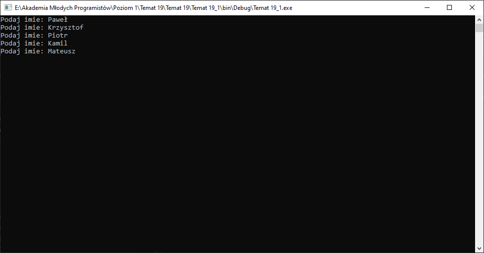
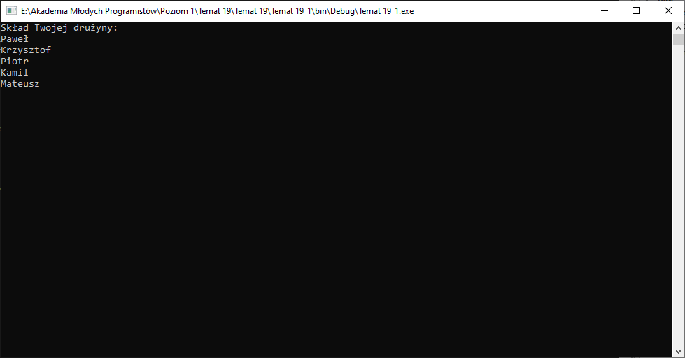
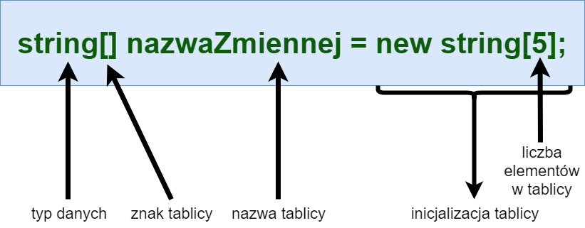
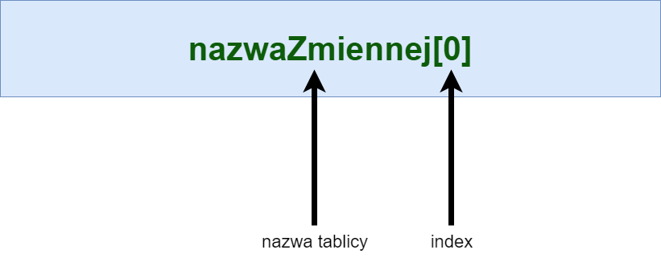

# Temat 19 - Tablice - Drużyna

## [Materiały](T19_Materiały.pdf)

### Zadanie 1

Napisz program, który odczyta od użytkownika 5 imion drużyny marzeń i zapisze te imiona do zmiennych:



A nastepnie wyczyści ekran i wyświetli imiona jedno pod drugim:



## Tablice - mnóstwo danych w jednej zmiennej

W zadaniu, które wykonaliście każde imie było przechowywane w innej zmiennej. Jego implementacja mogła wyglądać na przykład tak:

```csharp
public static void Main(string[] args)
{
	string imie1 = PodajImie();
	string imie2 = PodajImie();
	string imie3 = PodajImie();
	string imie4 = PodajImie();
	string imie5 = PodajImie();
	Console.Clear();
	Console.WriteLine("Skład Twojej drużyny:\n{0}\n{1}\n{2}\n{3}\n{4}", imie1, imie2, imie3, imie4, imie5);
	Console.ReadKey(true);
}

static string PodajImie()
{
	Console.Write("Podaj imie: ");
	return Console.ReadLine();
}
```

Utrzymanie takiej ilości zmiennych jest trudne, wyboraźmy sobie implmenetacje w ten sposób wyświetlania listy osób, które lubią profil Marka Zuckerberga (właściciel Facebooka). Na dzień 29.03.2020 jest ich  116 469 236.

Jak już pewnie zauważyliście skład wszej drużyny to zmienne o tym samym typie danych, a ich przeznaczenie jest bardzo podobne (każda z nich przechowuje imie członka drużyny). Jeżeli kilka zmiennych posiada takie cechy to możemy zapisać je w formie tablicy.

Stworzenie nowej zmiennej tablicowej wygląda następująco:


przykład:
```csharp
string[] druzyna = new string[5];
```

Tak jak zwykła zmienna na przykład:
```csharp
string imie = "Paweł"
```
przechowuje tylko jedno imie i wyobrażaliśmy sobie ją jako pudełko, w którym możemy schować kartkę z imieniem, tak nasza przykładowa zmienna tablicowa o nazwie `druzyna` jest pudełkiem, które może przechować kilka karteczek z imionami. Ich liczbę definiujemy przy tworzeniu tej zmiennej. 

Aby z zmiennej tablicowej uzyskać dostęp do pojedynczego elementu, czyli do pojedynczej karteczki w pudełku, używamy indexów:



Wracając do zmiennej `druzyna`, bedzie to:
```csharp
druzyna[0]
```
W powyższy sposób uzyskujemy dostęp do PIERWSZEGO elementu tablicy, ponieważ każda tablica o rozmiarze N posiada indexy od 0 do N-1. 

Nasza tablica `druzyna` ma rozmiar 5, więc indeksy w naszej tablicy posiadają numery od 0 do 4. 

Możemy zatem przypisać jakieś wartości do poszczególnych elementów na przykad w poniższy sposób:

```csharp
druzyna[0] = PodajImie();
druzyna[1] = PodajImie();
druzyna[2] = PodajImie();
druzyna[3] = PodajImie();
druzyna[4] = PodajImie();
```

A nawet je wyświetlić:

```csharp
Console.WriteLine(druzyna[0]);
Console.WriteLine(druzyna[1]);
Console.WriteLine(druzyna[2]);
Console.WriteLine(druzyna[3]);
Console.WriteLine(druzyna[4]);
```

### Zadanie 2

Napiszcie kolejny projekt aplikacji i na podstawie powyższych przykładów stwórzcie pierwszy program, który w tablicy zapisze skład Twojej drużyny marzeń, a następnie wyczyści ekran i wyświetli wszystkie imiona jedno pod drugim.

## Pętle FOR i tablice

Jak pewnie zauważyłeś kolejne indeksy do elementów tablicy to kolejne liczby. Dodatkowo należy mieć na uwadze, że cyfra wstawiana w `[]` jest zwykłą liczbą typu `int`, zatem zapis:
```csharp
ruzyna[0] = PodajImie();
druzyna[1] = PodajImie();
druzyna[2] = PodajImie();
druzyna[3] = PodajImie();
druzyna[4] = PodajImie();
```

może wyglądać w poniższy sposób:

```csharp
int i = 0;
druzyna[i] = PobierzImie();
i += 1;
druzyna[i] = PobierzImie();
i += 1;
druzyna[i] = PobierzImie();
i += 1;
druzyna[i] = PobierzImie();
i += 1;
druzyna[i] = PobierzImie();
```

Na jednych z poprzednich zajęć generowaliśmy kolejne liczby za pomocą pętli FOR. Tego typu pętle można wykorzystać, aby poruszać się po tablicy element po elemencie i wykonywać na nich jakieś operacje, ponieważ wykonają one dokładnie to samo co kod powyżej tylko w krótszej i bardziej czytelnej wersji.

Należy jednak pamiętać, że trzeba podać pętli informację o tym kiedy może się dalej wykonywać. W przypadku naszej 5cio elementowej tablicy o nazwie `drużyna` powinna ona się wykonywać tak długo jak `i` jest mniejsze od `5`, ale lepiej i praktyczniej jest wykorzystać właściwość `.Length` tablicy, która zwróci rozmiar tablicy - jeśli zmodyfikujemy jej rozmiar na początku programu to pętla od razu zacznie obsługiwać oczekiwaną liczbę elementów. Aby uzyskać rozmiar tablicy zapisanej w zmiennej `druzyna` należy wykonać poniższy kod:

```csharp
druzyna.Length
```

Właściwość `Length` zwróci nam wartość `5`, tablica posiada indeksy od 0 do 4, zatem pętla, która zastąpi kod pobierający imiona będzie wyglądała następująco:

```csharp
for(int i = 0; i < druzyna.Length; i++)
{
  druzyna[i] = PobierzImie();
}
```

jak łatwo zauważyć można po powyższej pętli zapisać drugą identyczną pętlę, która wyświetli te dane:

```csharp
for(int i = 0; i < druzyna.Length; i++)
{
  Console.WriteLine(druzyna[i]);
}
```

### Zadanie 3

Zmodyfikujcie wasze programy tak, aby używały one pętli do pobierania i wyświetlania danych na podstawie informacji zawartych powyżej.


