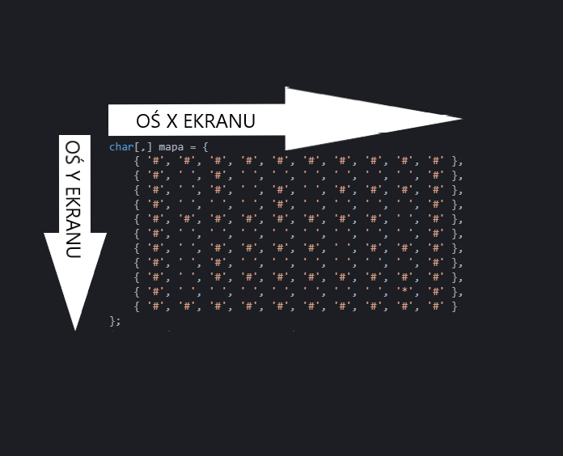

# Labirynt w konsoli - część 1

Na najbliższych zajęciach stworzymy aplikację, która pozwoli na granie w labirynt w konsoli.

## Tablica dwuwymiarowa jako mapa

Konsola pozwala nam na wyświetlanie znaków i wyświetlamy je w dwóch wymiarach (szerokość i wysokość okna konsoli). Na ostatnich zajęciach poznaliśmy również tablicę dwuwymiarową, która może posłużyć jako reprezentacja labiryntu jaki wyświetlimy w konsoli. Należy jednak poczynić pewne założenia. Mapa będzie zbudowana z 3 rodzajów znaków:

1. `' '` - znak spacji - miejsce po którym może poruszać się gracz.
2. `#` - ściana, gracz nie może na nią wejść.
3. `*` - wyjście z labirytnu - tylko jedno na całej planszy, użytkownik może wejść w to miejsce czym kończy rozgrywkę.

Nasza mapa będzie zatem składała się z dwuwymiarowej tablicy pojedynczych znaków - typ danych jaki zastosujemy to `char`. Załóżmy, że rozmiar naszej planszy do gry to 10 x 10 znaków, zatem tablica będzie miała właśnie takie wymiary. Taką tablicę możemy zdefiniować w bardzo szybki sposób (nazywa się go `inline` - w linijce):

```csharp
char[,] mapa = {
    { '#', '#', '#', '#', '#', '#', '#', '#', '#', '#' },
    { '#', ' ', ' ', ' ', ' ', ' ', ' ', ' ', ' ', '#' },
    { '#', ' ', ' ', ' ', ' ', ' ', ' ', ' ', ' ', '#' },
    { '#', ' ', ' ', ' ', ' ', ' ', ' ', ' ', ' ', '#' },
    { '#', ' ', ' ', ' ', ' ', ' ', ' ', ' ', ' ', '#' },
    { '#', ' ', ' ', ' ', ' ', ' ', ' ', ' ', ' ', '#' },
    { '#', ' ', ' ', ' ', ' ', ' ', ' ', ' ', ' ', '#' },
    { '#', ' ', ' ', ' ', ' ', ' ', ' ', ' ', ' ', '#' },
    { '#', ' ', ' ', ' ', ' ', ' ', ' ', ' ', '*', '#' },
    { '#', '#', '#', '#', '#', '#', '#', '#', '#', '#' },
}
```

Spójrz na klamry w powyższym przykładzie. Mamy klamrę główną w któej znajdzue się 10 zestawów klamer `{}` wewnątrz któych mamy po 10 znaków oddzielonych przecinkiem. W ten sposób zdefiniowaliśmy tablicę o rozmiarze 10x10znaków. Lewy górny róg tej tablicy to indeks `0, 0` natomiast prawy dolny to indeks `9, 9`. Jeśli dobrze się przyjrzałeś to w 9 wierszu i na pozycji 9 tego wiersza znajduje się znak `*`, który dla nas jest znakiem wyjścia z labiryntu.

Poczyńmy jeszcze jedno założenie: gracz zaczyna na indeksie 1, 1 naszej tablicy, czyli na pierwszym polu w lewym górnym rogu, który ma pusty znak. (Ściana w lewym górnym rogu jest na indeksie `0, 0`)

### Zadanie 1

Stwórz projekt aplikacji konsolowej. I dodaj jako pierwszy element programu powyżej podaną tablice. Następnie zamiast spacji dodaj ściany, ale zrób tak, aby dało się dojść do wyjścia.

## Kiedy kończy się gra?

Założyliśmy, że gracz zaczyna w pozycji 1, 1. Powinniśmy tą informację zapamiętać. Stwórzmy dwie zmienne:

```csharp
int pozycjaGraczaX = 1;
int pozycjaGraczaY = 1;
```

Oprócz tego powinniśmy mieć informację o końcu naszej rozgrywki:

```csharp
bool koniec = false;
```

Zakładamy na początku, że rozgrywka nie została zakończona stąd `false` w naszej nowej zmiennej. Nasza gra zakończy się kiedy użytkownik dotrze do pola oznaczonego symbolem wyjścia z labiryntu (`*`)

### Zadanie 2

Pod tablicą z Zadania 1 dodaj zmienne reprezentujące pozycje gracza oraz stan naszej gry

## Główna pętla gry

Każda gra może być uznana jako seria obrazów (jak film), która zmienia się pod wpływem decyzji gracza. Zatem chcąc wprowadzić naszą rozgrywkę w ruch powinniśmy sprawić że nasz ekran będzie się cały czas odświeżał, aplikacja będzie oczekiwała na reakcję użytkownia, zmieniała stan i pkazywał go na nowo. Dziać się to powinno wewnątrz pętli, która będzie działała tak długo aż gra nie jest skończona. Posiadamy już zmienną, która informuje nas o tym czy gra jest skończona (`koniec`). Zatem dopóki wartość `koniec` jest `false` powinna dziłać nasza gra.

Aby sprawdzić czy zmienna bool ma false możemy to zrobić na dwa sposoby:

```csharp
koniec == false
```

lub

```csharp
!koniec
```

Symbol `!` przed nazwą zmiennej zmienia nam jej wartość na przeciwną (działa tylko dla `bool`). Zatem jeśli `koniec` będzie miał wartość `false` postawienie `!` przed nazwą tej zmiennej spowoduje, że otrzymamy `true` (wartość przeciwną do false). Zatem możemy stworzyć taką petlę `while`:

```csharp
while(!koniec)
{

}
```

Koniec gry jest wtedy kiedy użytkownik wejdzie na pole oznaczone odpowiednim symbolem wyjścia. Wtedy zmienimy wartość naszej zmiennej `koniec` i przerwie się pętla.

### Zadanie 3

Dodaj pod zmiennymi pętlę, która będzie wykonywała się tak długo jak zmienna `koniec` będzie miała wartość `false`. Skorzystaj z omówienia powyżej.

## Rysowanie

Mamy już główną pętlę gry i kilka zmiennych. Nasz kod wygląda mniej więcej następująco (u Ciebie może być nieco inna mapa):

```csharp
public static void Main(string[] args)
{
    char[,] mapa = {
        { '#', '#', '#', '#', '#', '#', '#', '#', '#', '#' },
        { '#', ' ', '#', ' ', ' ', ' ', ' ', ' ', ' ', '#' },
        { '#', ' ', '#', ' ', '#', ' ', '#', '#', '#', '#' },
        { '#', ' ', ' ', ' ', '#', ' ', ' ', ' ', ' ', '#' },
        { '#', '#', '#', '#', '#', '#', '#', '#', ' ', '#' },
        { '#', ' ', ' ', ' ', ' ', ' ', ' ', ' ', ' ', '#' },
        { '#', ' ', '#', '#', '#', '#', ' ', '#', '#', '#' },
        { '#', ' ', '#', ' ', ' ', ' ', ' ', ' ', ' ', '#' },
        { '#', ' ', '#', '#', '#', '#', '#', '#', '#', '#' },
        { '#', ' ', ' ', ' ', ' ', ' ', ' ', ' ', '*', '#' },
        { '#', '#', '#', '#', '#', '#', '#', '#', '#', '#' }
    };
    int pozycjaGraczaX = 1, pozycjaGraczaY = 1;
    bool koniec = false;
    while(!koniec)
    {

    }
}
```

Teraz przejdziemy do najważniejszej rzeczy, czyli rysowania. Aby nasz kod był w miare czytelny stworzymy w tym celu funkcję o nazwie `Rysuj`. Funkcja będzie rysowała w konsoli naszą mapę oraz gracza i nie będzie nic zwracała. Aby narysować gracza musmy założyć jakiś symbol, który go będzie reprezentował. Nie będzie to symbol `@` - zapamiętaj go na kolejne etapy.

Żeby narysować gracza potrzebujemy jego pozycję, taką informację już mamy w zmiennych: `pozycjaGraczaX` i `pozycjaGraczaY`. Oprócz gracza rysujemy również mapę, która znajduje się w zmiennej tablicowej `mapa`. Funkcja powinna przymować w postaci parametrów właśnie te 3 informacje. Zatem jej definicja będzie wyglądała w następujący sposób:

```csharp
static void Rysuj(char[,] mapa, int XGracza, int YGracza)
{

}
```

Możemy również od razu wywołać naszą funkcję ponieważ wiemy jakie dane jej przekazać, zrobimy to w niniejszy sposób wewnątrz głównej pętli gry (w pętli `while` w `Main`):

```csharp
Rysuj(mapa, pozycjaGraczaX, pozycjaGraczaY);
```

Chcemy aby rysowanie zawsze rozpoczynało się na początku naszego ekranu, czyli w pozycji `0,0`. Nie wiemy gdzie będzie nasz kursor po każdym ruchu gracza, ale wiemy jak ustawić kursor konsoli na taką opzycję jakiej oczekujemy. W funkcji `Rysuj` dodajmy zatem powrót do punktu `0,0`:

```csharp
static void Rysuj(char[,] mapa, int XGracza, int YGracza)
{
    Console.SetCursorPosition(0, 0);
}
```

Teraz możemy zacząć rysować naszą planszę oraz gracza. Jako że logika rysowania gracza i mapy nieco będą się różniły, podzelimy je na osobne funkcje, które zrealizujemy w ramach kolejnych punktów.

### Zadanie 4

Stwórz funkcję typu `void` o nazwie `Rysuj` z parametrami `char[,] mapa, int XGracza, int YGracza`. Ustaw kursor w pozycji `0,0` wewnątrz funkcji a następnie wywołaj funkcję z parametrami: `mapa, pozycjaGraczaX, pozycjaGraczaY` wewnątrz pętli while w funkcji `Main`

## Rysowanie mapy

Tak jak zostało wspomniane w poprzednim punkcie. Chcemy podzielić naszą funkcjonalność na dwie osobne funkcje w tym punkcie stworzymy samo wyświetlanie mapy - chcemy wyświetlić na mapie gracza wiec jako pierwsza warstwa powinna pojawić się mapa. Do narysowania samej mapy nie są nam potrzebne dane gracza zatem funkcja powinna przyjąć jako parametr samą mapę. Nazwijmy ją `RysujMape` - funkcja nie zwraca nic w miejscu w którym jest wywoływana, więc będzie miała typ `void` - ona powinna tylko wyświetlić mapę na ekranie:

```csharp
static void RysujMape(char[,] mapa)
{

}
```

Przejdźmy od razu do jej implementacji. Nasz ekran ma dwie osie, w których powinniśmy się poruszać. Spójrz na obrazek poniżej:



To co na ekranie przesuwa się w prawo (odległość od lewej krawędzi) to wartości na osi X, natomiast to co w dół ekranu to wartości na osi Y. Zróbmy zatem pętle, które pozwolą nam na poruszanie się po ekranie w wybrane miejsce. Potrzebujemy dwóch zagnieżdżonych pętli, pierwsza będzie poruszała się po poszczególnych pozycjach względem osi X, a druga względem osi Y. Na razie ustawmy tylko kursor w danym miejscu.

Powinniśmy się poruszać tylko i wyłącznie po współrzędnych, w których faktycznie będziemy umieszczać symbole z naszej tablicy. Na podstawie parametru funkcji `mapa` jesteśmy w stanie określić jak dużo linijek i znaków w lini powinniśmy pokazać na ekranie, ALE jest tutaj mały szkopół, ponieważ pierwszy wymiar tablicy to nasza oś `Y` na ekranie a drugi wymiar to oś `X`. Chcemy zapewnić sobie na razie ustawianie się na ekranie, wiec petla główna będzie poruszała się po osi x - jest to drugi wymiar naszej tablicy (czyli rozmiar tablic wewnątrz pomniejszych tablic) natomiast oś Y to jest liczba wierszy w tablicy dwuwymiarowej - czyli liczba `podtablic` - pierwszy wymiar tablicy to oś Y a drugi to oś X.

Zatem wnętrze funkcji `RysujMape` powinno wyglądać następująco:

```csharp
for(int x = 0; x < mapa.GetLength(1); x++)
{
    for(int y = 0; y < mapa.GetLength(0); y++)
    {
        Console.SetCursorPosition(x, y);
    }
}
```

Nie chcemy tylko poruszać się po erkanie ale dodatkowo wyświetlać naszą mapę. Tak jak zostało wcześniej wspomniane jest tu pewien szkopół. Spójrz ustawialiśmy się na ekranie dość intuicyjnie przez przekazanie `x, y` do funkcji `SetCursorPosition` natmiast chcąc wyświetlić znak z tablicy musimy odwrócić kolejność tych parametrów, ponieważ zmienna `x` w pętli porusza się po drugim wymiarze naszej tablicy (czyli po liczbie miejsc z zadania z kinem), a zmienna `y` porusza się po pierwszym wymiarze tablicy (czyli po numerach rzędów naszego zadania z kinem). Zatem aby uzyskać dobrze wyświetlić element z mapy na ekranie powinniśmy do tablicy odwołać się w sposób następujący:

```csharp
mapa[y, x] //TO NIE JEST KOD!!!
```

Spójrz x z y zmieniły się tu miejscami względem tego co było w `SetCursorPosition`. Możemy zatem po `SetCursorPosition` wewnątrz istniejącej, drugiej pętli dodać wyświetlanie:

```csharp
Console.Write(mapa[y, x]);
```

Ufff... przebrnęliśmy przez najtrudniejszy etap wyświetlania. Ostanie co nam pozostało to wrócić do funkcji `Rysuj`, czyli tej z poprzedniego punktu i dodać w niej wywołanie naszej funkcji z odpowiednim parametrem. Zawartość funkcji `Rysuj` powinna być zatem po tej operacji następująca:

```csharp
Console.SetCursorPosition(0, 0);
RysujMape(mapa);
```

### Zadanie 5

Na podstawie powyżej przedtawionego opisu napisz funkcję `RysujMape`, która narysuje mapę na ekranie i przyjmie tą mapę jako parametr. Dodaj w funkcji `Rysuj` wywołanie funkcji `RysujMape` z odpowiednim parametrem. Po uruchomieniu program powinien w pętli rysować poprawnie Twoją mapę! Jednak da się go zamknąć tylko przez kliknięcie `krzyżyka` na oknie, ponieważ mapa jest rysowana obecnie cały czas i program jest zapętlony.

## Rysowanie gracza

Dużo prostszym zadaniem jest rysowanie gracza - w tym wypadku musimy się jedynie ustawić w wskazanej pozycji na ekranie i wyświetlić symbol gracza. Będzie nim wspomniana wcześniej `@`. Funkcja ta będzie tylko wyświetlała na ekranie symbol gracza, więc nie musi nic zwracać w miejscu jej wywołania. Stwórzmy zatę funkcję typu `void` o nazwie `RysujGracza` parametrami tej funkcji powinny być współrzędne `x` i `y` gracza. Zatem jej definicja powinna wyglądać następująco:

```csharp
static void RysujGracza(int x, int y)
{

}
```

Tak jak zostało to opisane na początku tego punktu wyświetlenie gracza to w zasadzie ustawienie się na odpowiedniej pozycji na ekranie:

```csharp
Console.SetCursorPosition(x, y);
```

A następnie wyświetlenie symbolu gracza:

```csharp
Console.Write('@');
```

Ostatnim krokiem będzie znów powrót do funkcji `Rysuj` i dopisanie na jej końcu wywołania funkcji `RysujGracza` i przekazanie jej współrzędnych gracza. Funkcja `Rysuj` po tej operacji powinna wyglądać następująco:

```csharp
Console.SetCursorPosition(0, 0);
RysujMape(mapa);
RysujGracza(XGracza, YGracza);
```

### Zadanie 6

Na podstawie powyższego opisu napisz funkcję `RysujGracza`, która ustawi kursor na odpowiedniej pozycji na ekranie i narysuje tam gracza. Po tym zadaniu na ekranie oprócz mapy powinien pojawić się również gracz na pozycji `1,1` na ekranie, stąd założenie że nie rysujemy w tym miejscu żadnej ściany - jeśli w miejscu gdzie postawiliśmy gracza wstawiłeś symbol ściany `#` to musisz teraz przerobić mapę.

## Sprawdzanie czy koniec

W poprzednim zadaniu dokończyliśmy rysowanie. Obecnie Twój kod powinien wyglądać następująco:

```csharp
public static void Main(string[] args)
{
    char[,] mapa = {
        { '#', '#', '#', '#', '#', '#', '#', '#', '#', '#' },
        { '#', ' ', '#', ' ', ' ', ' ', ' ', ' ', ' ', '#' },
        { '#', ' ', '#', ' ', '#', ' ', '#', '#', '#', '#' },
        { '#', ' ', ' ', ' ', '#', ' ', ' ', ' ', ' ', '#' },
        { '#', '#', '#', '#', '#', '#', '#', '#', ' ', '#' },
        { '#', ' ', ' ', ' ', ' ', ' ', ' ', ' ', ' ', '#' },
        { '#', ' ', '#', '#', '#', '#', ' ', '#', '#', '#' },
        { '#', ' ', '#', ' ', ' ', ' ', ' ', ' ', ' ', '#' },
        { '#', ' ', '#', '#', '#', '#', '#', '#', '#', '#' },
        { '#', ' ', ' ', ' ', ' ', ' ', ' ', ' ', '*', '#' },
        { '#', '#', '#', '#', '#', '#', '#', '#', '#', '#' }
    };
    int pozycjaGraczaX = 1, pozycjaGraczaY = 1;
    bool koniec = false;
    while(!koniec)
    {
        Rysuj(mapa, pozycjaGraczaX, pozycjaGraczaY);
    }
}

static void Rysuj(char[,] mapa, int XGracza, int YGracza)
{
    Console.SetCursorPosition(0, 0);
    RysujMape(mapa);
    RysujGracza(XGracza, YGracza);
}

static void RysujMape(char[,] mapa)
{
    for(int x = 0; x < mapa.GetLength(1); x++)
    {
        for(int y = 0; y < mapa.GetLength(0); y++)
        {
            Console.SetCursorPosition(x, y);
            Console.Write(mapa[y, x]);
        }
    }
}

static void RysujGracza(int x, int y)
{
    Console.SetCursorPosition(x, y);
    Console.Write('@');
}
```

Aby gracz mógł dokonać ruchu, a nasz komputer zbyt nie przemęczył się ewentualnymi obliczeniami w momencie gdy gracz jest już na polu oznaczonym jako wyjście (dla przypomnienia był to symbol `*`) powinniśmy teraz sprawdzić czy gracz jest na końcu gry.

Dodajmy zatem kolejną funkcję, która sprawdzi czy na mapie w miejscu gdzie stoi gracz jest symbol wyjścia z labiryntu - wtedy uznajemy, że to koniec gry. Funkcja powinna ustawić nam na nowo wartość zmiennej `koniec`, która już istnieje w naszym programie i ma typ `bool`. Zatem funkcja powinna zwrócić właśnie taki typ danych. Funkcję nazwijmy `CzyKoniec`, aby ustalić czy gracz jest przy wyjściu z labiryntu powinniśmy znać jego pozycję oraz znać mapę labiryntu. Zatem parametrami znów będą:

1. mapa
2. pozycjaGraczaX
3. pozycjaGraczaY

Zatem definicja tej funkcji po uwzględnieniu wszystkich założeń powinna wyglądać następująco:

```csharp
static bool CzyKoniec(char[,] mapa, int x, int y)
{

}
```

Funkcja powinna ustalić nam wartość zmiennej `koniec` zatem w funkcji `Main` wewnątrz głównej pętli gry powinniśmy po rysowaniu mapy wywołać nowo stworzoną funkcję i przypisać jej wynik do zmiennej `koniec`:

```csharp
koniec = CzyKoniec(mapa, pozycjaGraczaX, pozycjaGraczaY);
```

Wracamy do implementacji naszej nowej funkcji. Powinna ona sprawdzić czy na pozycji na której znajduje się gracz jest symbol oznaczający wyjście, czyli `*`. Pamiętamy o odwróconej orientacji w tablicy i sprawdzamy:

```csharp
if(mapa[y, x] == '*')
{
    return true;
}
return false;
```

### Zadanie 7

Napisz funkcję `CzyKoniec`, do której przekażesz pozycję gracza oraz mapę i na tej podstawie ustalisz czy gracz znajduje się w punkcie kończącym gre, czyli przy wyjściu z labiruntu. Funkcja powinna zostać wywołana w funkcji `Main` w głównej pętli gry zaraz po funckji rysującej mapę, wynik funkcji powinien zmieniac zmienną `koniec`, która już istnieje w naszej głónej funkcji.

## Wyślij rozwiazania

Przygotuj kod źródłowy programu powstałego w trakcie realizacji ćwiczeń do wysyłki na podstawie [instrukcji](../ZdalneInstrukcja#wysyłanie-projektu-aplikacji-konsolowej)

Adres do wysyłki: [pawel.woloszyn@akademiamlodychprogramistow.pl](mailto:pawel.woloszyn@akademiamlodychprogramistow.pl)

Temat Maila: `Labirynt CZ. 1`.
