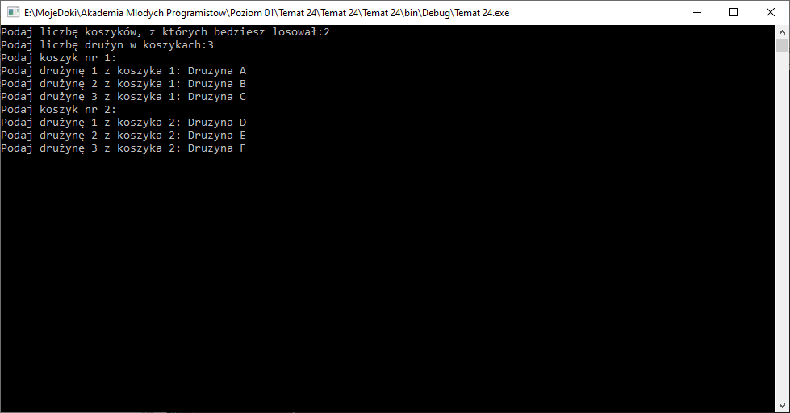

# Tablice dwuwymiarowe

## Wykonaj test

[Test](https://forms.gle/NckMcSZzxqZNQnkVA) - tym razem tylko 5 pytań ALE każde na 2 pkt.

## Wykonaj zadanie praktyczne - Losowanie grup do turnieju

Zwyczajowo w trakcie oficjalnych losowań do drużynowych turniejów (np piłkarskich mistrzostw świata) prezentowanych jest kilka "koszyków", w których znajdują się drużyny. Od początku wiadomo jaka drużyna jest w któym koszyku, ponieważ ich pozycja zależy od przebiegu eliminacji. Nie wiemy jednak która drużyna aktualnie będzie wylosowana, ponieważ są one zamknięte w pudełkach.

W trakcie losowania osoba losująca wyjmuje z każdego dostępnego koszyka po jednej drużynie i w ten sposób tworzone są kolejne grupy, które będą ze sobą grały w turnieju właściwym.

Przykład:

```text
Koszyk 1:
1. Drużyna 1
2. Drużyna 2
3. Drużyna 3

Koszyk 2:
1. Drużyna 4
2. Drużyna 5
3. Drużyna 6
```

Losujemy po jednej drużynie z każdego koszyka i tworzymy grupy z wylosowanych, zatem będziemy mieli 3 grupy po dwie drużyny. Wynikiem może być np:

```text
Grupa 1:
1. Drużyna 2
2. Drużyna 4

Grupa 2:
1. Drużyna 1
2. Drużyna 6

Grupa 3:
1. Drużyna 3
2. Drużyna 5
```

Jak widać z każdego koszyka w danej grupie jest po jednej druyżynie. Zauważ pewną analogię: 2 koszyki - 2 drużyny w grupach, 3 drużyny w każdym koszyku - 3 grupy.

Jak łatwo również można zauważyć zarówno koszyki jak i grupy mogą tworzyć dwuwymiarowe tablice. Patrząc na przykład tablica z koszykami miała by wymiary [2,3] natomiast tablica wynikowa z grupami miałaby wymiary [3,2] - dostrzegasz pewną analogię miedzy wymiarami? :)

### Zadanie

Napisz program, w któym:

1. Poprosisz użytkownika o liczbę koszyków.
2. Poprosisz użytkownika o liczbę drużyn w każdym z koszyków.
   
3. Stworzysz tablicę dwuwymiarową, która przechowa zadaną liczbę koszyków i drużyn w tych koszykach.
4. W pętlach poproś o nazwy drużyn dla każdego z koszyków (dodaj również informację o tym o jakim koszyk prosisz).
   
5. Dodaj do programu możliwość losowania:

```csharp
Random rnd = new Random();
```

6. Stwórz tablicę dwywymiarową o wymiarach adekwatnych do grup, które powstaną (pamiętaj grup powinno być tyle samo co drużyn w koszyku, a drużyn w grupie tyle co koszyków).
7. Stwórz pętle, które będą poruszały się po nowej tablicy. Pierwsza pętla niech zmienia zmienną `i`, a druga niech zmienia `j`. A wewnątrz drugiej pętli:
   1. Stwórz zmienną `druzyna` typu `string` i zapisz do niej pusty tekst `""`.
   2. Stwórz pętlę `while`, która będzie wykonywała się tak długo jak zmienna `druzyna` jest pusta. W pętli:
      1. Wylosuj liczbę która będzie w zakresie od 0 do liczby drużyn w KOSZYKU i zapamietaj ta liczbe w zmiennej `y`.
      2. Zapisz do zmiennej `druzyna` uzyskaną z tablicy z koszykami drużynę - wyjmij ją na podstawie indeksów `j` i `y` - numer drużyny w grupie jest adekwatny do numeru koszyka, a numer drużyny w koszyku jest losowy.
      3. W miejsce wyciągnietej z tablicy drużyny na ineksach `j` i `y` zapisz pusty tekst "".
   3. Za pętlą while zapisz do tablicy z GRUPAMI na indeksie `i` i `j` wybraną drużynę z zmiennej `druzyna`.
8. Wyświetl w pętlach zawartosć tablicy z grupami.
   

## Wyślij rozwiazania

Przygotuj kod źródłowy programu powstałego w trakcie realizacji ćwiczeń do wysyłki na podstawie [instrukcji](../ZdalneInstrukcja#wysyłanie-projektu-aplikacji-konsolowej)

Adres do wysyłki: [pawel.woloszyn@akademiamlodychprogramistow.pl](mailto:pawel.woloszyn@akademiamlodychprogramistow.pl)

Temat Maila: `Test - tablice`.
