# Zapis/Odczyt pliku

Dotychczas tworzyliśmy tylko programy, które trzymały dane w pamięci - po zamknięciu programu nie mieliśmy zapisanych żadnych wyników działania naszej aplikacji. Jak dobrze wiecie efektem prac na programie komputerowym może być jakiś plik wynikowy: obraz, dokument, dźwięk itd.

Najprostszym typem plików, który może być wynikiem działania naszego programu, jest plik tekstowy. Na tych zajęciach dowiecie się jak odczytać i zapisać plik. Oprócz tego dodamy do projektu plik tekstowy tak, aby środowisko (SharpDevelop) wrzucał nam automatycznie taki plik do katalogu, w którym tworzony jest plik `.exe`.

## Materiały

Najpierw pobierz [materiały](Materiały.pdf)

## Plik tekstowy w projekcie

Do projektu możemy dodawać różne ciekawe twory, jednym z nich są pliki tekstowe, aby tego dokonać należy kliknąć prawym przyciskiem na Projekt (lub otworzyć menu `Project` na górnym pasku okna). Z menu wybieramy opcję `Add` a następnie `New item...`

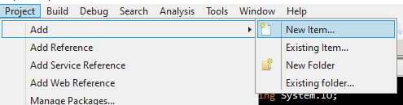

Po kliknięciu pojawia się nowe okno:

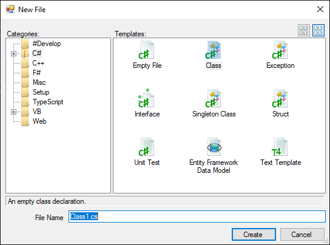

Okno to dzieli się na dwie części:

1. `Categories` - w tej części znajduje się drzewo z różnymi kategoriami plików jakie możemy dodać do projektu.
2. `Temaplates` - W tej części wybieramy wzór pliku który nas interesuje.

My w tym oknie wybierzemy kategorię `Misc` i w niej zaznaczymy template o nazwie `Empty text file`:

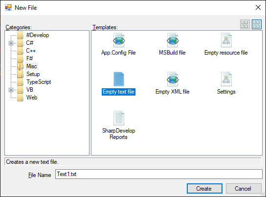

Pozostaje jeszcze nadać nazwę naszemu plikowi - tutaj już jest dowolność. W kolejnych zadaniach dostaniesz informację o tym jak ma nazywać się taki plik.

Ostatnią rzeczą jaką musimy zrobić to zmienić ustawienia pliku w projekcie tak, aby był on kopiowany zawsze do katalogu wyjściowego. Żeby tego dokonać powinniśmy po lewej stronie okna znaleźć drzewo naszego projektu, a w nim nowo dodany plik.

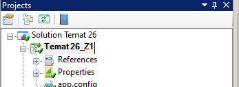

Zaznaczamy go tam i klikamy prawym przyciskiem myszy i wybieramy opcję `Properties`:

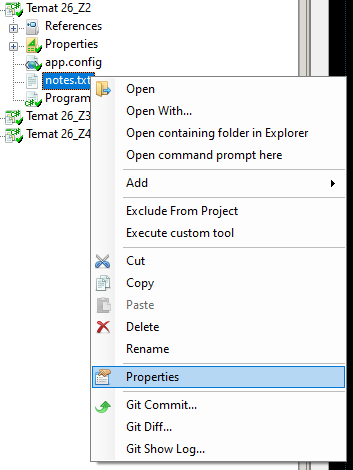

Jeżli po prawej stronie okna nic wcześniej nie miałeś to teraz powinieneś mieć okno ustawień `Properties`:

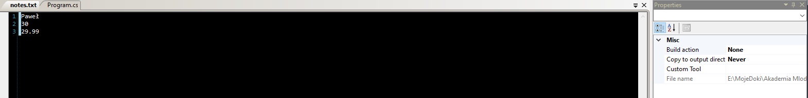

Na tym oknie musisz znaleźć opcję `Copy to utput directory`:

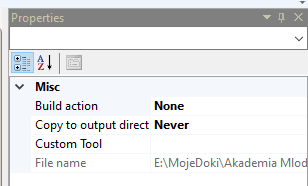

Z listy rozwijanej wybieramy opcje `Always`:

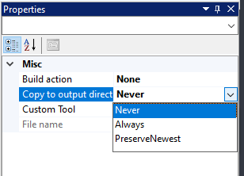

## Odczyt pliku

Najpierw nauczmy się odczytywać pliki. W tym celu służy `StreamReader`. W celu użycia StreamWriter należy dołączyć bibliotekę System.IO przez wpisanie na górze naszego pliku z kodem:

```csharp
using System.IO;
```

Teraz możemy użyć `StreamReader` w naszym kodzie i stworzyć zmienną, która pozwoli na czytanie pliku:

```csharp
StreamReader plik = File.OpenText("notes.txt");
```

Jak zawuażyłeś na końcu w `()` znajduje się nazwa pliku. Taki plik będzie wyszukiwany w katalogu w którym znajduje się plik wykonywalny naszej aplikacji. Możemy tu podać ścieżkę względną:

```text
..\folder\notes.txt
```

Powyższy zapis wyjdzie o katalog wyżej względem tego w któym jest plik wykonywalny (`exe`) otworzy folder o nazwie `folder` i w nim będzie szukać pliku `notes.txt`.

Możemy też alternatywnie zastosować ścieżkę bezwzględną:

```text
C:\notes.txt
```

W tym wypadku plik zawsze będzie poszukiwany w jednym konkretnym miejscu - w przykładzie na dysku C.

Po stworzniu zmiennej otwierającej plik możemy przy jej pomocy odczytać z niego pierwszą linijkę tekstu:

```csharp
string imie = plik.ReadLine();
```

Czy zauważyłeś pewną analogię?

Odczyt z pliku jest podobny do odczytu tekstu wpisanego przez użytkownika z konsoli - nazwa funkcji jest identyczna `ReadLine()`. Tutaj również należy pamiętać o tym, że `ReadLine()` zwraca tekst, więc jeśli chcemy coś wpisać do zmiennej innego typu niż `string` to musimy użyć pasrowania. Na przykład:

```csharp
int liczba = int.Parse(plik.ReadLine());
```

Każde kolejne wywołanie: `plik.ReadLine()` odczytuje kolejną linijkę z pliku.

Jak wiecie plik leży na dysku, a nasze systemy operacyjne oraz komputery pozwalają na działanie na wielu programach jednocześnie. Zdarzyć się może, że jeden plik będzimy chcieli używać w kilku programach jednocześnie. Każde stworzenie zmiennej do odczytu plików:

```csharp
StreamReader plik = File.OpenText("notes.txt"); //TĄ LINIJKĘ JUŻ ZNAMY
```

Otwiera plik i blokuje go dla innych programów - co może skutkować problemami w przyszłości przy próbie otwarcia takiego pliku spoza naszego programu w trakcie jego działania. Żeby zapobiec takim problemom MUSIMY PAMIĘTAĆ O JEDNEJ BARDZO ISTOTNEJ RZECZY: zawsze po zakończeniu odczytywania danych z pliku zamknąć plik z poziomu kodu:

```csharp
plik.Close();
```

### Zadanie 1

Nic tak nie wpływa na zapamiętanie wiedzy jak praktyczne jej zastosowanie. Stwórz nowy projekt i dodaj do niego plik o nazwie `notes.txt` (spójrz na opis z początku zajęć).

Następnie do pliku dodaj w kolejnych linijkach:

1. Imie
2. Wiek
3. Jakaś liczba zmiennoprzecinkowa np. `22,99`

Wróc do pliku `Program.cs`:

1. Dodaj na górze pliku:

   ```csharp
   using System.IO;
   ```

2. W funkcji main:

   1. Otwórz plik:

      ```csharp
      StreamReader plik = File.OpenText("notes.txt");
      ```

   2. Odczytaj z pliku imie:

      ```csharp
      string imie = plik.ReadLine();
      ```

   3. Odczytaj z pliku wiek:

      ```csharp
      int wiek = int.Parse(plik.ReadLine());
      ```

   4. Odczytaj z pliku liczbę zmiennoprzecinkową:

      ```csharp
      double skarbonka = double.Parse(plik.ReadLine());
      ```

   5. PAMIĘTAMY O ZAMKNIĘCIU PLIKU:

      ```csharp
      plik.Close();
      ```

   6. A na koniec wyświetlamy nasze dane:

      ```csharp
      Console.WriteLine(imie);
      Console.WriteLine(wiek);
      Console.WriteLine(skarbonka);
      Console.ReadKey(true);
      ```

   7. Po uruchomieniu programu powinieneś zobaczyć na ekranie zawartość swojego pliku:

      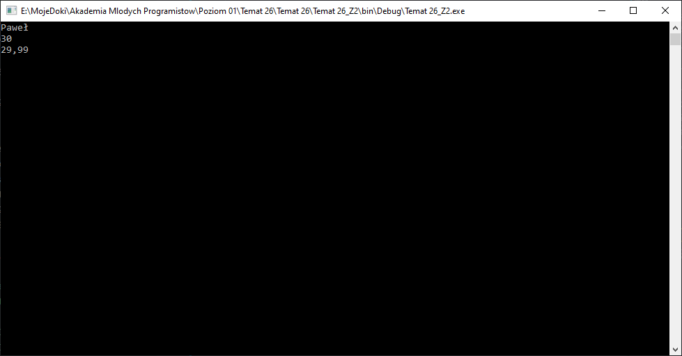

W kolejnym zadaniu będziemy tworzyli nowy projekt, przygotuj to co wykonałeś w tym zadaniu do wysłania.

## Zapis pliku

Potrafimy już odczytać plik. Pora na zapis danych do pliku. Jest on bardzo podobny do odczytu. Dlatego najpierw, aby zapisać do pliku potrzebujemy dodać na początku naszego programu bibliotekę:

```csharp
using System.IO;
```

Następnie w głownym programie możemy stworzyć zmienną typu `StreamWriter`, która służy do zapisu danych. Zauważ `StreamReader` (read - czytać) - odczyt, `StreamWriter` (write - pisać) - zapis. Zmienną `StreamWriter` tworzymy podobnie do odczytu:

```csharp
StreamWriter plik = File.CreateText("notes.txt");
```

Otwarliśmy plik do zapisu i teraz wpisujemy do niego dane:

1. Tekstowe:

   ```csharp
   plik.WriteLine("Paweł");
   ```

2. Liczbowe:

   ```csharp
   plik.WriteLine(256);
   plik.WriteLine(8.52);
   ```

Zauważ znów pojawia się analogia do konsoli - aby wpisać coś w konsoli należało użyć `Console.WriteLine` tutaj używamy zmiennej przechowujązej informacje o pliku i również używamy funckji `WriteLine`.

Na koniec PAMIĘTAMY O ZAMKNIĘCIU PLIKU!!!

```csharp
plik.Close();
```

Pamiętaj, że po wywołaniu plik.Close() nie możemy użyć ani `WriteLine` dla `StreamWriter`ani `ReadLine` dla `StreamReader`.

### Zadanie 2

Stwórz nowy projekt - w tym projekcie nie będziemy dodawać żadnego pliku do projektu. Plik ten stworzymy sami i podejrzymy jego wynik:

1. Na samej górze kodu programu dodaj:

   ```csharp
   using System.IO;
   ```

2. W funkcji `Main` dodaj zmienną zapisującą do pliku:

   ```csharp
   StreamWriter plik = File.CreateText("notes.txt");
   ```

3. Następnie za pomocą zmiennej `plik` wpisz do pliku kilka danych np.:

   ```csharp
   plik.WriteLine("Paweł Wołoszyn");
   plik.WriteLine(30);
   plik.WriteLine(8.52);
   ```

4. Następnie zamykamy plik:

   ```csharp
   plik.Close();
   ```

5. Na koniec możemy zostawić (dodać):

   ```csharp
   Console.ReadLine(true);
   ```

6. Po uruchomieniu widzimy pustą konsolę, ale to jest spodziewany efekt - nic nie wyświetlamy na ekran. Cała magia wydarzyła się na dysku twardym.
7. Zamknij okno konsoli
8. Przejdź do menu `Project` i tam wybierz `Open output folder`:

   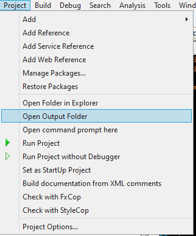

9. Powinno pojawić się okno eksploratora plików a w nim plik `notes.txt` - tak to nasz efekt działania programu.

   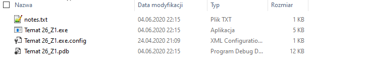

10. Po otwarciu pliku powinieneś zobaczyć zapisane w nim dane:

    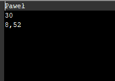

Przygotuj ten projekt do wysłania w kolejnym zadaniu będziemy tworzyć nowy.

## Odczytuj plik aż do końca

Potrafimy już odczytać i zapisać plik o stałej zawartości - to znaczy taki który np ma 3 linijki i w nich dane których sie spodziewamy. Zazwyczaj zdarza się jednak, że wiemy tylko jakich danych spodziewamy się w kolejnych liniach pliku, ale nie wiemy ile takich zestawów linijek jest lub po prostu plik ma w sobie nieznanej długości tekst i chcemy go wczytać i wyświetlić.

W tym celu podczas odczytywania pliku możemy sprawdzać wewnątrz zmiennej odczytującej dane jaką wartość ma jej właściwość `EndOfStream` - jest to zmienna typu `bool`, która ma wartość `true` kiedy odczytamy ostatnią linijkę z pliku.

Możemy zatem odczytać nasz plik w następujący sposób:

```csharp
StreamReader plik = File.OpenText("ksiazka.txt");
while(!plik.EndOfStream)
{
    Console.WriteLine(plik.ReadLine());
}
plik.Close();
```

W fragmencie: `!plik.EndOfStream` symbol `!` oznacza negację, więc jeśli zmienna `EndOfStream` będzie miała wartość `false`, to nasza pętla while będzie sie wykonywała. Zatem wykonywała się ona będzie TAK DŁUGO AŻ NIE DOJDZIEMY DO KOŃCA PLIKU.

Zauważ, że zamykamy plik za pętlą - gdybyśmy to zrobili wewnątrz pętli to odczytalibyśmy jedną linijkę i dostali błąd.

### Zadanie 3

Stwórz nowy projekt aplikacji konsolowej. Jeśli potrafimy czytać plik o nieznanej nam długości to może dodajmy do naszego projektu plik tekstowy (patrz opis na początku zajęć) o nazwie: `ksiazka.txt`.

Do pliku wklej poniższy tekst:

```text
Lorem ipsum dolor sit amet, consectetur adipiscing elit. Nam nibh lorem, sagittis ac dolor tincidunt, pulvinar tristique sem. Nunc viverra erat euismod ultricies commodo. Fusce blandit est eu commodo bibendum. Sed dignissim neque in ipsum finibus, ac consequat velit bibendum. Fusce commodo scelerisque leo, sit amet egestas nulla iaculis in. In nec egestas nisl. Proin lorem sem, viverra ac gravida vitae, blandit id quam.

Etiam in aliquam ex. Sed sollicitudin turpis nunc, ut ultricies mauris sodales sit amet. Proin elit ex, sagittis vitae euismod vel, sagittis nec est. Fusce tristique ligula sit amet eros pharetra vulputate. Curabitur pellentesque dignissim maximus. Mauris et mattis diam. Cras vel ligula in nisl luctus dapibus pellentesque sed est. Nunc quis libero at libero pharetra posuere iaculis ut lacus. Cras tincidunt est et elit pellentesque facilisis ac eget tellus. Mauris nec lobortis risus.

Phasellus ex tortor, tincidunt nec nisl sit amet, venenatis convallis lacus. Donec at felis felis. Donec at fermentum erat. Pellentesque quis sapien diam. Nunc faucibus, purus vitae lacinia aliquam, ipsum neque elementum enim, sit amet venenatis lorem quam sit amet ex. Nunc et ligula leo. Vivamus in blandit quam. Quisque non maximus augue, at laoreet diam. Aliquam congue sed magna a hendrerit. Fusce finibus tincidunt mi, et dictum libero maximus tempor. Suspendisse in vehicula urna. Nam nec lorem at nisl vehicula bibendum. Fusce consequat id neque eu tempus.

Interdum et malesuada fames ac ante ipsum primis in faucibus. Suspendisse sed venenatis nibh. Nam vitae rhoncus nibh. Mauris ultrices volutpat dui vel varius. Sed cursus velit et eros ullamcorper finibus. Aliquam nec nisl tempor, fringilla lacus ac, ultricies ex. In auctor vel diam ut sodales.

Nunc luctus eget nisl a venenatis. Nam auctor ante libero, eu egestas massa faucibus id. Nam dapibus porttitor ligula eget euismod. Phasellus et condimentum augue. Etiam enim diam, aliquet scelerisque eros eu, pellentesque tristique tortor. Curabitur commodo a eros vitae faucibus. Duis maximus nunc eget pulvinar dignissim. In maximus volutpat dui. Nam semper libero in urna semper tempor. Curabitur et purus a nulla interdum posuere quis ac nisi.
```

Po dodaniu wrócmy do pliku `Porgram.cs` a następnie:

1. Dodajmy możliwość odczytu plików:

   ```csharp
   using System.IO;
   ```

2. Stwórzmy zmienną do ODCZYTU PLIKÓW:

   ```csharp
   StreamReader plik = File.OpenText("ksiazka.txt");
   ```

3. A następnie w pętli czytajmy linijka po lijnce plik tak długo, aż dojdziemy do jego konca:

   ```csharp
   while(!plik.EndOfStream)
   {
       Console.WriteLine(plik.ReadLine());
   }
   plik.Close();
   ```

4. Na koniec dodajmy oczekiwanie na klawisz, aby zobaczyć efekt działania:

   ```csharp
   Console.ReadKey(true);
   ```

Przygotuj ten projekt do wysłania w kolejnym zadaniu będziemy tworzyć nowy.

## PROGRAM DO SAMODZIELNEGO NAPISANIA

Wspólnie nauczyliśmy się dzisiaj odczytywać pliki. Jako zadanie kończące te zajęcia napisz program według wymagań:

1. Pobierz plik [stąd](Download/wyniki.txt)
2. Plik zawiera kolejno następujące po sobie
   1. Imie osoby
   2. Liczba punktów zdobytą przez osobę na teście.
3. W nowym projekcie odczytaj dane z pliku kolejno, linijka po linijce, aż do jego końca - nie wyświetlaj tych danych na ekranie, ale analizuj je w trakcie odczytu.
4. Twoim zadaniem podczas odczytywania danych z pliku jest znaleźć osobę z najlepszym wynikiem i zapamiętać ten wynik oraz jej imie w zmiennych.
5. Pamiętaj, że nie wiesz ile w moim pliku będzie takich par imie, wynik - musisz czytać tak długo plik, aż się skończy.
6. Po przeanalizowaniu pliku należy wyświetlić imie osoby z najwyższą liczbą punktów oraz jej wynik. TO JEST JEDYNA INFORMACJA JAKA MA SIĘ POJAWIĆ NA EKRANIE KONSOLI!
7. Pamiętaj, że jeśli zmieni się zawartość pliku to program powinien dalej znajdować najlepszy wynik.

## Wyślij rozwiazania

Przygotuj kod źródłowy programów, które stworzyłeś podczas zajęć na podstawie [instrukcji](../ZdalneInstrukcja#wysyłanie-projektu-aplikacji-konsolowej)

Adres do wysyłki: [pawel.woloszyn@akademiamlodychprogramistow.pl](mailto:pawel.woloszyn@akademiamlodychprogramistow.pl)

Temat Maila: `Test - pliki`.
