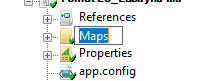
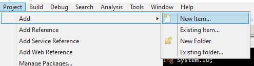
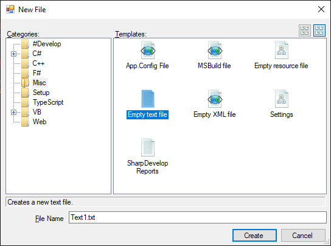
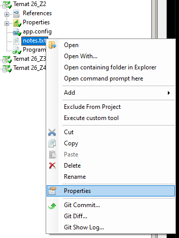
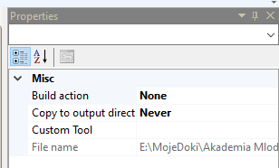
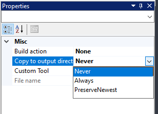

# Labirytn z pliku

Pamiętasz program, który realizowaliśmy przez kilka tygodni? Był to nasz pierwszy projekt gry w labirynt. Przypomnijmy sobie jego kod:

```csharp
using System;

namespace Temat_23
{
    class Program
    {
        enum Kierunek
        {
            Gora,
            Dol,
            Lewo,
            Prawo,
            Nieznany
        }

        public static void Main(string[] args)
        {
            char[,] mapa = {
                { '#', '#', '#', '#', '#', '#', '#', '#', '#', '#' },
                { '#', ' ', '#', ' ', ' ', ' ', ' ', ' ', ' ', '#' },
                { '#', ' ', '#', ' ', '#', ' ', '#', '#', '#', '#' },
                { '#', ' ', ' ', ' ', '#', ' ', ' ', ' ', ' ', '#' },
                { '#', '#', '#', '#', '#', '#', '#', '#', ' ', '#' },
                { '#', ' ', ' ', ' ', ' ', ' ', ' ', ' ', ' ', '#' },
                { '#', ' ', '#', '#', '#', '#', ' ', '#', '#', '#' },
                { '#', ' ', '#', ' ', ' ', ' ', ' ', ' ', ' ', '#' },
                { '#', ' ', '#', '#', '#', '#', '#', '#', '#', '#' },
                { '#', ' ', ' ', ' ', ' ', ' ', ' ', ' ', '*', '#' },
                { '#', '#', '#', '#', '#', '#', '#', '#', '#', '#' }
            };
            int pozycjaGraczaX = 1, pozycjaGraczaY = 1;
            bool koniec = false;
            while(!koniec)
            {
                Rysuj(mapa, pozycjaGraczaX, pozycjaGraczaY);
                koniec = CzyKoniec(mapa, pozycjaGraczaX, pozycjaGraczaY);
                if(!koniec)
                {
                    Kierunek wybranyKierunek = CzekajNaRuch();
                    if(wybranyKierunek != Kierunek.Nieznany)
                    {
                        int nowaPozycjaGraczaX = ObliczNowaPozycjeGraczaX(wybranyKierunek, pozycjaGraczaX);
                        int nowaPozycjaGraczaY = ObliczNowaPozycjeGraczaY(wybranyKierunek, pozycjaGraczaY);
                        if(!CzySciana(mapa, nowaPozycjaGraczaX, nowaPozycjaGraczaY))
                        {
                            pozycjaGraczaX = nowaPozycjaGraczaX;
                            pozycjaGraczaY = nowaPozycjaGraczaY;
                        }
                    }
                }
            }
        }

        static void Rysuj(char[,] mapa, int XGracza, int YGracza)
        {
            Console.SetCursorPosition(0, 0);
            RysujMape(mapa);
            RysujGracza(XGracza, YGracza);
        }

        static void RysujMape(char[,] mapa)
        {
            for(int x = 0; x < mapa.GetLength(1); x++)
            {
                for(int y = 0; y < mapa.GetLength(0); y++)
                {
                    Console.SetCursorPosition(x, y);
                    Console.Write(mapa[y, x]);
                }
            }
        }

        static void RysujGracza(int x, int y)
        {
            Console.SetCursorPosition(x, y);
            Console.Write('@');
        }

        static bool CzyKoniec(char[,] mapa, int x, int y)
        {
            return mapa[y, x] == '*';
        }

        static Kierunek CzekajNaRuch()
        {
            switch(Console.ReadKey(true).Key)
            {
                case ConsoleKey.W:
                    return Kierunek.Gora;
                case ConsoleKey.A:
                    return Kierunek.Lewo;
                case ConsoleKey.S:
                    return Kierunek.Dol;
                case ConsoleKey.D:
                    return Kierunek.Prawo;
                default:
                    return Kierunek.Nieznany;
            }
        }

        static int ObliczNowaPozycjeGraczaX(Kierunek wybrany, int x)
        {
            switch(wybrany)
            {
                case Kierunek.Lewo:
                    return x - 1;
                case Kierunek.Prawo:
                    return x + 1;
                default:
                    return x;
            }
        }

        static int ObliczNowaPozycjeGraczaY(Kierunek wybrany, int y)
        {
            switch(wybrany){
                case Kierunek.Gora:
                    return y - 1;
                case Kierunek.Dol:
                    return y + 1;
                default:
                    return y;
            }
        }

        static bool CzySciana(char[,] mapa, int x, int y)
        {
            return mapa[y, x] == '#';
        }

    }
}
```

Będziemy ten projekt przerabiali tak, aby najpierw załadować z pliku tą mapę którą mamy w kodzie. Następnym krokiem będzie przeróbka na dynamiczne ładowanie map.

### Zadanie 1

Stwórz projekt aplikacji konsolowej i zamiast tego co domyślnie jest w kodzie aplikacji wstaw powyższy kod z projektu labirynt.

## Pojedyncza mapa - dodajmy plik z mapą

Mamy już przywrócony projekt naszej aplikacji pierwszym etapem będzie stworzenie katalogu w naszym projekcie na mapy.

Aby dodać katalog należy wybrać menu Project->Add...->New folder. W eksproatorze projektu po lewej stronie okna powinien pojawić się folder z możliwością edycji jego nazwy z domyślną nazwą `New Folder`:



Nazwijmy folder: `Maps` tak jak na screenie.

Do folderu dodajmy plik, w którym znajdzie się nasza mapa. Klikamy na stworzony folder w zakładce z projektem, a następnie: `Project` -> `Add` -> `New item...`



W kategoriach wybieramy `Misc`, a następnie zaznaczamy `Empty text file`



Niech nowy plik nazywa się `mapa1.txt`. Pamiętajmy o ustawieniu właściwości pliku:



Właściwość `Copy to output directory`:



Ustawiamy na `Always`:



### Zadanie 2

Dodaj do projektu pusty plik według powyższego opisu tak aby kopiował się do katalogu gdzie ląduje plik wykonywalny.

## Pojedyncza mapa - uzupełnijmy plik z mapą

Mamy już plik, pora go uzupełnić, ale najpierw musimy wiedzieć co powinno się w nim znaleźć.

Nasza mapa to tablica o dwóch wymiarach, która zawiera pojedyncze znaki oznaczające:

1. Pusty znak - pole do poruszania się
2. `#` - ścianę
3. `*` - koniec labiryntu

Przenieśmy najpierw z kodu naszą mapę do pliku. Fragment:

```csharp
{
    { '#', '#', '#', '#', '#', '#', '#', '#', '#', '#' },
    { '#', ' ', '#', ' ', ' ', ' ', ' ', ' ', ' ', '#' },
    { '#', ' ', '#', ' ', '#', ' ', '#', '#', '#', '#' },
    { '#', ' ', ' ', ' ', '#', ' ', ' ', ' ', ' ', '#' },
    { '#', '#', '#', '#', '#', '#', '#', '#', ' ', '#' },
    { '#', ' ', ' ', ' ', ' ', ' ', ' ', ' ', ' ', '#' },
    { '#', ' ', '#', '#', '#', '#', ' ', '#', '#', '#' },
    { '#', ' ', '#', ' ', ' ', ' ', ' ', ' ', ' ', '#' },
    { '#', ' ', '#', '#', '#', '#', '#', '#', '#', '#' },
    { '#', ' ', ' ', ' ', ' ', ' ', ' ', ' ', '*', '#' },
    { '#', '#', '#', '#', '#', '#', '#', '#', '#', '#' }
};
```

przenieś do pliku tekstowego i przerób na formę poniższą:

```text
##########
# #      #
# # # ####
#   #    #
######## #
#        #
# #### ###
# #      #
# ########
#       *#
##########
```

Nasza plansza stała się czytelna. Ok, ale jak ją odczytać?? Potrafimy odczytać plik o nieznanej długości, ale czy potrafimy robić tablicę której wielkość będzie w trakcie odczytywania pliku się zwiększała? Algorytm do odczytu tablicy z mapą mógłby się mocno skomplikować, prawda?

Dodajmy zatem do naszego pliku informację o wymiarach naszej mapy. Ta powyżej ma wymiary 11 linijek po 10 znaków w linii. Możemy dodać na początku pliku tekstowego te informacje, zatem plik będzie teraz wyglądał następująco:

```text
11
10
##########
# #      #
# # # ####
#   #    #
######## #
#        #
# #### ###
# #      #
# ########
#       *#
##########
```

Ok, ale odczyt z naszego pliku odbywa się linijka po linijce, a w każdej pojedynczej linijce znajduje się cała tablica pojedynczych znaków, która składa się na linijkę mapy. Wynik pobrania linijki z pliku to `string` - mawia się na ten typ danych, że jest to `ciąg znaków` lub też `tablica znaków` - i w tym wypadku wykorzystamy `tablicową` właściwość typu string, ponieważ wykonanie takiej operacji:

```csharp
//TEGO KODU NIE UŻYWAJ W PROGRAMIE TO PRZYKŁAD
string napis = "Ala ma kota";
Console.WriteLine(napis[0]);//Wynik na erkanie: A
Console.WriteLine(napis[4]);//Wynik na erkanie: m
```

Jak widać daje w efekcie pojedyncze znaki z naszego napisu, zatem wiemy już jak odczytać z poszczególnych linijek znaki, wiemy ile tych znaków będzie bo to druga wartość z wymiarów naszej mapy.

Jak powinien wygladać odczyt takiej mapy?

1. Odczytujemy pierwszą linijkę z pliku - odczytaliśmy: `11`
2. Odczytujemy drugą linijkę z pliku - odczytaliśmy `10`
3. Mamy wymiary tablicy - możemy ją zainicjować.
4. W pętli odczytujemy kolejną linijkę.
5. W kolejnej pętli (która jest wewnątrz tej pierwszej) odczytujemy kolejne znaki z odczytanej z pliku linijki mapy i zapisujemy pod konkretnym adresem w tablicy.

Wróćmy do kodu naszej aplikacji, w miejscu gdzie wycięliśmy nasz fragment z mapą powinna nam pozostać obecnie zmienna:

Było to:

```csharp
char[,] mapa = {
                { '#', '#', '#', '#', '#', '#', '#', '#', '#', '#' },
                { '#', ' ', '#', ' ', ' ', ' ', ' ', ' ', ' ', '#' },
                { '#', ' ', '#', ' ', '#', ' ', '#', '#', '#', '#' },
                { '#', ' ', ' ', ' ', '#', ' ', ' ', ' ', ' ', '#' },
                { '#', '#', '#', '#', '#', '#', '#', '#', ' ', '#' },
                { '#', ' ', ' ', ' ', ' ', ' ', ' ', ' ', ' ', '#' },
                { '#', ' ', '#', '#', '#', '#', ' ', '#', '#', '#' },
                { '#', ' ', '#', ' ', ' ', ' ', ' ', ' ', ' ', '#' },
                { '#', ' ', '#', '#', '#', '#', '#', '#', '#', '#' },
                { '#', ' ', ' ', ' ', ' ', ' ', ' ', ' ', '*', '#' },
                { '#', '#', '#', '#', '#', '#', '#', '#', '#', '#' }
            };
```

wycięliśmy na poprzednim etapie fragment z mapą (tego już nie ma - a jak jest tu usuń):

```csharp
{
    { '#', '#', '#', '#', '#', '#', '#', '#', '#', '#' },
    { '#', ' ', '#', ' ', ' ', ' ', ' ', ' ', ' ', '#' },
    { '#', ' ', '#', ' ', '#', ' ', '#', '#', '#', '#' },
    { '#', ' ', ' ', ' ', '#', ' ', ' ', ' ', ' ', '#' },
    { '#', '#', '#', '#', '#', '#', '#', '#', ' ', '#' },
    { '#', ' ', ' ', ' ', ' ', ' ', ' ', ' ', ' ', '#' },
    { '#', ' ', '#', '#', '#', '#', ' ', '#', '#', '#' },
    { '#', ' ', '#', ' ', ' ', ' ', ' ', ' ', ' ', '#' },
    { '#', ' ', '#', '#', '#', '#', '#', '#', '#', '#' },
    { '#', ' ', ' ', ' ', ' ', ' ', ' ', ' ', '*', '#' },
    { '#', '#', '#', '#', '#', '#', '#', '#', '#', '#' }
};
```

Pozostało nam:

```csharp
char[,] mapa =
```

Na razie nie mamy załadowanej żadnej mapy, więc program nie zadziała i wyrzuca mnóstwo błędów. Musimy uzupełnić powyższą niedokończoną linijkę.

Niech naszą mapę odczytuje funkcja, która otrzyma lokalizację pliku z mapą np:

```csharp
char[,] mapa = WczytajMape("Maps\\mapa1.txt");
```

Podwójny `\` jest celowo w tym ciągu znaków, gdybyśmy zostawili jeden `\` to nasz program potraktuje go jako tak zwany znak ucieczki, czyli taki który służy np do wstawienia tabulatora: `\t` - nie chcemy tego, chcemy wstawić symbol `\` zatem musimy posłuzyć się znakiem ucieczki `\` i symbolem `\` po znaku ucieczki, stąd w lokalizacji pliku `\\`.

Ok, dodaliśmy w kodzie wywołanie funkcji która istnieje, dodajmy tą funkcję - powinna ona zwrócić tablicę `char[,]` i przyjąć jako parametr nazwe pliku w formie tekstowej:

```csharp
static char[,] WczytajMape(string nazwaPliku)
{

}
```

### Zadanie 3

Do dodanego pliku z mapą przenieś z kodu aplikacji mapę, a przed mapą wstaw informację o jej wymiarach: w pierwszej linijce dodaj liczbę wierszy w mapie, a w drugiej liczbę kolumn w mapie. Następnie w kodzie programu, w miejscu dawniej ładowanej mapy dodaj funkcję `WczytajMape`, która przyjmie jako parametr nazwę pliku z mapą.

## Pojedyncza mapa - wczytajmy plik z mapą

Chcemy obsługiwać pliki, zatem na początku naszego pliku z kodem dodajmy:

```csharp
using System.IO;
```

W poprzedniej części spisaliśmy listę korków jaką powinien wykonać nasz odczyt pliku. Dla przypomnienia:

1. Odczytujemy pierwszą linijkę z pliku - odczytaliśmy: `11`
2. Odczytujemy drugą linijkę z pliku - odczytaliśmy `10`
3. Mamy wymiary tablicy - możemy ją zainicjować.
4. W pętli odczytujemy kolejną linijkę.
5. W kolejnej pętli (która jest wewnątrz tej pierwszej) odczytujemy kolejne znaki z odczytanej z pliku linijki mapy i zapisujemy pod konkretnym adresem w tablicy.

W przyszłości jednak chcemy, aby funkcja `WczytajMape` oprócz powyższych kroków była zabezpieczona przed próbą otwarcia nieistniejącego pliku a także zwróciła cokolwiek w miejscu jej użycia co powie użytkownikowi tej funkcji, że mapa w danym pliku nie istnieje.

Zatem najpierw w funkcji musimy:

1. Stworzyć zmienną wynikową z odczytaną mapą ale bez danych:

   ```csharp
   char[,] nowaMapa = null;
   ```

2. Sprawdzić czy istnieje plik i dopiero wtedy wkonać kroki z wcześniej zaprezentowanej listy. Sprawdzenie czy plik istnieje robimy w taki sposób:

   ```csharp
   if (File.Exists(nazwaPliku))
   {
   }
   ```

3. Po takiej operacji możemy dodać operację `return`, która zwróci nam bezpieczenie pustą tablicę jeśli plik nie będzie istniał - wykorzystamy to w przyszłości.

   ```csharp
   return nowaMapa;
   ```

Funkcja `WczytajMape` powinna wyglądać teraz następująco:

```csharp
static char[,] WczytajMape(string nazwaPliku)
{
    char[,] nowaMapa = null;
    if (File.Exists(nazwaPliku))
    {

    }
    return nowaMapa;
}
```

Wewnątrz bloku `if`:

```csharp
//TEN FRAGMENT JUŻ JEST W KODZIE!!!!!
if (File.Exists(nazwaPliku))
{
}
```

Zanim wykonamy nasz algorytm powinniśmy jeszcze otworzyć plik do odczytu:

```csharp
StreamReader plik = File.OpenText(nazwaPliku);
```

I możemy przejść do algorytmu (DALEJ WEWNĄTRZ RZECZONEGO BLOKU IF):

1. Odczytujemy pierwszą linijkę z pliku z liczbą wierszy w pliku

   ```csharp
   int x = int.Parse(plik.ReadLine());
   ```

2. Odczytujemy drugą linijkę z pliku z liczbą kolumn w pliku:

   ```csharp
   int y = int.Parse(plik.ReadLine());
   ```

3. Mamy wymiary tablicy wynikowej - możemy ją zainicjować. Nasza tablica wynikowa już istnieje zatem:

   ```csharp
   nowaMapa = new char[x, y];
   ```

4. W pętli odczytujemy kolejną linijkę. Tutaj pierwsza pętla, która porusza się po wierszach:

   ```csharp
   for (int i = 0; i < x; i++)
   {
       string liniaMapy = plik.ReadLine();
   }
   ```

5. W kolejnej pętli (która jest wewnątrz tej pierwszej) odczytujemy kolejne znaki z odczytanej z pliku linijki mapy i zapisujemy pod konkretnym adresem w tablicy. Poniżej przykład RAZEM Z PĘTLĄ Z PUNKTU 4!

   ```csharp
   for (int i = 0; i < x; i++)
   {
        string liniaMapy = plik.ReadLine();
        for (int j = 0; j < y; j++) {
            nowaMapa[i, j] = liniaMapy[j];
        }
   }
   ```

Na koniec musimy pamiętać, że należy zamknąć plik, wewnątrz instrukcji `IF`, w któej implementowaliśmy cały nasz powyższy algorym:

```csharp
plik.Close();
```

### Zadanie 4

Zaimplementuj funkcję `WczytajMape`. Niech funkcja zainicjuje zmienną wynikową z pustą wartością `null` następnie sprawdzi czy istnieje plik, jeśli istnieje to niech odczyta z pliku mapę i zapisze ją do odpowienio zainicjalizowanej zmiennej wynikowej. Na koniec niech zwróci zawartość zmiennej wynikowej.

Po uruchomieniu programu labirynt powinien działać tak jak wcześniej, z tą różnicą że łąduje nam się on z pliku.

## Dodajmy jeszcze jedną mapę

Zaznaczamy katalog `Maps` tak jak w przypadku pierwszej mapy i za pomocą `Project` -> `Add` -> `New item...` dodajemy do niego plik o nazwie `mapa2.txt` o zawartości:

```text
11
10
##########
#        #
# ### ####
#   #    #
######## #
#        #
###### ###
#        #
#### #####
#*       #
##########
```

Teraz możemy w naszym kodzie zmienić nazwę pliku i z łatwością załadujemy naszą nową mapę. Zmieniamy:

```csharp
char[,] mapa = WczytajMape("Maps\\mapa1.txt");
```

na

```csharp
char[,] mapa = WczytajMape("Maps\\mapa2.txt");
```

I gotowe nowa mapa śmiga po ekranie. Proste?

### Zadanie 5

Dodaj do projektu nową mapę w pliku `mapa2.txt` i zmodyfikuj program tak, aby odczytał nową mapę.

## Poziomy labiryntu

Spójrzmy na to co zmieniliśmy w poprzednim zadaniu aby załadować nową mapę. Zmienialiśmy:

```csharp
char[,] mapa = WczytajMape("Maps\\mapa1.txt");
```

na

```csharp
char[,] mapa = WczytajMape("Maps\\mapa2.txt");
```

A w zasadzie w powyższym fragmentcie zmodyfikowaliśmy tekst:

```csharp
"Maps\\mapa1.txt"
```

na:

```csharp
"Maps\\mapa2.txt"
```

A tak bardzo dokładnie ujmując to zmieniliśmy w zasadzie tylko cyferkę w nazwie pliku, prawda?

Zmieniliśmy 1 na 2, zatem ta cyfra w nazwie mogłaby stać się numerem naszego poziomu w grze. Każdy kolejny poziom to nowa mapa do przejścia, a gracz przechodzi tak długo przez poziomy, aż uda mu się wyjść całkowicie z labiryntu, brzmi ciekawie, prawda?

Zróbmy to!

Na początku naszego głównego programu dodajmy zmienną:

```csharp
int poziom = 1;
```

Na początku gracz gra na pierwszym poziomie naszego labirtyntu. Ok, jak przekuć to na nazwę pliku? w banalnie prosty sposób, wystarczy zmodyfikować jedną linijkę:

```csharp
char[,] mapa = WczytajMape("Maps\\mapa1.txt");
```

Zamiast stalej cyfry w tekście wprowadzić tam naszą zmienną, zatem linijka powinna być teraz następująca:

```csharp
char[,] mapa = WczytajMape("Maps\\mapa" + poziom + ".txt");
```

### Zadanie 6

Dodaj do prorgamu zmienną reprezentującą poziom labiryntu z domyślną wartością 1, a następnie zmodyfikuj tak wywołanie wczytywania mapy, aby wczytało mapę z pliku o nazwie z numerem zadanego z programu poziomu.

Po uruchomieniu powinna się wyświetlić mapa z pliku `mapa1.txt`.

## Zwiększajmy poziomy

Po przejściu labirnytu na pierwszym poziomie nie zmieniła nam się mapa na poziom 2 mimo, że plik z odpowiednią nazwą mamy. Niestety tutaj musimy zapętlić nasz algorytm rozgrywki tak, aby po jej zakończeniu wczytywala sie kolejna mapa.

Wróćmy do linijki:

```csharp
char[,] mapa = WczytajMape("Maps\\mapa" + poziom + ".txt");
```

W tym miejscu zmienna `mapa` może mieć w sobie mapę, ale jeśli nie będzie pliku z mapą to będzie miała `null` - pamiętasz wynika to z implementacji `WczytajMape`. Możemy to teraz wykorzystać, cały kod naszej funkcji main wygla teraz tak:

```csharp
public static void Main(string[] args)
{
   int poziom = 1;
   char[,] mapa = WczytajMape("Maps\\mapa" + poziom + ".txt");

    int pozycjaGraczaX = 1, pozycjaGraczaY = 1;
    bool koniec = false;
    while (!koniec) {
       Rysuj(mapa, pozycjaGraczaX, pozycjaGraczaY);
       koniec = CzyKoniec(mapa, pozycjaGraczaX, pozycjaGraczaY);
       if (!koniec) {
          Kierunek wybranyKierunek = CzekajNaRuch();
          if (wybranyKierunek != Kierunek.Nieznany) {
             int nowaPozycjaGraczaX = ObliczNowaPozycjeGraczaX(wybranyKierunek, pozycjaGraczaX);
             int nowaPozycjaGraczaY = ObliczNowaPozycjeGraczaY(wybranyKierunek, pozycjaGraczaY);
             if (!CzySciana(mapa, nowaPozycjaGraczaX, nowaPozycjaGraczaY)) {
                pozycjaGraczaX = nowaPozycjaGraczaX;
                pozycjaGraczaY = nowaPozycjaGraczaY;
             }
          }
       }
    }


}
```

No dobra, wygląda trochę inaczej, widzisz puste miejsca w kodze - linijka pod wczytywaniem mapy i dwie przedostatnie linijki. W tym miejscu wstawimy pętlę, która do swojego działania wykorzysta to, że jeśli nie ma danej mapy to zmienna `mapa` będzie miała wartość `null`. Zatem pod linijką:

```csharp
char[,] mapa = WczytajMape("Maps\\mapa" + poziom + ".txt");
```

Wstawiamy pętlę:

```csharp
while(mapa != null)
{
```

Pętla będzie miała koniec w owej przedostatniej linijce:

```csharp
public static void Main(string[] args)
{
   int poziom = 1;
   char[,] mapa = WczytajMape("Maps\\mapa" + poziom + ".txt");
   while(mapa != null)
   {
        int pozycjaGraczaX = 1, pozycjaGraczaY = 1;
        bool koniec = false;
        while (!koniec) {
            Rysuj(mapa, pozycjaGraczaX, pozycjaGraczaY);
            koniec = CzyKoniec(mapa, pozycjaGraczaX, pozycjaGraczaY);
            if (!koniec) {
                Kierunek wybranyKierunek = CzekajNaRuch();
                if (wybranyKierunek != Kierunek.Nieznany) {
                    int nowaPozycjaGraczaX = ObliczNowaPozycjeGraczaX(wybranyKierunek, pozycjaGraczaX);
                    int nowaPozycjaGraczaY = ObliczNowaPozycjeGraczaY(wybranyKierunek, pozycjaGraczaY);
                    if (!CzySciana(mapa, nowaPozycjaGraczaX, nowaPozycjaGraczaY)) {
                    pozycjaGraczaX = nowaPozycjaGraczaX;
                    pozycjaGraczaY = nowaPozycjaGraczaY;
                    }
                }
            }
        }

   }
}
```

Pozostaj nam jeszcze jedna wolna linijka, w której to zwiększymy nasz poziom o 1:

```csharp
poziom++;
```

a następnie odczytamy kolejną mapę do naszej zmiennej:

```csharp
mapa = WczytajMape("Maps\\mapa" + poziom + ".txt");
```

Całość powinna być następująca:

```csharp
public static void Main(string[] args)
{
   int poziom = 1;
   char[,] mapa = WczytajMape("Maps\\mapa" + poziom + ".txt");
   while(mapa != null)
   {
        int pozycjaGraczaX = 1, pozycjaGraczaY = 1;
        bool koniec = false;
        while (!koniec) {
            Rysuj(mapa, pozycjaGraczaX, pozycjaGraczaY);
            koniec = CzyKoniec(mapa, pozycjaGraczaX, pozycjaGraczaY);
            if (!koniec) {
                Kierunek wybranyKierunek = CzekajNaRuch();
                if (wybranyKierunek != Kierunek.Nieznany) {
                    int nowaPozycjaGraczaX = ObliczNowaPozycjeGraczaX(wybranyKierunek, pozycjaGraczaX);
                    int nowaPozycjaGraczaY = ObliczNowaPozycjeGraczaY(wybranyKierunek, pozycjaGraczaY);
                    if (!CzySciana(mapa, nowaPozycjaGraczaX, nowaPozycjaGraczaY)) {
                    pozycjaGraczaX = nowaPozycjaGraczaX;
                    pozycjaGraczaY = nowaPozycjaGraczaY;
                    }
                }
            }
        }
        poziom++;
        mapa = WczytajMape("Maps\\mapa" + poziom + ".txt");
   }
}
```

### Zadanie 7

Według opisu powyżej dodaj do aplikacji algorytm zmiany i ładowania poziomów. Teraz po przejściu pierwszej mapy powinna załadować się druga, a następnie po przejściu drugiego labiryntu aplikacja się zamknie.

### Zadanie 8

Dodaj więcej map do programu. Proszę o przesłanie conajmniej jednej dodatkowej, działającej mapy w załączniku z rozwiazaniami.

## Wyślij rozwiazania

Przygotuj kod źródłowy programu, który stworzyłeś podczas zajęć na podstawie [instrukcji](../ZdalneInstrukcja#wysyłanie-projektu-aplikacji-konsolowej)

Adres do wysyłki: [pawel.woloszyn@akademiamlodychprogramistow.pl](mailto:pawel.woloszyn@akademiamlodychprogramistow.pl)

Temat Maila: `Pliki - labirynt`.

## [DZIĘKUJĘ ZA TEN ROK! :)](thanks)
