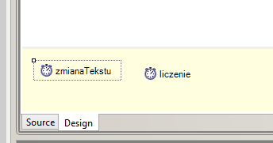
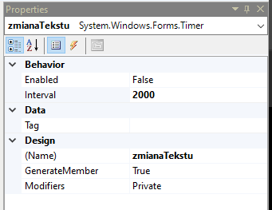
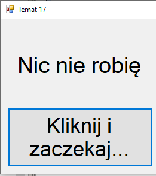
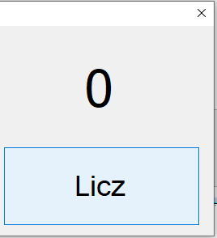
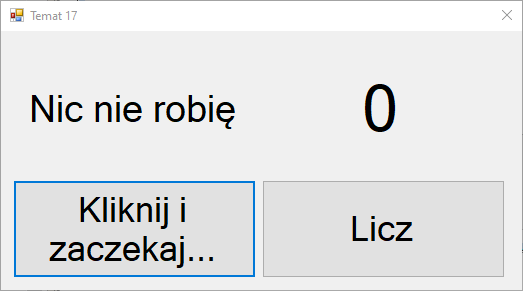

# Odmierzanie czasu

## 1. [Test](http://bit.ly/AkademiaMP_P2T3)
---
## 2. [Materiały](Materiały.pdf)
---
## 3. Liczenie czasu

Czasem w aplikacji okienkowej konieczne jest wykoanie pewnych operacji w określonych interwałach czasowych lub po odczekaniu określonego czasu. 

W tym celu służy kontrolka o nazwie `Timer`.

Po wrzuceniu kontrolki na okno aplikacji w zakładce `Design` na dole znajdziemy nasz timer.

Po wybraniu timer'a w oknie edytora okna, w zakładce properties znajdują się właściwości, w których możemy ustawić:

| Właściwość | Wartość | Opis |
|-|-|-|
|Enabled|true/false|Oznacza czy dany timer jest włączony|
|Interval|czas w milisekundach|Oznacza czas odliczany przez timer, po odliczeniu czasu wywoływany jest event `tick`, o którym niżej|
|(Name)|Nazwa kontrolki|Nazwa używana w kodzie - tak jak w przypadku poprzednich kontrolek|

Pozostałe właściwości nie są dla nas obecnie istotne.

## Używamy timera

Po skonfigurowaniu nazwy i odpowiedniego interwału możemy wygenerować zdarzenie `Tick` timera. Wykonujemy to przy pomocy kliknięcia dwa razy na ikonkę timera w zakładce design. Okna mogą posiadać wiele timerów.

Po kliknięciu dwukrotnie na timer wygeneruje nam się funkcja, która zostanie wywołana w momencie gdy DZIAŁAJĄCY timer policzy odpowiedni interwał czasowy podany w właściwościach kontrolki.

W celu uruchomienia timera możemy ustawić właściwość `Enabled` na true - wtedy timer będzie działał od momentu uruchomienia naszej aplikacji. UWAGA: będzie on od tego momentu odliczał czas i wykonywał zadania wewnątrz eventu `Tick`. Nie jest to najlepsze rozwiązanie.

Najlepiej sterować timerem z poziomu kodu aplikacji. W tym celu używamy dwóch funkcji:

|Nazwa Funkcji|Opis działania|
|-|-|
|*nazwa_timera*.Start()| Uruchamia timer |
|*nazwa_timera*.Stop()| Zatrzymuje timer |

Funkcję Stop można wywołać na przykład wewnątrz funkcji Tick w celu zatrzymania timera po odliczeniu jednego interwału czasowego.

## Ćwiczenie 1 - zmiana tekstu po chwili

1. Dodaj do okna Label, Button oraz Timer.
2. Timer nazwij (przy pomocy właściwości (Name)): `zmianaTekstu`.
3. Ustaw interwał czasowy timera tak aby odliczał 2 sekundy. Pamiętaj, że timer liczy w milisekundach!
4. Przycisk nazwij: `zmianaTekstuPrzycisk`
5. Ustaw tekst przycisku na: *Kliknij i zaczekaj...*
6. Label nazwij: `tekst`
7. Ustaw tekst Label'a na: `"Nic nie robię"`
8. Kliknij dwa razy na przycisk aby dodać zdarzenie kliknięcia. W kodzie uruchom dodany timer za pomocą funkcji przedstawionej w materiałach.
9. Wróć do zakładki *Design*
10. Kliknij dwukrotnie na Timer. I dodaj zdarzenie, w którym:
   1. Ustawisz tekst Label'a na wybrany inny tekst.
   2. Zatrzymaj Timer za pomocą funkcji przedstawionej w materiałach.
11. Spróbuj uruchomić program wciśnij przycisk i odczekaj 2 sekundy. Czy tekst się zmienił?

## Ćwiczenie 2 - licznik 

Funkcja stop może również być wywoływana w innych miejscach. W ten sposób możemy zrobić prosty licznik sekund. Ćwiczenie wyknaj na tym samym projekcie aplikacji co poprzednie zadanie. 
1. Dodaj do aplikacji: Label, Button oraz Timer
2. Timer nazwij (przy pomocy właściwości (Name)): `liczenie`
3. Ustawi interwał czasowy w timerze tak, aby odliczał on 1 sekundę.
4. Przycisk nazwij: `LicznikPrzycisk`
5. Ustaw tekst przycisku na: *Licz*
6. Label nazwij: `licznik`
7. Ustaw tekst Label'a na: `"0"`
8. Kliknij na przycisk licznika dwukrotnie aby stworzyć zdarzenie dla kliknięcia na przycisk.
9. W kodzie aplikacji nad funkcją `public MainForm()` dodaj zmienną: `int stanLicznika = 0;`
10. W kodzie obsługującym przycisk wykonaj poniższe kroki:
   1.  Sprawdź przy pomocy właściwości `Enabled` czy timer jest aktywny:
       1.  JEŻELI JEST AKTYWNY: 
           1.  Zatrzymaj timer.
           2.  Wyzeruj wartość zmiennej `stanLicznika`
           3.  Ustaw tekst Label'a. Podpowiedź: `stanLicznika.ToString()`
        1. JEŻELI JEST **NIE**AKTYWNY - po prostu go uruchom za pomocą funkcji `Start()`.
11. Wróć do zakładki *Design* i kliknij dwukrotnie na dodany w tym ćwiczeniu timer aby dodać zdarzenie `Tick`
12. Wewnątrz zdarzenia wykonaj poniższe kroki:
    1.  Zwiększ wartość zmiennej `stanLicznika` o 1.
    2.  Ustaw tekst kontrolki Label według wartości zmiennej `stanLicznika`. Podpowiedź: `stanLicznika.ToString()`.
13. Uruchom program i wciśnij przycisk *Licz*, poczekaj chwilę, licznik na Labelu powinien się zmieniać co około 1sek. Po ponownym wciśnięciu licznik powinien się zatrzymać i wyzerować. 

## Ćwiczenia DODATKOWE

1. Zmodyfikuj część dotyczącą ustawiania tekstu, tak, aby po odliczeniu czasu zmieniał się tekst na jeden, losowy tekst wybrany z kilku tekstów (wybierz sam jakie). 
2. Zmodyfikuj część dotyczącą timera.
   1. Zrób tak, aby przycisk miał domyślnie tekst "START", po kliknięciu na niego zmienił się na "STOP" i aktuwował liczenie. A po kliknięciu ponownie na ten sam przycisk, ale już z ustawionym napisem "STOP" zatrzymawał się timer i zerował.
   2. Zrób tak, aby po zatrzymaniu timera (wciśnięciu przycisku z napisem "STOP") nie zerował się licznik w Labelu, ale tekst przycisku ustawił się na "Reset" i dopiero po ponownym wciśnięciu przycisku wyzeruj licznik i ustaw tekst labela oraz tekst przycisku na "START".

---
## 4. Wysyłanie zadania.
