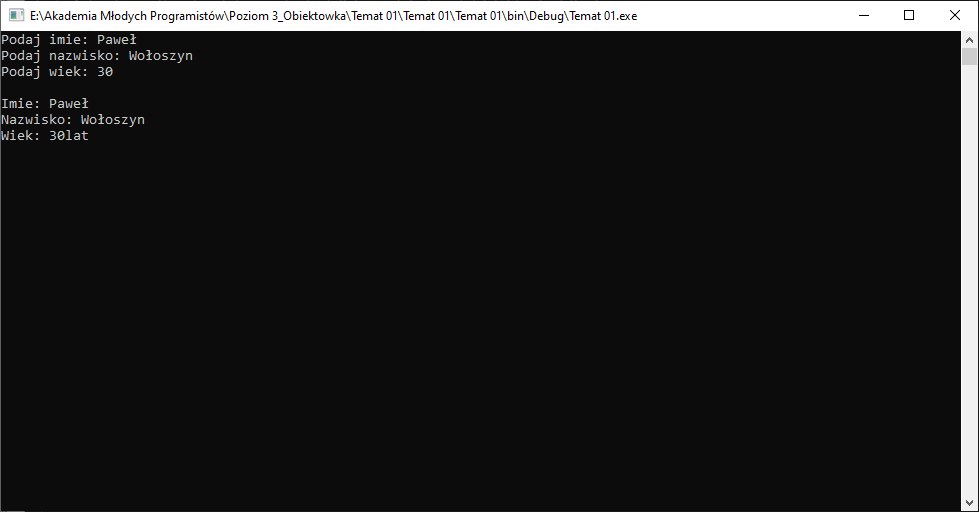
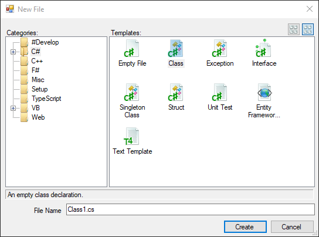
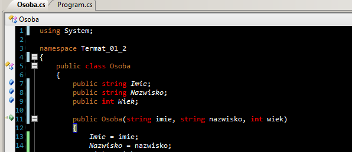
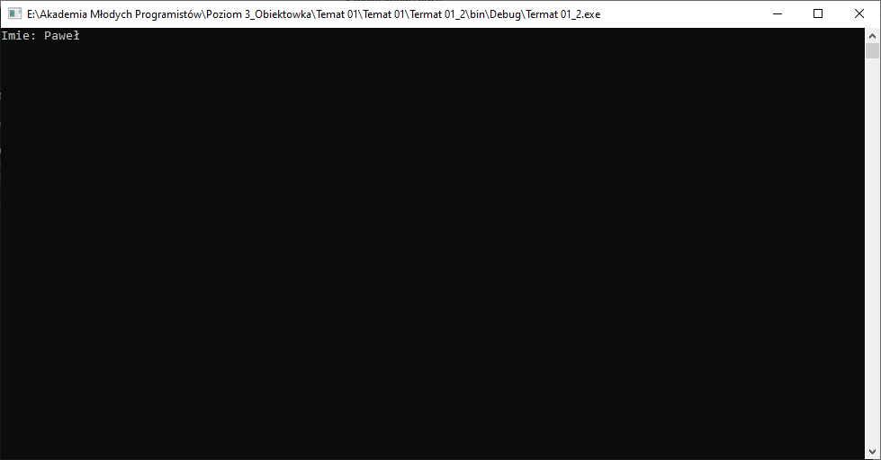
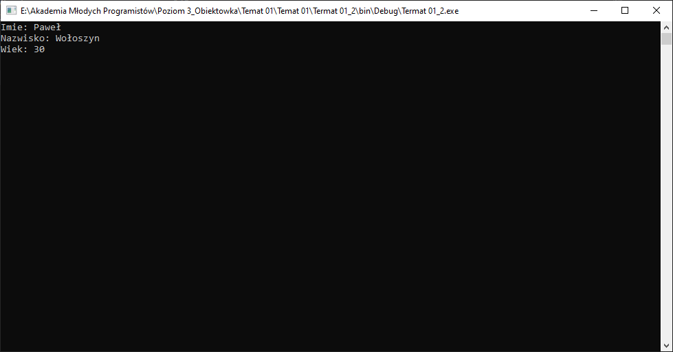
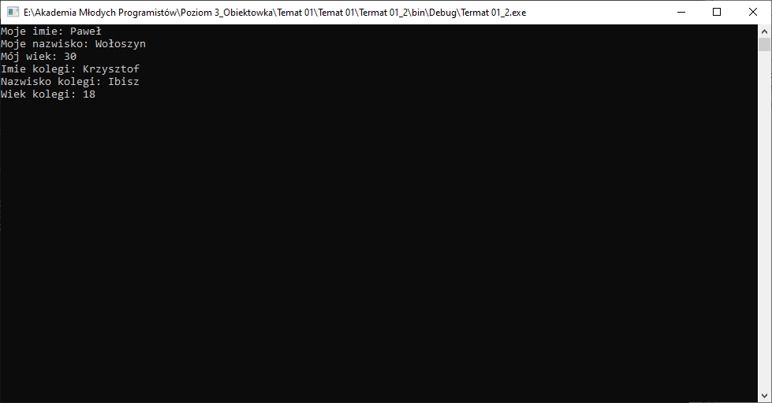

# Temat 01 - Typy proste i referencyjne

## Typ danych

W pierwszym roku nauki, na samym początku poznaliśmy kilka podstawowych typów danych. Poniżej została przygotowana tabela z typami, które poznaliśmy:

|Typ danych|Zastosowanie|
|-|-|
|int|Liczba całkowita|
|double|Liczba zmiennoprzecinkowa|
|bool|Stan: prawda/fałsz|
|char|Znak|
|String *|Ciąg znaków|

Służyły one po to, aby w pamięci komputera zarezerwować im odpowiednią ilość miejsca i móc zapisać w nich jakąś informację (ich wartość).

## Typy proste

Oprgramowanie, które tworzyliśmy dotychczas było głównie oparte o typy proste. Zwane są one również typami wartościowymi, ponieważ jak już zostało wspomniane typy te mogą zapamiętać konkretną wartość (konkretną informację).

Oprócz tego znamy również `enum`, który jest typem wartościowym. Jest to typ watroświowy-wyliczeniowy, pozwala zapamiętać kilka wartości typu int, które w kodzie mogą być reprezentowane za pomocą odwołania do nich, co jest bardziej zrozumiałe. 

### Ćwiczenie 1

Stwórz projekt aplikacji **KONSOLOWEJ** i w ramach przypomnienia stwórz aplikację, która pobieże od użytkownika dane:

1. Imie
2. Nazwisko
3. Wiek



#### Przypomnienie

|Kod|Opis|
|-|-|
|Cosnole.ReadLine()|Odczyt linijki tekstu|
|int.Parse(Console.ReadLine())|Odczyt linijki i przetworzenie wpisanego tekstu na liczbę|
|Console.WriteLine("Hello World!")|Wyświetlenie na ekranie `Hello World!`|
|Console.WriteLine("Imie: {0}", imie)|Wyświetlenie na ekranie napisu `Imie: ` oraz zawartości zmiennej `imie`|

Zapisz zadanie tak, aby je wysłać.

## Typy referencyjne (złożone)

Typy złożone, często zwane referncyjnymi to trochę bardziej rozwinięte niż typy proste (wartościowe). Wspólnym mianownikiem wszystkich typów referencyjnych jest to, że korzystają one z typów wartościowych.

Na zajęciach poznaliście już kilka typów referencyjnych. Byla to na przykład tablica:

```csharp
int[] tab = new int[10];
```

Był to też typ danych `String`. Zapis z `*` u góry dokumentu nie był bez powodu ponieważ String to tak zwana tablica znaków. Sam string pozwala nam na modyfikację tekstu, dostarcza dodatkowej funkcjonalności co również jest domeną typów złożonych (referencyjncyh).


## Pierwszy typ referencyjny

Spójrzmy na strukturę pliku programu, który został stworzony w ramach rozwiązania ćwiczenia 1:


```csharp
using System;

namespace Temat_01
{
	class Program
	{
		public static void Main(string[] args)
		{
			Console.Write("Podaj imie: ");
			string imie = Console.ReadLine();
			Console.Write("Podaj nazwisko: ");
			string nazwisko = Console.ReadLine();
			Console.Write("Podaj wiek: ");
			int wiek = int.Parse(Console.ReadLine());
			
			Console.WriteLine("\nImie: {0}", imie);
			Console.WriteLine("Nazwisko: {0}", nazwisko);
			Console.WriteLine("Wiek: {0}lat", wiek);
			Console.ReadKey(true);
		}
	}
}
```

Na samym początku mamy blok `using`, w którym wpisujemy dodatkowe linijki w celu załadowania do programu dodatkowych funkcjonalności np. 

```csharp
using System.Threading;
```

w celu użycia 

```csharp
Thread.Sleep(1000);
```

aby zatrzymać działanie programu na 1sek.

Pod tym fragmentem znajduje się blok przestrzeni nazw (`namespace`):


```csharp
namespace Temat_01
{

}
```

Blok ten pozwala dzielić projekt na pliki, a także ukrywać zawartość plików, które znajdują się w podkatalogach projektu. Jeżli ten fragment kodu w dwóch plikach jest identyczny to znaczy, że to co zapisałeś w jednym jest możliwe do użycia w drugim pliku. Przestrzenie nazw pomagają organizować kod zaawansowanych aplikacji i dzielić je na pliki.

Wewenątrz przestrzeni nazw naszego programu konsolowego znajduje się klasa o nazwie `Program`:

```csharp
class Program
{

}
```

Tutaj zatrzymamy się na chwilę, ponieważ klasa jest pierwszym typem referencyjnym (złożonym), który poznamy na zajęciach. Wewnątrz klasy program znajduje się funkcja `Main`, która obsługuje działanie całego programu. Funkcje wewnątrz klas mają swoją specyficzną nazwę, którą poznamy na kolejnych zajęciach.

### Klasy

Tak jak już zauważyliście wewnątrz klas można stworzyć funkcje, co robiliśmy dość często na zajęciach. Oprócz takich funkcji, o których trochę wiecej na kolejnych zajęciach, możemy również definiować zmienne, czyli **pola klasy**.

Klasy stosujemy po to, aby opakować pewne informacje w grupy. W pierwszym ćwiczeniu pytaliśmy o imie, nazwisko i wiek, czyli podstawowe cechy każdej osoby. Zaawansowane programy komputerowe przechowują informacje o wielu rzeczach (obiektach), więc orgnizowanie ich w klasy powoduje, że łatwiej rozpoznać konketkst w jakim działa dany fragment aplikacji. 

Tak jak w życiu wszystko ma swoją nazwę, tak też patrzymy na kogoś to wiemy, że jest to jakaś `osoba`, nasza mózg klasyfikuje to co widzimy jako właśnie taki typ "obiektu". Każda osoba posiada zestaw cech (właściwości) takich jak: imie, nazwisko czy wiek. Tych cech moglibyśmy wypisać dużo więcej na przykład: wzrost, waga, rozmiar buta itd itd., ale musimy pamiętać, że przy tworzniu oprogramowania i definiowaniu klas tworzymy tylko takie właściwości (pola klas), które będziemy wykorzystywać. Ten zabieg stosujemy po to, aby oszczędzać pamięć komputera ponieważ każde pole posiada swój typ danych który zajmuje określoną ilość miejsca w pamięci. 


#### Tworzenie klasy
W celu stworzenia reprezentacji jakiegoś obiektu, czyli klasy, w naszej aplikacji musimy wejść do menu: `Project -> Add -> New Item`

Następnie na liście po lewej stronie wybieramy `C#` oraz po prawej `Class`:



W polu `File Name` wpisujemy nazwę klasy. Nazwa powinna w oczywisty sposób informawać nas o tym co dana klasa będzie przychowywać.


#### Ćwiczenie 2 - część 1

Stwórz nowy projekt aplikacji **KONSOLOWEJ** i dodaj do niego klasę o nazwie `Osoba`.


#### Konstruktor klasy

W pierwszej cześci ćwiczenia 2 stworzyłeś pustą klasę. Spójrzmy co w niej się znajduje:


```csharp
using System;

namespace Temat_01_2
{
	public class Osoba
	{
		public Osoba()
		{
			
		}
	}
}
```

Pierwsza część to podobny fragment co w pliku `Program.cs` czyli blok `using` gdzie ładujemy dodatkowe biblioteki do naszego programu. 

Następnie znajduje się przestrzeń nazw, jest ona identyczna z tą która znajduje się w pliku `Program.cs`

Następnie pojawia się definicja nowo utworzonej klasy:

```csharp
public class Osoba
{

}
```

Wewnątrz znajduje się coś bardzo dziwnego, ponieważ jest to funkcja, ale nie posiada ona żadnego typu danych, a jej nazwa jest taka sama jak nazwa klasy. 

```csharp
public Osoba()
{

}
```

Ta funkcja to **konstruktor** pozwala ona na zapisanie w pamięci obiektu (czyli pojedynczej instancji) takiej klasy.

#### Pola klasy

Tak jak zostało wspomniane wcześniej każda klasa opisuje jakiś obiekt, który posiada swoje właściwości. Właściwości klasy nazywane są jej polami. 

Nasza osoba z ćwiczenia 1 opisywana jest przez 3 jej właściwości:
1. Imie - typ danych string
2. Nazwisko - typ danych string
3. Wiek - typ danych int

Wewnątrz pliku klasy możemy stworzyć takie właściwości, czyli pola klasy. W tym celu w ramach klamer klasy tworzymy po prostu zmienne o podanych nazwach. Dobrą praktyką jest tworzenie takich zmiennych z nazwą zaczynającą się od dużej litery. 

#### Ćwiczenie 2 - część 2

Stwórz pola (właściwości) klasy `Osoba`:

```csharp
public string Imie;
public string Nazwisko;
public int Wiek;
```

całość powinna wygląać w poniższy sposób:

```csharp
using System;

namespace Termat_01_2
{
	public class Osoba
	{
		public string Imie;
		public string Nazwisko;
		public int Wiek;

		public Osoba()
		{

		}
	}
}
```

#### Wpiszmy dane do pól klasy

Wewnątrz klasy posiadamy już pola, ale nie posiadają one żadnych informacji. Aby ustawić wartości właściwości (pól klasy) możemy użyć kontruktora, o którym było wspomniane wcześniej. Konstruktor jest specyficzną funkcją klasy, która wywoływan jest przy tworzeniu obiektu.

Możemy zatem wewnątrz tej funkcji ustawić jej własciwości na przykład zapisać w niej coś takiego:

```csharp
Imie = "Paweł";
```

cały konstruktor będzie wyglądał wtedy następująco:

```csharp
public Osoba()
{
    Imie = "Paweł";
}
```

#### Ćwiczenie 2 - część 3

Wewnątrz konstruktora klasy zainicjalizuj jej wszystkie pola (Imie, Nazwisko, Wiek) w sposób analogiczny do przedstawionego powyżej.

#### Stwórzmy pierwszą osobę

Nasza klasa powinna wyglądać teraz następująco:

```csharp
using System;

namespace Termat_01_2
{
	public class Osoba
	{
		public string Imie;
		public string Nazwisko;
		public int Wiek;
		
		public Osoba()
		{
			Imie = "Paweł";
			Nazwisko = "Wołoszyn";
			Wiek = 30;
		}
	}
}
```

Aby stworzyć obiekt naszej klasy musimy wywołać jej konstruktor i zapisać w pamięci. Tak jak tworzyliśmy zmienną tak też możemy stworzyć nasz obiekt, ponieważ nowo utworzona klasa stała się złożonym typem danych, więc możemy jej użyć tak jak typu prostego (`int`, `double` itd). W tym celu możemy zdefiniować zmienną w poniższy sposób:

```csharp
Osoba osoba1
```

a następnie zainicjalizować obiekt typu `Osoba`, czyli wywołać konstruktor przez `new NazwaKlasy()` i przyrównać do nowo tworzonej zmiennej, na przykład:

```csharp
Osoba osoba1 = new Osoba();
```

Można tego dokonać na przykład w głownej funkcji naszego programu, czyli funkcji `Main` w pliku `Program.cs`.

Nasz plik `Program.cs` jest dostępny w formie zakładki nad obaszarem edycji kodu:




#### Ćwiczenie 2 - cześć 4

Przełącz się do pliku z programem głównym (`Program.cs`) i stwórz w kodzie funkcji `Main` nowy obiekt klasy `Osoba` według powyższego opisu.

Po próbie uruchomienia powinno się to udać bez błędów.

#### Uzyskajmy dostęp do informacji w klasie

Plik `Program.cs` powinien obecnie wyglądać następująco:

```csharp
using System;

namespace Termat_01_2
{
	class Program
	{
		public static void Main(string[] args)
		{
			Osoba osoba = new Osoba();
			Console.ReadKey(true);
		}
	}
}
```

W kodzie funkcji `Main` mamy stworzoną zmienną `osoba`, który przechowuje obiekt o typie danych `Osoba`. 

Możemy teraz wykorzystać taką zmienną (obiekt). Jeśli dobrze pamiętasz z aplikacji okienkowych, aby zmienić właściwość `Text` na `Hello Wolrd` kontrolki o nazwie `textBox1` należało wykonać taki fragment kodu:

```csharp
textBox1.Text = "Hello World";
```

W tym przypadku zmienna `textBox1` to był obiekt o typie danych `TextBox`, reprezentujący bardzo zaawansowany typ danych służący do wyświetlenia kontrolki z polem tekstowym na oknie.

Wracając do przykładu z osobą. Aby uzyskać dostęp na przykład do pola (właściwości) `Imie` obiektu osoby powinniśmy wykonać:

```csharp
osoba.Imie
```

Możemy zatem wyświetlić tą informację na konsoli na przykład przez:

```csharp
Console.WrieLine("Imie: {0}", osoba.Imie);
```

W efekcie możemy zobaczyć na konsoli poniższy efekt:



Jak widzisz wewnątrz konstruktora zapisaliśmy do właściwości Imie inforamcje o swoim imieniu (dla mnie było to: `Paweł`). Świetnie nasz obiekt przechowuje informacje o osobie.

#### Ćwiczenie 2 - część 5

Za pomocą funkcji `Console.WriteLine` wyświetl na ekranie wszystkie pola (właściwosci) obiektu osoby.

Po uruchomieniu aplikacji efekt powinien wyglądać następująco:



#### Rozszerzmy konstruktor

Konstruktor jest specyficzną funkcją klasy, więc możemy w `()` konstruktora wstawić parametry, które ustawią wartości pól klasy na podstawie wartości z poza tej klasy.

Typy dla parametrów powinny być zgodne z typami zastosowanymi w polach klasy. Natomiast nazwy parametrów konstruktora powinny być zapisane z małej litery. Zatem jeśli posiadamy pole:

```csharp
public string Imie;
```

to konstruktor powinien posiadać taki parametr, który usawi wartość powużej wspomnianego pola:

```csharp
string imie
```

Konstruktor klasy `Osoba` powinien wyglądać zatem w poniższy sposób:

```csharp
public Osoba(string imie)
{

}
```

Jak zostało wspomniane wcześniej, konstruktor powinien zapisywać wartości pól klasy. Powinniśmy zatem wewnątrz konstruktora powinien wykonać operację zapisania wartości paramteru konstruktora do pola klasy:

```csharp
Imie = imie;
```

Pierwsza nazwa powyżej to nazwa pola naszej klasy, czyli `Imie` druga to nazwa parametru konstruktora `imie`. Reasumując to co przyjdzie jako parametr konstruktora jako parametr `imie` zostanie zapisane do pola `Imie`.

Całość powinna wygląać w poniższy sposób:

```csharp
public Osoba(string imie)
{
    Imie = imie;
}
```

#### Ćwiczenie 2 - część 6

Wróć do pliku `Osoba.cs`. 

Uzupełnij konstruktor klasy `Osoba` tak, aby posiadał on 3 parametry: imie, nazwisko i wiek z odpowiednimi typami. A nastepnie wartość tych parametrów zapisz do odpowiadających im pól klasy zamieniając wpisane na stałe wartości z imieniem, nazwiskiem i wiekiem na nazwy zmiennych z parametrów, które dodasz.

UWAGA! Po tym kroku program powinien przestać się kompilować!


#### Tworzenie obiektu przez kontstruktor z parametrami

Klasa `Osoba` po rozwiązaniu części 6 powinna wyglądać następująco:

```csharp
using System;

namespace Termat_01_2
{
	public class Osoba
	{
		public string Imie;
		public string Nazwisko;
		public int Wiek;
		
		public Osoba(string imie, string nazwisko, int wiek)
		{
			Imie = imie;
			Nazwisko = nazwisko;
			Wiek = wiek;
		}
	}
}
```

Tworząc obiekt klasy w pliku `Program.cs` wywołaliśmy konstruktor bez parametrów:

```csharp
Osoba osoba = new Osoba();
```

Dodając wewnątrz klasy `Osoba` parametry do konstruktora zmuszamy użytkowników naszej klasy do tego, aby podali te informacje przy tworzeniu obiektu klasy. Zatem tworzenie nowego obiektu klasy powinno wyglądać teraz (po uwzględnieniu dodanych parametów) następująco:

```csharp
Osoba osoba = new Osoba("Paweł", "Wołoszyn", 30);
```

#### Ćwiczenie 2 - cześć 7

Wróć do pliku `Program.cs` linijka tworząca zmienną `osoba` powinna być oznaczona jako błedna. Popraw wywołanie konstruktora tak, aby obiekt przechowywał informacje o Tobie. 

Program po tej cześci powinien ponownie działać, a na ekranie powinniście zobaczyć informacje na swój temat.

#### Programy mogą przechowywać wiele obiektów tej samej klasy

Plik `Program.cs` powinien po poprzedniej części ćwiczenia wyglądać podobnie do poniższego kodu:

```csharp
using System;

namespace Termat_01_2
{
	class Program
	{
		public static void Main(string[] args)
		{			
			Osoba osoba = new Osoba("Paweł", "Wołoszyn", 30);
			
			Console.WriteLine("Imie: {0}", osoba.Imie);
			Console.WriteLine("Nazwisko: {0}", osoba.Nazwisko);
			Console.WriteLine("Wiek: {0}", osoba.Wiek);
			
			Console.ReadKey(true);
		}
	}
}
```

Tak jak w przypadku typów prostych (np. `int`, `bool`) można tworzyć wiele zmiennych o tym samym typie, tak też jest w przypadku typów złożonych. Należy pamiętać również o tym, że zmienne tego typu powinny różnić się nazwami. Można zatem stwórzyć dwie zmienne:

```csharp
Osoba ja = new Osoba("Paweł", "Wołoszyn", 30);
Osoba kolega = new Osoba("Krzysztof", "Ibisz", 18);
```

i wyświetlić informacje zawarte w tych obiektach (zmiennych):

```csharp
Console.WriteLine("Moje imie: {0}", ja.Imie);
Console.WriteLine("Moje nazwisko: {0}", ja.Nazwisko);
Console.WriteLine("Mój wiek: {0}", ja.Wiek);

Console.WriteLine("Imie kolegi: {0}", kolega.Imie);
Console.WriteLine("Nazwisko kolegi: {0}", kolega.Nazwisko);
Console.WriteLine("Wiek kolegi: {0}", kolega.Wiek);
```

#### Ćwiczenie 2 - część 8

Zmień nazwę zmiennej `osoba` na `ja`, popraw wyświetlanie. Sprawdź czy obecna wersja działa poprawnie.

Dodaj nową zmienną reprezentującą obiekt osoby, który będzie przechowywał informacje na temat Twojego ulubionego znajomego. a następnie wyświetl je pod swoimi danymi.

Efekt działania programu powinien być następujący:




## Wyślij rozwiazania

Podczas zajęć stworzyłeś dwa programy w konsoli. 

Przygotuj kod źródłowy obu programów do wysyłki na podstawie [instrukcji](../ZdalneInstrukcja#wysyłanie-projektu-aplikacji-okienkowej)

Stworzone DWA załączniki wyślij na maila

Adres do wysyłki: [pawel.woloszyn@akademiamlodychprogramistow.pl](mailto:pawel.woloszyn@akademiamlodychprogramistow.pl)

Temat Maila: `Klasy - część 1`