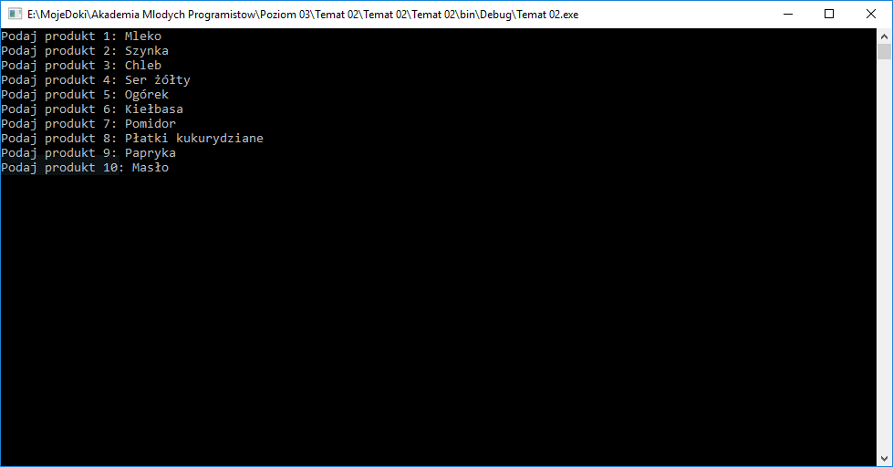
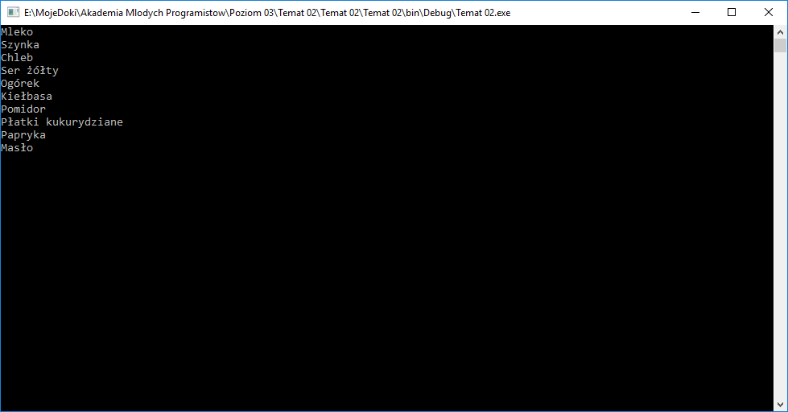
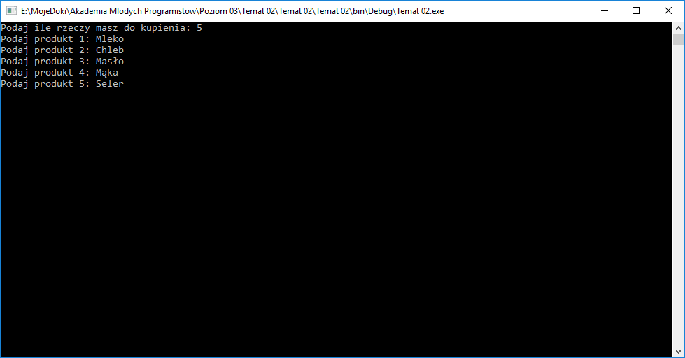
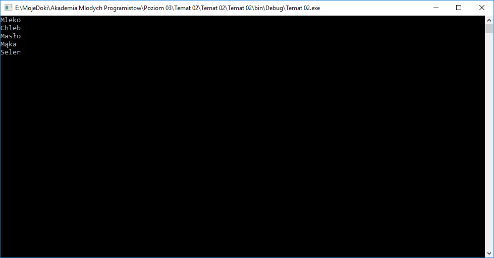
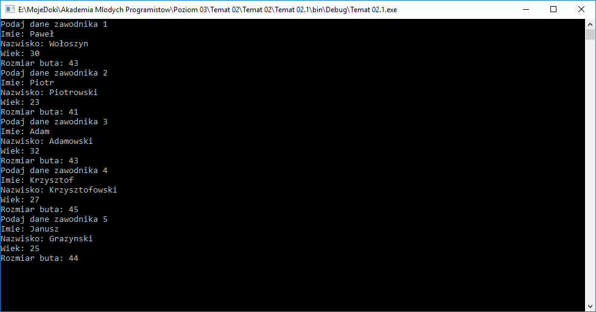
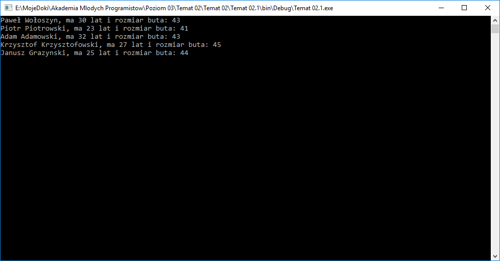

# Temat 02 - Klasy, podstawy - utrwalenie wiedzy i kolekcje obiektów - program drużyna

Na ostatnich zajęciach poznaliśmy strukturę klasy, która wygląda w poniższy sposób:

```csharp
class Osoba //Definicja klasy
{
    public string Imie; //Pole klasy
    public string Nazwisko; //Inne pole klasy
    public int Wiek;

    public Osoba(string imie, string nazwisko, int wiek) //konstruktor klasy z parametrami
    {
        Imie = imie;
        Nazwisko = nazwisko;
        Wiek = wiek;
    }
}
```

Dziś nauczymy się jak zapisać wiele osób w naszym programie i stworzymy drużynę.

## Lista

Na jednych z ostatnich zajęć, przy okazji tworzenia programu z listą zakupów nauczyliśmy się korzystać z listy, która reprezentowała naszą `listę zakupów`.

Jak zrobilibyśmy listę zakupów w konsoli?

```csharp
List<string> listaZakupow = new List<string>();
```

w celu używania list konieczne jest również załadowanie dodatkowej biblioteki. Należy na początku pliku wpisać:

```csharp
using System.Collections.Generic;
```

Jak dodalibyśmy do tej listy 5 elementów?

```csharp
for(int i = 1; i <= 5; i++)
{
    Console.Write("Podaj produkt {0}: ", i);
    string nowyElementListy = Console.ReadLine();
    listaZakupow.Add(nowyElementListy);
}
```

A jak byśmy wyświetlili wszystkie elementy tej listy?

```csharp
foreach(string elementListy in listaZakupow)
{
    Console.WriteLine(elementListy);
}
```

### Zadanie 1

Stwórz aplikację konsolową, która będzie przechowywała listę zakupów, pobierze od użytkownika 10 artykułów i zapisze je na listę zakupów, a na koniec wyczyści ekran (PRZYPOMNIENIE: `Console.Clear();`) i wyświetli listę zakupów.





## A może zapytać użytkownika ile potrzebuje wpisać elementów listy?

W poprzednim kroku wykonaliśmy prosty program, który zapisywał listę 10ciu elementów i je wyświetlał. Kod programu rozwiązującego ten problem będzie wyglądał następująco:

```csharp
public static void Main(string[] args)
{
    List<string> listaZakupow = new List<string>();
    for(int i = 1; i <= 10; i++)
    {
        Console.Write("Podaj produkt {0}: ", i);
        string nowyElementListy = Console.ReadLine();
        listaZakupow.Add(nowyElementListy);
    }
    Console.Clear();
    foreach(string elementListy in listaZakupow)
    {
        Console.WriteLine(elementListy);
    }
    Console.ReadKey(true);
}
```

Gdybyśmy jednak chcieli zmienić liczbę elementów jaką będzie miała lista zakupów, to powinniśmy zmodyfikować poniższy fragment:

```csharp
(...)
for(int i = 1; i <= 10; i++)
{
    Console.Write("Podaj produkt {0}: ", i);
    string nowyElementListy = Console.ReadLine();
    listaZakupow.Add(nowyElementListy);
}
(...)
```

Wyświetlanie odbywa się za pomocą pętli `foreach`, która wyświetli dowolną liczbę elementów z tablicy, więc jej nie musimy już modyfikować jeśli chcemy podać inną liczbę elementów. Aby użytkownik mógł podać 15 elementów pierwsza linijka powyżej przedstawionego fragmentu będzie taka:

```csharp
for(int i = 1; i <= 15; i++)
```

Zmienia się zatem wartość, która jest warunkiem działania pętli. Możemy zatem na samym początku działania naszego programu poprosić użytkownika o liczbę elementów jaka ma zostać zapisana na jego liście zakupów, np. tak:

```csharp
Console.Write("Podaj ile rzeczy masz do kupienia: ");
int liczbaElementowListy = int.Parse(Console.ReadLine());
```

A następnie za pomocą zmiennej `liczbaElementowListy` zmienić warunek działania pętli, któa przyjmie teraz poniższą formę:

```csharp
(...)
for(int i = 1; i <= liczbaElementowListy; i++)
(...)
```

W ten sposób program powinien zapytać najpierw użytkownika o to ile ma zakupów do wpisania na listę, a następnie zapytać go o te elementy i wyświetlić wszystkie.

### Zadanie 2

Dokonaj przeróbki programu z zadania 1, tak aby na początku zapytał o to ile użytkownik ma rzeczy do kupienia, a następnie zapytał go dokładnie o tyle produktów ile podał. Po wyczyszczeniu ekranu powinna wyświetlić się podana lista elementów (tak jak w poprzednim zadaniu).





#### UWAGA

Po wykonaniu zadania przygotuj program do wysłania mailowo.

## A gdyby tak stworzyć swój własny typ elementu listy?

W poprzednim ćwiczeniu tworzyliśmy listę napisów (Listę typu string):

```csharp
List<string> listaZakupow = new List<string>();
```

świadczy o tym typ `string` użyty w definicji tej listy. Typ listy możemy stosować dowolnie, może to być na przykład lista liczb typu `int` albo `double`, ale możemy też zastosować swój własny typ danych. Taki typ danych tworzyliśmy już na poprzednich zajęciach.

Jednym z tematów, które realizowane były w konsoli na pierwszym poziomie naszych zajęć były takie, na których zapisywaliśmy skład naszej drużyny. Wtedy była to tablica typu string. Możemy jedak zastosować tu własny typ danych jakim będzie członek drużyny, który ma swój zestaw cech:

1. Imie
2. Nazwisko
3. Wiek
4. Numer na koszulce

Tą listę cech możemy rozszerzać w przyszłości, ale na razie zostawmy ją tak jak powyżej, klasa reprezentująca naszego gracza będzie zatem wyglądała w poniższy sposób:

```csharp
public class CzlonekDruzyny
{
    public string Imie;
    public string Nazwisko;
    public int Wiek;
    public int NumerNaKoszulce;

    public CzlonekDruzyny(string imie, string nazwisko, int wiek, int   numerNaKoszulce)
    {
        Imie = imie;
        Nazwisko = nazwisko;
        Wiek = wiek;
        NumerNaKoszulce = numerNaKoszulce;
    }
}
```

Tak jak zostało wcześniej wspomniane możemy stworzyć w głównym programie (funkcja `Main` w pliku `Program.cs` listę, któa przechowa skład naszej drużyny w postaci elementów typu `CzlonekDruzyny`:

```csharp
List<CzlonekDruzyny> druzyna = new List<CzlonekDruzyny>();
```

Aby dodać do listy taki element musimy go stworzyć przez wywołanie konstruktora dla typu `CzlonekDruzyny`, mamy tutaj listę elementów więc spróbujmy dodać na początek 5ciu zawodników:

```csharp
for(int i=1; i<=11; i++)
{
    //Najpierw pytamy użytkownika o dane i zapisujemy je do zmiennych:
    Console.WriteLine("Podaj dane zawodnika {0}", i);
    Console.Write("Imie: ");
    string imieZawodnika = Console.ReadLine();
    Console.Write("Nazwisko: ");
    string nazwiskoZawodnika = Console.ReadLine();
    Console.Write("Wiek: ");
    int wiekZawodnika = int.Parse(Console.ReadLine());
    Console.Write("Numer na koszulce: ");
    int numerNaKoszulceZawodnika = int.Parse(Console.ReadLine());
    //Tworzymy pojedynczego zawodnika drużyny w postaci elementu klasy CzlonekDruzyny:
    CzlonekDruzyny zawodnik = new CzlonekDruzyny(imieZawodnika, nazwiskoZawodnika, wiekZawodnika, numerNaKoszulceZawodnika);
    //Dodajemy pojedynczego zawodnika do drużyny (czyli list typu CzlonekDruzyny):
    druzyna.Add(zawodnik);
}
```

W powyższy sposób możemy przechować na przykłąd skład drużyny piłkarskiej, która posiada 11 zawodników. 

### Zadanie 3

Stwórz nowy projekt aplikacji konsolwej, w której na podstawie powyższego opisu: 

1. Dodasz klasę `CzlonekDruzyny`, która:
   1. Będzie posiadała właściwości: imie, nazwisko, wiek, rozmiar buta.
   2. Konstruktor z parametrami pozwalającymi na ustawienie wspomnianych właściwości.

2. W funkcji `Main` w pliku `Program.cs`:
   1. Stworzysz listę elementów `CzlonekDruzyny` o nazwie `druzyna`
   2. W pętli:
      1. Pobierzesz dane potrzebne do stworzenia pojedynczego Członka dużyny
      2. Stworzysz pojedynczego członka drużyny jako zmienna o nazwie `zawodnik`
      3. Dodasz zmienną `zawodnik`, przechowjącą pojedynczego członka drużyny, do listy `druzyna`.
      4. Pętla powinna pobrać dane 5ciu zawodników.



## Wyświetlanie pojedynczych obiektów klasy

W zadaniu trzecim stworzyliśmy reprezentację pojedynczego członka drużyny, a także dodaliśmy do głównego programu możliwość przechowywania 5ciu członków drużyny. Klasa `CzlonekDruzyny` powinna wyglądać zatem następująco:

```csharp
public class CzlonekDruzyny
{
    public string Imie;
    public string Nazwisko;
    public int Wiek;
    public int RozmiarButa;

    public CzlonekDruzyny(string imie, string nazwisko, int wiek, int rozmiarButa)
    {
        Imie = imie;
        Nazwisko = nazwisko;
        Wiek = wiek;
        RozmiarButa = rozmiarButa;
    }
}
```

Natomiast implementacja pobierania danych w pliku `Program.cs` w funkcji `Main`:

```csharp
public static void Main(string[] args)
{
    List<CzlonekDruzyny> druzyna = new List<CzlonekDruzyny>();
    for (int i = 1; i <= 5; i++)
    {
        Console.WriteLine("Podaj dane zawodnika {0}", i);
        Console.Write("Imie: ");
        string imieZawodnika = Console.ReadLine();
        Console.Write("Nazwisko: ");
        string nazwiskoZawodnika = Console.ReadLine();
        Console.Write("Wiek: ");
        int wiekZawodnika = int.Parse(Console.ReadLine());
        Console.Write("Rozmiar buta: ");
        int rozmiarButa = int.Parse(Console.ReadLine());
        CzlonekDruzyny zawodnik = new CzlonekDruzyny(imieZawodnika, nazwiskoZawodnika, wiekZawodnika, rozmiarButa);
        druzyna.Add(zawodnik);
    }
    Console.ReadKey(true);
}
```

Tak jak w przypadku listy zakupów, gdzie typem danych był `string` wyświetlanie odbywało się za pomocą poniżej zdefiniowanego fragmentu pętli `foreach`:

```csharp
foreach(string elementListy in listaZakupow)
```

tak też możemy postąpić z elementami listy `druzyna`, których typ danych to `CzlonekDruzyny`. Wtedy definicja pętli `foreach` będzie następująca:

```csharp
foreach(CzlonekDruzyny zawodnik in druzyna)
{

}
```

Możemy zatem za pomocą tego typu pętli wyświetlić informacje o zawodniku. Pojedynczego zawodnika wyświetlalibyśmy następująco:

```csharp
Console.WriteLine("{0} {1}, ma {2} lat i rozmiar buta: {3}", zawodnik.Imie, zawodnik.Nazwisko, zawodnik.Wiek, zawodnik.RozmiarButa);
```

Ubierając to w poprzednio stworzoną pętle `foreach` całość powinna wyglądać następująco:

```csharp
foreach(CzlonekDruzyny zawodnik in druzyna)
{
    Console.WriteLine("{0} {1}, ma {2} lat i rozmiar buta: {3}", zawodnik.Imie, zawodnik.Nazwisko, zawodnik.Wiek, zawodnik.RozmiarButa);
}
```

### Zadanie 4

Zmodyfikuj program z zadania 3 tak, aby na końcu wyczyścił on ekran użytkownika i wypisał na nim dane zawodników.




### Zadanie 5*

*To jest zadanie niobowiązkowe*

Zmodyfikuj program z zadania 5 tak, aby pytał na początku o liczbę graczy w drużynie, następnie zapytaj o dane dla zadanej przez użytkownika liczby graczy, zapisz je w liście i na koniec wyczyść ekran oraz wyświetl dane wszystkich graczy.

## Podsumowanie

Na dzisiejszych zajęciach przypomnieliśmy sobie korzystanie z list, które poznaliśmy podczas poznawania aplikacji okienkowych. Następnie nauczyliśmy się tworzyć tego typu kolekcje w kodzie aplikacji. Na koniec połączyliśmy wiedzę związaną z listami z tym czego nauczyliśmy się na poprzednich zajęciach.


## Wyślij zadanie

Rozwiązane zadania wyślij z uzyciem instrukcji, którą znajdziesz [tutaj](https://pawwol90.github.io/amp/ZdalneInstrukcja#wysy%C5%82anie-projektu-aplikacji-okienkowej).

Adres email: pawel.woloszyn@akademiamlodychprogramistow.pl

Temat: `Zajęcia zdalne - 04.04.2020 - Kolekcje obiektów`
