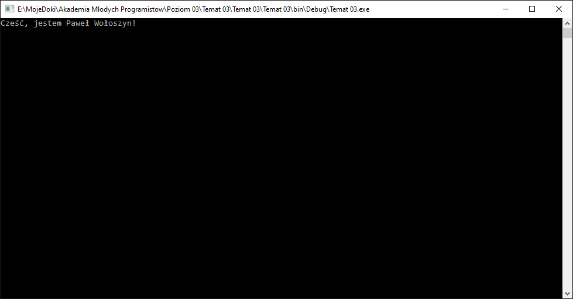
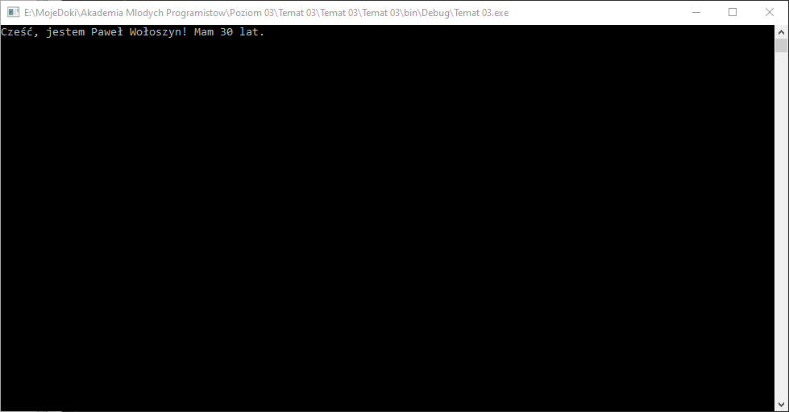
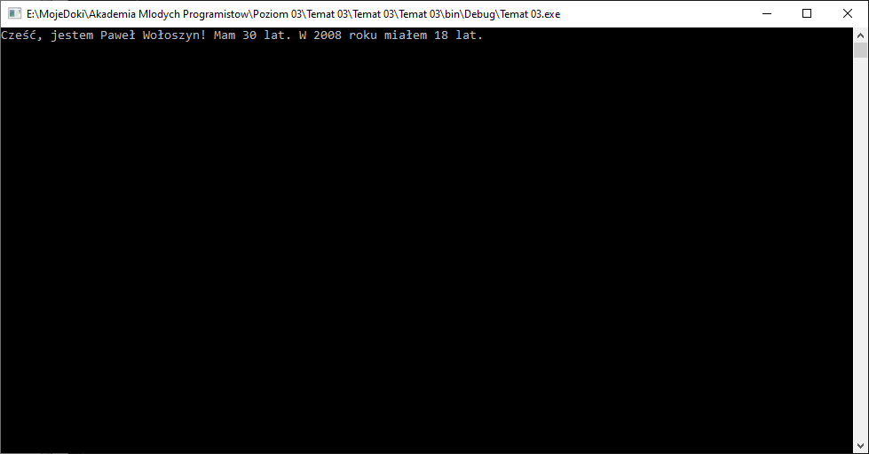

# Funkcje w klasie - metody

Na ostatnich zajęciach poznaliśmy klasy oraz dowiedzieliśmy się również że możemy tworzyć listy obiektów naszej klasy. Na dziesiejszych zajęciach poznamy dodatkową pożliwość klas, jaką jest tworzenie funkcji w ramach klasy i używanie ich w kodzie.

## Przypomnienie struktury klasy

Jak wiecie po poprzednich zajęciach, aby dodać klasę musimy w menu `Project` kliknąć `Add` -> `New Item...`, a następnie wybrać po lewej stronie katalog `C#` i następnie `Class`. Po wpisaniu nazwy klasy w dolnej części okna, np `Osoba` stworzy nam się plik z klasą o wspomnianej nazwie:

```csharp
public class Osoba //Definicja klasy
{
	public Osoba() //Konstruktor
	{

	}
}
```

Klasa posiada domyślnie konstruktor bez parametrów jest to praktycznie funkcja, króra nie ma zdefiniowanego typu:

|Funkcja|Konstruktor|
|-|-|
|`public void Funkcja() { }`|`public Osoba() { }`|

Dla funkcji `Funkcja` typ to `void` dla konstruktora zwracany typ to typ naszej klasy, czyli `Osoba`.

Do klasy możemy dodać dowolną liczbę pól, czyli właściwości obiektu. Dla przykładowej osoby może to być:
1. Imie
2. Nazwisko
3. Rok urodzenia

Pola te mogą być uzupełniane podczas tworzenia obiektu klasy, czyli za pomocą konstruktora z parametrami. Całość może prezentować się w poniższy sposób:

```csharp
public class Osoba //Definicja klasy
{
    public string Imie;
    public string Nazwisko;
    public int RokUrodzenia;

	public Osoba(string imie, string nazwisko, int rokUrodzenia) //Konstruktor z parametrami, które uzupełniają pola klasy
	{
        Imie = imie;
        Nazwisko = nazwisko;
        RokUrodzenia = rokUrodzenia;
	}
}
```

### Zadanie 1

Stwórz projekt aplikacji konsolowej oraz dodaj do niej klasę Osoba z polami: Imie, Nazwisko, Rok Urodzenia.

## Funkcje przypomnienie

Funkcje można było podzielić w następujący sposób:

||Zwracająca wartość|Nie zwracająca wartości|
|-|-|-|
|Z parametrami|`int ZwrocSume(int a, int b) { return a + b; }`|`void PokazSume(int a, int b){ Console.WriteLine("{0} = {1} + {2}", a + b, a, b); }`|
|Bez parametrów|`string ZeroSlownie() { return "Zero"; }`|`void NapiszCzesc() { Console.Writeline("Cześć"); }`|

Jak zauważyłeś w tabelce jeśli funkcja ma zwrócić jakaś wartośc zamiast słówka kluczowego `void` jest użyty typ danych jak ma "wyjść" z funkcji w miejscu jej użycia. 

Natomiast funkcja nie zwracająca wartości (`void`) nie używa słówka kluczowego `return`, które odpowiada za zwrócenie wartości z funkcji. 

## Funkcje w klasach - metody

Tak jak funkcje, które tworzyliśmy na zajęciach wcześniej, tak też w klasach dzielą sie w identyczny sposób. Jedyne o czym należy pamiętać to o słówku kluczowym `public` przed nazwą typu zwracanego z funkcji. A także o tym, że funkcja w klasie nosi nazwe: `METODA` - i tą nazwą będziemy posługiwali się w dalszej części zajęć.

Metody definiujemy zazwyczaj pod konstruktorem. W ramach metody możemy korzystać z pól klasy, mogą one korzystać również z pól które są ukryte, ale o tym na kolejnych zajęciach.

Najprostszy przykład metody to taka, która wyświetli nam imie i nazwisko naszej osoby na ekranie, więc nie pobierze żadnego parametru oraz nie zwróci żadnych danych do programu głównego - wykona tylko swoje zadanie, czyli wyświetlenie na ekranie danych:

```csharp
public void PrzedstawSie()
{
    Console.Write("Cześć, jestem {0} {1}! ", Imie, Nazwisko);
}
```

Całość powinna się prezentować w poniższy sposób:
```csharp
public class Osoba //Definicja klasy
{
    public string Imie;
    public string Nazwisko;
    public int RokUrodzenia;

	public Osoba(string imie, string nazwisko, int rokUrodzenia) //Konstruktor z parametrami, które uzupełniają pola klasy
	{
        Imie = imie;
        Nazwisko = nazwisko;
        RokUrodzenia = rokUrodzenia;
	}

    public void PrzedstawSie()
    {
        Console.WriteLine("Cześć, jestem {0} {1}! ", Imie, Nazwisko);
    }
}
```

### Zadanie 2

Napisz w klasie `Osoba` metodę dzięki, której będzie mogła się ona przedstawić, tak jak w przykładzie powyżej zadania.


## Wywołanie metody w głównym programie

Metody z klasy wywołujemy tak, jak w przypadku odwołania do poszczególnych pól klasy przez `.`. Możemy na przykłak w metody `Main` w głównym programie stworzyć obiekt osoby:

```csharp
Osoba osoba1 = new Osoba("Paweł", "Wołoszyn", 1990);
```

Teraz możemy powiedzieć osobie, aby się przedstawiła:

```csharp
osoba1.PrzedstawSie();
```

Jako, że uzupełniliśmy powyższymi linijkami główną funkcję programu (`Main`) to powinien on stworzyć w pamięci obiekt typu `Osoba` a następnie wywołać metodę tego obiektu. Wynik działania takiego kodu powinien być następujący:



### Zadanie 3

Przejdź do pliku `Program.cs` i w funkcji `Main` stwórz obiekt klasy osoba, jako parametry konstruktora podaj swoje dane (Imie, Nazwisko, RokUrodzenia). Następnie wywołaj metodę `PrzedstawSie()`.


## Metody zwracające wartość

Oprócz metody typu `void`, które nie wymagają zwracania danych można również tworzyć takie metody, które zwrócą wartość w miesjcu ich użycia.

Możemy na przykład obliczyć wiek osoby na podstawie daty urodzenia. Swórzmy zatem metodę, która zwróci wiek - wiek to liczba typu `int`, więc będziemy z metody zwracać liczbę tego typu, zatem:

```csharp
public int ObliczSwojAktualnyWiek()
{

}
```

Aktualną datę możemy pobrać następująco:

```csharp
DateTime.Now.Year
```

Obiekt osoby posiada rok urodzenia, więc wystarczy od aktualnego roku odjąć rok urodzenia:

```csharp
DateTime.Now.Year - RokUrodzenia
```

A wynik tych obliczeń po prostu zwrócić z naszej metody. Zatem jej zawartość będzie następująca (tak 1 linijka):

```csharp
return DateTime.Now.Year - RokUrodzenia;
```

### Zadanie 4

Napisz funkcję `ObliczSwojAktualnyWiek` w klasie `Osoba` (plik `Osoba.cs`) na podstawie powyższego opisu.

## Wykorzystajmy dane zwrócone z metod

Klasa po ostatnich modyfikacjach powinna wyglądać następująco:

```csharp
public class Osoba
{
	public string Imie;
    public string Nazwisko;
    public int RokUrodzenia;

	public Osoba(string imie, string nazwisko, int rokUrodzenia)
	{
        Imie = imie;
        Nazwisko = nazwisko;
        RokUrodzenia = rokUrodzenia;
	}

    public void PrzedstawSie()
    {
        Console.Write("Cześć, jestem {0} {1}! ", Imie, Nazwisko);
    }
    
    public int ObliczSwojAktualnyWiek()
    {
    	return DateTime.Now.Year - RokUrodzenia;
    }
}
```

W jednym z porzednich zadań w funkcji `Main` uruchamialiśmy metodę `PrzedstawSie`, nowa metoda `ObliczSwojAktualnyWiek` zwraca liczbę. W zadaniu dotyczącym metody `PrzedstawSie` celowo użyliśmy `Console.Write` oraz na końcu dodaliśmy spację, dla przypomnienia:

```csharp
public void PrzedstawSie()
{
    Console.Write("Cześć, jestem {0} {1}! ", Imie, Nazwisko);
}
```

Teraz obok tego napisu możemy wyświetlić wiek, ale w główny programie. Najpierw jednak musimy zmusić obiekt, aby policzył swój wiek przez wywołanie odpowiedniej metody, a następnie wypisać zapamiętany wynik działania tej metody na ekranie. Aby tego dokonać poprawnie, należy obliczony przez "osobę" wiek przechować w zmiennej i wyświetlić ją na ekranie. Zatem możemy w funkcji `Main` programu gównego (plik: `Program.cs`) najpierw napisać:

```csharp
int wiekOsoby = osoba1.ObliczSwojAktualnyWiek();
```

Następnie pamiętając, że metoda `PrzedstawSie` nie spowoduje przejścia do kolejnej linijki możemy napisać:

```csharp
Console.Write("Mam {0} lat.", wiekOsoby);
```

Obie powyższe linijki wpisane zaraz po wywołaniu funkcji "PrzedstawSie" powinny dać poniższy efekt:



### Zadanie 5

Zmodyfikuj funkcję `Main` w pliku `Program.cs` tak, aby powstał efekt przedstawiony na screenie powyżej. Postępuj zgodnie z powyższym opisem.

## Metody z parametrem - powiedz mi ile miałeś lat w roku _____

Ostatni rodzaj metod jaki poznamy to takie "funkcje" z parametrami wejściowymi. W tym celu stworzymy metodę `IleLatMialesWPodanymRoku`, która powie nam ile lat miała osoba w wybranym przez nas roku. Owy wybrany rok będzie podany jako parametr metody. Zatem w pliku z klasą `Osoba` możemy zdefiniować kolejną funkcję:

```csharp
public int IleLatMialesWPodanymRoku(int rok)
{

}
```

Teraz musimy obliczyć jaka jest różnica między rokiem urodzenia osoby, a podanym rokiem do funkcji:

```csharp
rok - RokUrodzenia
```

no i pamiętamy o słówku kluczowym `return`, które zwróci dane z metody:

```csharp
return rok - RokUrodzenial
```

### Zadanie 6

Dodaj w pliku `Osoba.cs` w klasie `Osoba` metodę `IleLatMialesWPodanymRoku` z parametrem `rok` typu `int` oraz oblicz w tej metodzie różnicę lat między rokiem urodzenia osoby a rokiem zadanym do funkcji. Postępuj zgodnie z powyżej przedstawionym opisem.


### Zadanie 7

W pliku `Program.cs` w funkcji `Main`, pod linijką w której wyświetlasz aktualny wiek obiektu osoby wywołaj metodę `IleLatMialesWPodanymRoku`. Jako parametr podaj np rok 2008. Następnie wyświetl wynik obliczeń w następujący spsób:




### Zadanie 8* - NIEOBOWIĄZKOWE

Stwórz aplikację konsolową, w której pobieżesz od użytkownika w konsoli dane 10 osób - osoba powinna być reprezentowana przez klasę `Osoba`, która będzie posiadała pola: Imie, Nazwisko, Wiek. Następnie stwórz metody klasy:

1. `PrzedstawSie` - wyswietla za pomocą `Console.Write()`: imie, nazwisko i wiek - np. `Cześć, jestem Paweł Wołoszyn! Mam 30 lat.`
2. `ObliczRokUrodzenia` - funkcja liczy rok urodzenia osoby na podstawie aktualnej daty i wieku.

W głownym programie po pobraniu danych na temat osób wykonaj funkcję `PrzedstawSie` dla każdej osoby, następnie do wyświetlonego napisu "dopisz" obok napis `Urodziłem się w 1990 roku`, gdzie `1990` to rok obliczony za pomocą funkcji `ObliczRokUrodzenia`. Całość powinna działać tak, że wyświetli 10 linijek, z danymi 10ciu osób w następujący sposób:

`Cześć, jestem Paweł Wołoszyn! Mam 30 lat. Urodziłem się w 1990 roku`

Możesz również przed powyższym napisem dodać numerek osoby od 1 do 10.

## Wyślij zadanie

Rozwiązane zadań wyślij z uzyciem instrukcji, którą znajdziesz [tutaj](https://pawwol90.github.io/amp/ZdalneInstrukcja#wysyłanie-projektu-aplikacji-konsolowej).

Adres email: [pawel.woloszyn@akademiamlodychprogramistow.pl](mailto:pawel.woloszyn@akademiamlodychprogramistow.pl)

Temat: `Zajęcia zdalne - 18.04.2020 - Metody`