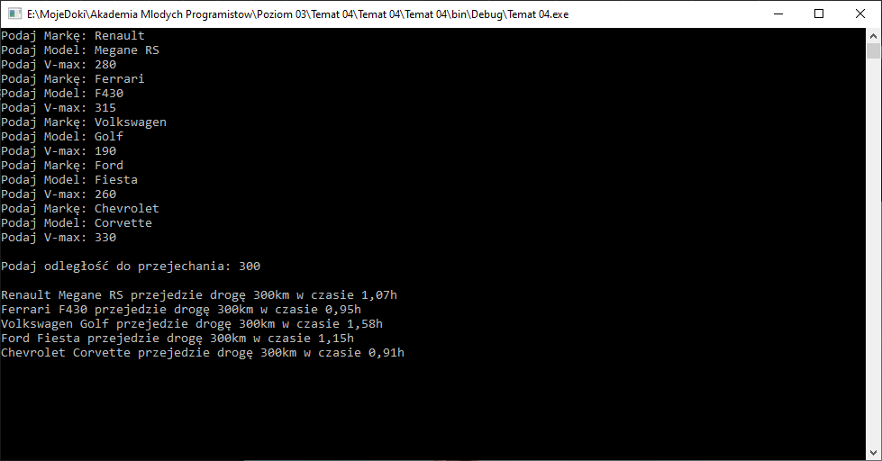

# Klasy - podstawy - Test

## Test teoretyczny

Wykonaj [test](https://bit.ly/AkademiaMP_P3T1)

## Zadanie praktyczne

Stwórz aplikację konsolową, w której znajdzie się klasa `Pojazd`. Klasa powinna posiadać trzy pola:

1. Marka
2. Model
3. Prędkość Maksymalna

Pamietaj nazwy pól, tak jak nazwy zmiennych nie mogą mieć pustych znaków np. spacj. Zmień konstruktor klasy tak aby przyjmował odpowiednią liczbę parametrów, które nadają wartość powyższym polom klasy (właściwościom).

Do klasy dodaj metodę, która na podstawie zadanej odległości obliczy czas przejazdu z predkoscia maksymalna. Niech metoda nosi nazwe `CzasPrzejazduZPredkosciaMaksymalna`. Pamiętaj

`czas = droga / predkosc`

W funkcji głownej (`Main` w pliku `Program.cs`) stwórz listę pojazdów, poproś użytkownika w pętli o dane 5ciu pojazdów i dodaj je do listy. Następnie poproś o odległość jaką pojazdy mają do przejechania i oblicz przy pomocy pętli czas przejazdu? 

Pamiętaj, że aby móc korzystać z list, należy na początku pliku `Program.cs` dodać: `using System.Collections.Generic;`

W celu poprawnych obliczeń dla prędkości maksymalnej, drogi i czasu obliczonego w metodzie zastosuj typ danych `double`.

Obrazek poglądowy, dane losowe.

## Wyślij efekty pracy

Rozwiązane zadania wyślij z uzyciem instrukcji, którą znajdziesz [tutaj](https://pawwol90.github.io/amp/ZdalneInstrukcja#wysyłanie-projektu-aplikacji-konsolowej). Pamiętaj że mail powinien zawierać pliki: `Program.cs` i `Pojazd.cs`

Adres email: [pawel.woloszyn@akademiamlodychprogramistow.pl](mailto:pawel.woloszyn@akademiamlodychprogramistow.pl)

Temat: `Zajęcia zdalne - 25.04.2020 - Test klasy`
