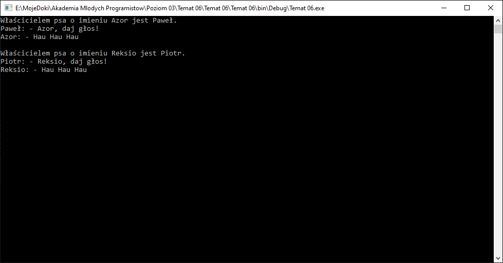
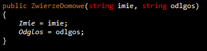
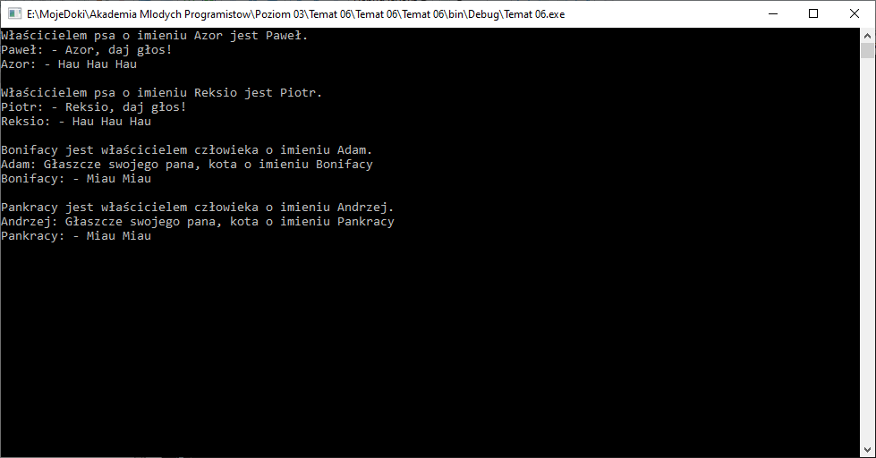
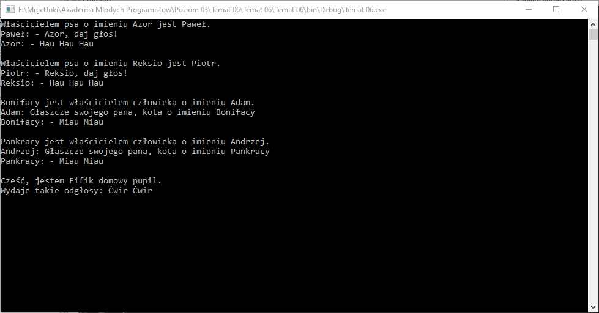

# Dziedziczenie - czyli co wspólnego ma kot z psem

Na dzisiejszych zajęciach dowiemy się o tym, że pewne cechy nasze klasy mogą być `odziedziczone` to znaczy, że mogą być dołączone do naszej klasy z innej klasy. Stworzymy dzisiaj dla naszego programu więcej niż jedną klasę. Wykorzystując mechanizm dziedziczenia możemy w liście przechowywać kilka rodzajów obiektów (kilka różnych typów danych zdefiniowanych przez nas).

## Założenia

Nasz program jako całość ma mieć za zadanie przedstawianie wszystkich zwierząt domowych jakie posiadamy. Zakładamy że w domu obecnie są tylko dwa rodzaje zwierząt: koty i psy, ale przewidujemy że w przyszłości może pojawić się jakieś inne zwierze. Każde zwierze powinno potrafić się przedstawić i wejść w interakcję z człowiekiem przez danie głosu.

## Piesek

Na początek możemy napisać klasę która bedzie reprezentowała pojedynczego pieska. Każdy pies posiada kilka cech, nas interesują następujące:

1. Imie
2. Odgłos jaki wydaje.
3. Imie swojego pana.

Wszystkie te dane możemy zapisać w klasie `Piesek` jako pola typu string:

```csharp
public class Piesek
{
    public string Imie;
    public string Odgłos;
    public string ImiePana;
}
```

Powyższy kod to coś, co znamy. Możemy oprócz pól stworzyć jeszcze konstruktor, który podczas tworzenia obiektu klasy wpisze dane do do pól. Tu będzie coś nowego, ponieważ każdy Pies, kiedy daje głos to zawsze wydaje jeden dźwięk, więc nie musimy `ręcznie` ustawiać tej właściwości:

```csharp
public class Piesek
{
    public string Imie;
    public string Odglos;
    public string ImiePana;

    public Piesek(string imie, string imiePana)
    {
        Imie = imie;
        ImiePana = imiePana;
        Odgłos = "Hau Hau Hau";
    }
}
```

Jak widzisz nasz konstruktor ma 2 parametry, a klasa ma 3 pola. Pole `Odgłos` inicjalizujemy na stałe identyczną wartością, przecież każdy pies ma identyczny odgłos - możemy tak zrobic.

### Zadanie 1

Stwórz klasę `Piesek` według opisu powyżej. Pamiętaj o tym, że klasa ma mieć 3 pola: Imie, Ogloslos, ImiePana. Pamiętaj aby konstuktor domyślnie wpisywał jedną wartość do pola `Odgłos`.

## Lista piesków

Możemy teraz stworzyć na przykład listę Piesków w pliku `Program.cs` w funkcji `Main`. Pamiętamy o dodaniu:

```csharp
using System.Collections.Generic;
```

a następnie w funkcji `Main`:

```csharp
public static void Main(string[] args)
{
    List<Piesek> pieski = new List<Piesek>();
    pieski.Add(new Piesek("Azor", "Paweł"));
    pieski.Add(new Piesek("Reksio", "Piotr"));

    Console.ReadKey(true);
}
```

### Zadanie 2

W pliku `Program.cs` stwórz listę psów a następnie dodaj do niej dowolne dwa obiekty jak w przykładzie. Pamiętaj o dodaniu odpowieniego `using` na początku pliku, tak aby działały listy.

## Odgłos psa

Możemy sprawić, aby każdy obiekt pieska, mógł sie przedstawić. W tym celu stworzymy w klasie `Piesek` metodę o nazwie `PrzedstawSie`:

```csharp
public void PrzedstawSie()
{
    Console.WriteLine("Właścicielem psa o imieniu {0} jest {1}.", Imie, ImiePana);
}
```

Sprawmy, aby nasze pieski mogły `dać głos`. Niech odbędzie sie to na zasach typowego dialogu pana z psem. W tym celu stworzymy metodę `DajGlos` w klasie `Piesek`, któa wykorzysta w tym celu pole `Odglos`:

```csharp
public void DajGlos()
{
    Console.WriteLine("{0}: - {1}, daj głos!",  ImiePana, Imie);
    Console.WriteLine("{0}: - {1}", Imie, Odglos);
}
```

Następnie możemy w pliku `Program.cs` w funkcji `Main` możemy dodać pętlę, która wykona kolejno metody `PrzedstawSie` oraz `DajGlos`. W celu odróżnienia poszczególnych zwierząt w liście dodajmy jeszcze pustą linię:

```csharp
foreach(Piesek pies in pieski)
{
    pies.PrzedstawSie();
    pies.DajGlos();
    Console.WriteLine();
}
```

### Zadanie 3

Dodaj do klasy `Piesek` dodaj metody `PrzedstawSie` oraz `DajGlos` według opisu. Następnie w programie głównym dodaj pętlę `foreach`, która wywoła te metody i doda na końcu pustą linijkę. Wynik działania programu powinien być następujący:



## Inne zwierzęta domowe - Kotki

Innym równie popularnym zwierzęciem domowym są kotki. Każdy kot posiada takie cechy:

1. Imie
2. Imie swojego podwładnego - jak wiemy każdy kot jest królem w swoim domu zatem posiada swojego podwładnego :)
3. Odgłos

Jak wiemy odgłos kotków jest, tak jak w przypadku psów, dla każdego kota taki sam `Miau Miau`. Zatem mozemy stworzyć nową klasę `Kotek` z konstruktorem, który wpisze tą wartość od razu:

```csharp
public class Kotek
{
    public string Imie;
    public string ImiePodwladnego;
    public string Odglos;

    public Kotek(string imie, string imiePodwladnego)
    {
        Imie = imie;
        ImiePodwladnego = imiePodwladnego;
        Odglos = "Miau Miau";
    }
}
```

Możemy również dodać do tej klasy metody `PrzedstawSie` i `DajGlos`:

```csharp
public void PrzedstawSie()
{
    Console.WriteLine("{0} jest właścicielem człowieka o imieniu {1}.", Imie, ImiePodwladnego);
}
```

```csharp
public void DajGlos()
{
    Console.WriteLine("{0}: Głaszcze swojego pana, kota o imieniu {1}",  ImiePodwladnego, Imie);
    Console.WriteLine("{0}: - {1}", Imie, Odglos);
}
```

### Zadanie 4

Dodaj do programu klasę `Kotek` według powyższego opisu.

## Lista kotków

Nasza funkcja `Main` w pliku `Program.cs` ma obecnie poniższą formę:

```csharp
public static void Main(string[] args)
{
    List<Piesek> pieski = new List<Piesek>();
    pieski.Add(new Piesek("Azor", "Paweł"));
    pieski.Add(new Piesek("Reksio", "Piotr"));

    foreach(Piesek pies in pieski)
    {
        pies.PrzedstawSie();
        pies.DajGlos();
        Console.WriteLine();
    }

    Console.ReadKey(true);
}
```

Pod istniejącą pętlą `foreach` możemy zatem dodać nową listę wraz z naszymi kotkami:

```csharp
List<Kotek> kotki = new List<Kotek>();
```

następnie dodać do niej kilka nowych obiektów klasy kotek:

```csharp
kotki.Add(new Kotek("Bonifacy", "Adam"));
kotki.Add(new Kotek("Pankracy", "Andrzej"));
```

na koniec dajmy możliwość przemówienia przez konsolę i dodania odstępu między nimi:

```csharp
foreach(Kotek kot in kotki)
{
    kot.PrzedstawSie();
    kot.DajGlos();
    Console.WriteLine();
}
```

### Zadanie 5

Dodaj do funkcji `Main` w pliku `Program.cs` obsługę listy kotków. Dodaj do listy minimum dwa zwierzątka z ich właścicielami, a następnie w pętli wykonaj ich metody i dodaj po ich wykonaniu jedną pustą linię tak jak w przykładzie powyżej.


## Co ma wspólnego pies i kot? - klasa ZwierzatkoDomowe

Jak już pewnie zauważyłeś jedyne czym różnią się koty i psy w naszym programie to tym, że `Piesek` ma `ImiePana` a `Kotek` ma `ImiePodwladnego`. Pozostałe części czyli:

1. Pola:
   1. Imie
   2. Odglos
2. Metody:
   1. PrzedstawSie
   2. DajGlos

sa bardzo podobne - fakt różnią się implementacją, ale ich nazwy są identyczne. Takie części wspólne możemy wydzielić do osobnej klasy `ZwierzatkoDomowe`, ponieważ każde zwierze domowe w naszym programi posiada powyższe cechy. Stwórzmy klasę `ZwierzatkoDomowe`:

```csharp
public class ZwierzeDomowe
{
    public ZwierzeDomowe()
    {

    }
}
```

dodajmy do tej klasy pola, które są częścią wspólną Kotka i Pieska, czyli:

```csharp
public string Imie;
public string Odglos;
```

Następnie w konstruktorze zainicjalizujmy ich wartości. Musimy jednak pamiętać, że każde zwierze domowe może dawać inny odgłos zatem powinniśmy dać możliwość wpisania takiej wartości do obiektu klasy `ZwierzeDomowe` przez konstruktor. W tym wypadku będzie on wyglądał następująco:

```csharp
public ZwierzeDomowe(string imie, string odglos)
{
    Imie = imie;
    Odglos = oglos;
}
```

### Zadanie 6

Stwórz trzecią klasę w programie o nazwie `ZwierzeDomowe`. Dodaj do niej pola wspólne dla klasy `Kotek` i `Piesek`, a następnie zainicjalizuj je za pomocą konstruktora tak jak omówiono to powyżej.

## Metody wspólne dla Kota i Psa

Tak jak zostało to omówione w poprzedniej części klasy `Kotek` i `Piesek` mają oprócz wspólnych pól również dwie metody, któe mają identyczną nazwę w obu przypadkach. Możemy je również dodać do naszej klasy `ZwierzeDomowe`. Musimy jednak pamiętać, że w przypadku omawianej, nowej klasy nie wiemy o jakim zwierzęciu mówimy. Musimy zatem jakoś zunifikować wypowiedzi obiektu "ZwierzeDomowe". Implmentacja metod `DajGlos` i `PrzedstawSie` dla klasy `ZwierzeDomowe` może wyglądać następująco:

```csharp
public void PrzedstawSie()
{
    Console.WriteLine("Cześć, jestem {0} domowy pupil.", Imie);
}
```

```csharp
public void DajGlos()
{
    Console.WriteLine("Wydaje takie odgłosy: {0}", Odglos);
}
```

W efekcie klasa `ZwierzeDomowe` powinna wyglądać następująco:

```csharp
public class ZwierzeDomowe
{
    public string Imie;
    public string Odglos;

    public ZwierzeDomowe(string imie, string odlgos)
    {
        Imie = imie;
        Odglos = odlgos;
    }

    public void PrzedstawSie()
    {
        Console.WriteLine("Cześć, jestem {0} domowy pupil.", Imie);
    }

    public void DajGlos()
    {
        Console.WriteLine("Wydaje takie odgłosy: {0}", Odglos);
    }
}
```

### Zadanie 7

Dodaj do klasy `ZwierzeDomowe` metody `PrzedstawSie` i `DajGlos` - tak aby wyświetlały w konsoli jakiś sensowny tekst z wykorzystaniem swoich pól.

## Dziedziczenie

Jak wiemy zarówno kot jak i pies są zwierzątkami domowymi. Zatem cechy każdego zwierzęcia domowego powinny należeć do kota i psa. Obecnie nasz kod klas `Kotek` i `Piesek` posiadają te same pola i metody co `ZwierzeDomowe` - budowaliśmy tą ostatnią klasę na podstawie tych części wspólnych.

W celu przeniesienia właściwości i metod z jednego typu (klasy) na inny stosujemy właśnie mechanizm dziedziczenia. Aby odziedziczyć coś z klasy A do klasy B należy zmienić definicję klasy B w naspujący sposób:

```csharp
public class B : A
{

}
```

od teraz każda metoda napisana w klasie A będzie dostępna do użycia w klasie B, to samo dotyczy pól klasy A - będą one również dostępne. Zatem, aby kotek stał się zwierzęciem domowym powinniśmy usunąć z niego takie pola:

```csharp
public string Imie; //Znajdź w pliku Kotek.cs i usuń taką linijkę
public string Odglos; //Znajdź w pliku Kotek.cs i usuń taką linijkę
```

Usuwamy je ponieważ za chwilkę za pomocą dziedziczenia dodamy je spowrotem tylko przy pomocy klasy `ZwierzeDomowe`. Usuwamy również ich inicjalizację z konstruktora klasy:

```csharp
public Piesek(string imie, string imiePodwladnego)
{
    Imie = imie; //TA LINIJKA JEST DO USUNIĘCIA
    Odglos = "Hau Hau Hau"; //TA LINIJKA JEST DO USUNIĘCIA
    ImiePodwladnego: imiePodwladnego;
}
```

Aby klasa `Kotek` odziedziczyła te właściwości oraz metody od klasy `ZwierzeDomowe` należy definicję klasy `Kotek` z takiej formy:

```csharp
public class Kotek
```

przerobić na:

```csharp
public class Kotek : ZwierzeDomowe
```

Czym informujemy klasę `Kotek` o tym, że od teraz jest ona klasa, która dziedziczy po klasie `ZwierzeDomowe`. Innymi słowy: klasa `ZwierzeDomowe` jest klasą bazową dla klasy `Kotek`.

Klasa `ZwierzeDomowe` posiada rónież swój konstruktor, ten powinniśmy wywołać przy okazji naszego konstruktora klasy `Kotek`. Robimy to przez słówko kluczowe `base` - oznacza ono klasę bazową - a dokładnie wywołanie konstruktora klasy bazowej. Dla `Kotka` klasą bazową jest `ZwierzeDomowe`. Klasa `ZwierzeDomowe` posiada wewnątrz siebie istotne właściwości dla kota - `Imie` oraz `Odlgos`, więc musimy im nadać wartość tak jak robiliśmy to wtedy kiedy te pola były bezpośrednio w klasie `Kotek`.

Aby tego dokonać należy zmodyfikować konstruktor. Obecnie konstuktor dla klasy `Kotek` wygląda następująco:

```csharp
public Kotek(string imie, string imiePodwladnego)
{
    ImiePodwladnego = imiePodwladnego;
}
```

To jest wersja po usunięciu pól, które dziedziczymy z klasy `ZwierzeDomowe`. Aby wywołać konstruktor klasy bazowej postępujemy podobnie jak przy nadaniu dziediczenia z tej klasy - do konstruktora klasy dziedziczącej dodajemy `:`, słówko kluczowe `base` a w `()` podajemy kolejne argumety tak jak do konstruktora klasy `ZwierzeDomowe`. Zatem nasz konstruktor będzie wyglądał następująco:

```csharp
public Kotek(string imie, string imiePodwladnego) : base(imie, "Miau Miau")
{
    ImiePodwladnego = imiePodwladnego;
}
```

Zwróć uwagę, konstruktor klasy `ZwierzeDomowe`:



Posiada argumenty `imie` oraz `odglos` i to je przekazujemy w nawiasie do `base` w klasie `Kotek`, która dziedziczy z klasy `ZwierzeDomowe`.

### Zadanie 8

Zmodyfikuj klasę `Kotek` - najpierw usuń z niej pola `Imie` i `Odglos` a następnie użyj mechanizmu dziedziczenia, aby dodać je za pomocą klasy `ZwierzeDomowe`. Na koniec zmodyfikuj konstruktor klasy `Kotek`, aby wywołał on również konstruktor klasy `ZwierzeDomowe`.

**UWAGA!** Po próbie uruchomienia pojawią się DWA błędy - TO JEST SPODZIEWANY EFEKT!

## Dziedziczenie - dodawanie możliwości nadpisywania metod

W poprzednich krokach dodaliśmy z klasy `ZwierzeDomowe` do klasy `Kotek` pola `Imie` oraz `Odglos`. Chcąc aby dowolne zwierzątko mogło się przedstawić do klasy `ZwierzeDomowe` dodaliśmy metody `PrzedstawSie` i `DajGlos` - jak pamiętasz zarówno `Piesek` jak i `Kotek` nieco inaczej realizowały działanie tych dwóch metod. Teraz w tych dwóch metodach w klasie `Kotek` mamy błędy, ponieważ metoda istnieje już w klasie dziedziczonej `ZwierzeDomowe`. Wróćmy do klasy `ZwierzeDomowe` i dodajmy odpowiedni modyfikator do metod `DajGlos` i `PrzedstawSie` tak, aby klasy dziedziczące z `ZwierzeDomowe` mogły zmieniać ich implementacje - robimy to przez dodanie słóka `virtual` w następujący sposób:

Z obecnego:

```csharp
public void PrzedstawSie()
```

Zmień na:

```csharp
public virtual void PrzedstawSie()
```

Z obecnego:

```csharp
public void DajGlos()
```

Zmień na:

```csharp
public virtual void DajGlos()
```

Teraz musimy klasie `Kotek` powiedzieć aby nadpisała implementację metody klasy `ZwierzeDomowe` na swój indywidualny sposób. Nadpisanie po angielsku to `override` i powinniśmy je dodać w klasie `Kotek` w analogiczy sposób jak dodawaliśmy przed chwilą słówko `virtual` do klasy `ZwierzeDomowe`. Zatem w klasie `Kotek` powinniśmy zaprowadzić następujące zmiany:

Z obecnego:

```csharp
public void PrzedstawSie()
```

Zmień na:

```csharp
public override void PrzedstawSie()
```

Z obecnego:

```csharp
public void DajGlos()
```

Zmień na:

```csharp
public override void DajGlos()
```

W ten sposób poinformowaliśmy klasę `Kotek`, że nadpisujemy metody `DajGlos` i `PrzedstawSie` z klasy bazowej (czyli takiej, z której dziedziczymy).

### Zadanie 9

Zmodyfikuj definicje metod klasy `ZwierzeDomowe` przy pomocy słówka kluczowego `virtual` tak, aby można było zmienić ich implementację w klasach dziedziczących z tej klasy. A nastepnie poinformuj klasę `Kotek` przy pomocy słówka kluczowego `override` o tym, że dana metoda nadpisuje jej istniejącą implementację w klasie bazowej.

**UWAGA!** Po tym ćwiczeniu powinny zniknąć błędy a program powinien działać jak dotychczas!

## Ale przecież nic się nie zmieniło

Jak już pewnie zauważyliście po uruchomieniu niemal nic się nie zmieniło. Psy i koty przedstawiają się w programie jak dotychczas. Na dodatek klasa `Piesek` ma nadal swoje właściwości `Imie` oraz `Odglos` - tak to prawda. Zmodyfikujmy ją zatem analogicznie do klasy `Kotek`. Otwórzmly plik z klasą `Piesek` a w nim.

1. Do definicji klasy dodajmy dziedziczenie z klasy `ZwierzeDomowe`:

   Z obecnego:

   ```csharp
   public class Piesek
   ```

   na:

   ```csharp
   public class Piesek : ZwierzeDomowe
   ```

2. Z klasy usuwamy nie potrzebne już pola `Imie` i `Odglos`.

   ```csharp
   public string Imie; //DO USUNIĘCIA
   public string Odglos; //DO USUNIĘCIA
   ```

3. Z konstruktora usuwamy inicjalizację tych pól.

   ```csharp
   public Piesek(string imie, string imiePana)
   {
       Imie = imie; //DO USUNIĘCIA
       Odglos = "Hau Hau Hau"; //DO USUNIĘCIA
       ImiePana = imiePana;
   }
   ```

4. Dodajemy wywołanie konstruktora klasy bazowej w konstruktorze klasy `Piesek`.

   Z obecnego:

   ```csharp
   public Piesek(string imie, string imiePana)
   ```

   na:

   ```csharp
   public Piesek(string imie, string imiePana) : base(imie, "Hau Hau Hau")
   ```

5. Dodajemy do metod `DajGlos` i `PrzedstawSie` modyfikator `override` tak, aby klasa wiedziała, że nadpisuje je z klasy bazowej:

   Z obecnego:

   ```csharp
   public void PrzedstawSie()
   ```

   na:

   ```csharp
   public override void PrzedstawSie()
   ```

   Z obecnego:

   ```csharp
   public void DajGlos()
   ```

   na:

   ```csharp
   public override void DajGlos()
   ```

### Zadanie 10

Zmodyfikuj klasę `Piesek` tak, aby dziedziczyła z klasy `ZwierzeDomowe` a także nie posiadała dziedziczonych z tej klasy pól, nie inicjalizowała ich sama i nadpisywała metody z klasy `ZwierzeDomowe`.

## Ale nadal nic się nie zmieniło

No dobrze zrobiliśmy dużo zmian, ale program działa dalej tak samo:



**ALE** teraz dokonamy największej magii i zobaczymy prawdziwą moc dziedziczenia. Jedyne miejsce, w którym jeszcze nic nie zmienialiśmy to funkcja `Main` w pliku `Program.cs`. Obecnie wygląda ona następująco:

```csharp
public static void Main(string[] args)
{
    List<Piesek> pieski = new List<Piesek>();
    pieski.Add(new Piesek("Azor", "Paweł"));
    pieski.Add(new Piesek("Reksio", "Piotr"));

    foreach(Piesek pies in pieski)
    {
        pies.PrzedstawSie();
        pies.DajGlos();
        Console.WriteLine();
    }

    List<Kotek> kotki = new List<Kotek>();
    kotki.Add(new Kotek("Bonifacy", "Adam"));
    kotki.Add(new Kotek("Pankracy", "Andrzej"));

    foreach(Kotek kot in kotki)
    {
        kot.PrzedstawSie();
        kot.DajGlos();
        Console.WriteLine();
    }

    Console.ReadKey(true);
}
```

W programie mamy dwie listy jedna, która zawiera koty a druga z psami. Teraz możemy to wszystko spokojnie usunąć. Zostawmy w funkcji main tylko oczekiawnie na klawisz, zatem powinna ona wyglądać następująco:

```csharp
public static void Main(string[] args)
{
    Console.ReadKey(true);
}
```

Zaczynamy nasz program od nowa, ALE tym razem z użyciem klasy `ZwierzeDomowe`. Zatem jako pierwsze dodajmy listę obiektów typu `ZwierzeDomowe`:

```csharp
List<ZwierzeDomowe> zwierzetaDomowe = new List<ZwierzeDomowe>();
```

A teraz najciekawsza magia, ponieważ do takiej listy możemy dodać zarówno nasze psy i koty:

```csharp
zwierzetaDomowe.Add(new Piesek("Azor", "Paweł"));
zwierzetaDomowe.Add(new Piesek("Reksio", "Piotr"));
zwierzetaDomowe.Add(new Kotek("Bonifacy", "Adam"));
zwierzetaDomowe.Add(new Kotek("Pankracy", "Andrzej"));
```

Bez dziedziczenia nie bylibyśmy w stanie dodać dwóch różnych typów danych do jednej listy, ale dlatego, że nasze klasy `Kotek` i `Piesek` dziedziczą z klasy `ZwierzeDomowe` to możemy dodać takie obiekty do listy.

W pierwotnym programie po dodaniu do listy wywoływaliśmy dla każdego obiektu w liście metody `PrzedstawSie` oraz `DajGlos`. Zatem nasza nowa pętla foreach, będzie następująca:

```csharp
foreach(ZwierzeDomowe zwierze in zwierzetaDomowe)
{
    zwierze.PrzedstawSie();
    zwierze.DajGlos();
    Console.WriteLine();
}
```

Cała funkcja `Main` naszego programu powinna teraz być o wiele krótsza:

```csharp
public static void Main(string[] args)
{
    List<ZwierzeDomowe> zwierzetaDomowe = new List<ZwierzeDomowe>();
    zwierzetaDomowe.Add(new Piesek("Azor", "Paweł"));
    zwierzetaDomowe.Add(new Piesek("Reksio", "Piotr"));
    zwierzetaDomowe.Add(new Kotek("Bonifacy", "Adam"));
    zwierzetaDomowe.Add(new Kotek("Pankracy", "Andrzej"));

    foreach(ZwierzeDomowe zwierze in zwierzetaDomowe)
    {
        zwierze.PrzedstawSie();
        zwierze.DajGlos();
        Console.WriteLine();
    }

    Console.ReadKey(true);
}
```

### Zadanie 11

Zmodyfikuj funkcję `Main` w pliku `Program.cs` tak aby korzystała z listy obiektów typu `ZwierzeDomowe` dodaj do nich kotki i pieski tak jak w opisie powyżej a następnie wywołaj w pętli metody `PrzedstawSie` i `DajGlos` dla poszczególnych elementów listy.


## A gdyby tak dodać do listy nowe "ZwierzeDomowe"

Zauważ, że dodanie pieska i uruchomienie dla niego `PrzedstawSie` i `DajGlos` powodują wywolanie tych metod z klasy `Piesek`. To samo dzieje się dla kotka, a co, gdybyśmy dodali do listy po prostu obietk typu `ZwierzeDomowe`?

Do naszej listy w funkcji `Mian` możemy dodać obiekt typu `ZwierzeDomowe`:

```csharp
zwierzetaDomowe.Add(new ZwierzeDomowe("Fifik", "Ćwir Ćwir"));
```

Wtedy uruchomią się metody bezpośrednio z tej właśnie klasy:



## Podsumowanie

Mechanizm dziedziczenia spowodował, że w klasach pozbyliśmy się części wspólnych - wydzieliliśmy je do osobnej klasy - jest to częsty zabieg, który pozwala na ograniczenie pisania tego samego kodu kilkukrotnie. Pozwala na tworzenie kolekcji obiektów o różnych typach ale podobnych właściwościach czy metodach. Oczywiście na obecnym etapie nie jesteśmy w stanie zmodyfikować specyficznych właściwości Kotka czy Pieska w takiej kolekcji, ale w przyszłości być może tego również się nauczymy.

## Wyślij efekty pracy

Rozwiązane zadania wyślij z uzyciem instrukcji, którą znajdziesz [tutaj](https://pawwol90.github.io/amp/ZdalneInstrukcja#wysyłanie-projektu-aplikacji-konsolowej).

Adres email: [pawel.woloszyn@akademiamlodychprogramistow.pl](mailto:pawel.woloszyn@akademiamlodychprogramistow.pl)

Temat: `Zajęcia zdalne - 17.05.2020 - Dziedziczenie`
