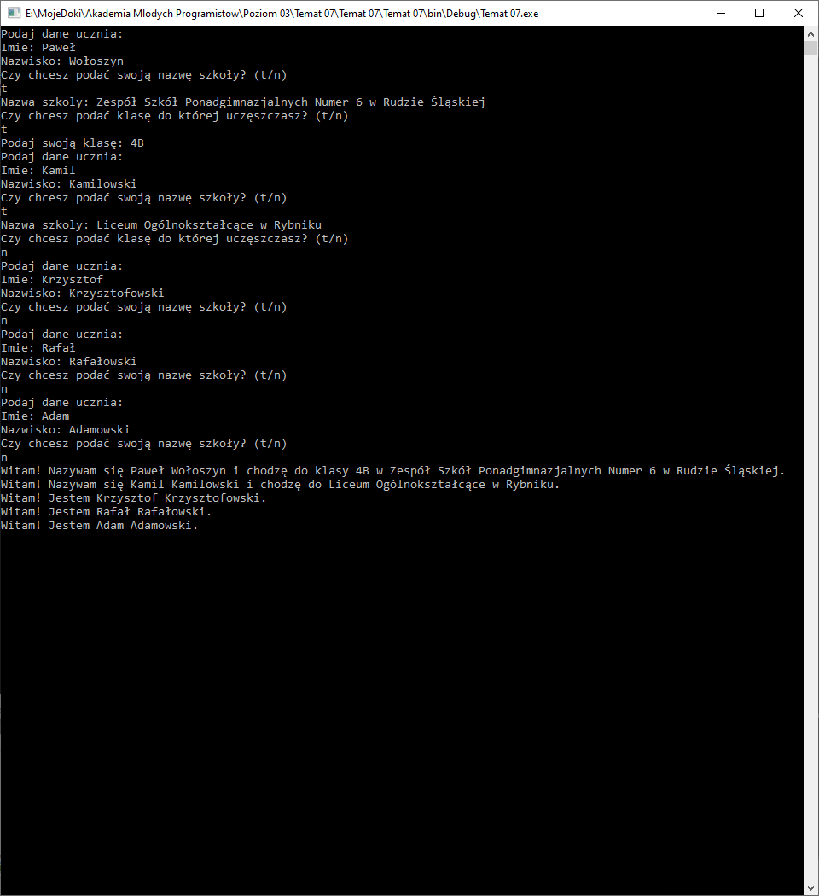

# Dziedziczenie - ćwiczenia

Na ostatnich zajęciach poznaliśmy mechanizm dziedziczenia. Najpierw stworzyliśmy dwie klasy Piesek i Kotek, które miały pewne cechy wspólne i te cechy wspólne wyciągneliśmy z tych klas o poziom wyżej do klasy `ZwierzeDomowe`, z któego następnie dziedziczyliśmy.

Na dzisiejszych zajęciach oprócz ćwiczenia naszego mechanizmu dziedziczenia dowiemy się, że mechanizm dziedziczenia może działać jeszcze głębiej, czyli "obiekt B dziedziczacy po A, może być odziedziczony przez C" - brzmi skomplikowanie, ale zobaczmy.

## Omówienie

Stworzymy program, któy będzie mógł przechować listę uczniów różnych klas i szkół. Każdy uczeń musi podać swoje imie i nazwisko, jeśli będzie chciał może podać nazwę szkoły do której chodzi. A dodatkowo, również jeśli będzie chciał, może podać klasę do jakiej uczęszcza.

Do zrealizowania zadania stworzymy 3 klasy (ich implementacja zostanie omówiona w kolejnych krokach):

1. `Uczen` - podstawowy obiekt, który będzie przechowywał imie i nazwisko ucznia.
2. `UczenSzkoly` - obiekt, który będzie dziedziczył z `Uczen` i dodatkowo (oprócz imienia i nazwiska odziedziczonych z klasy `Uczen`) będzie przechowywał informację o nazwie szkoły do której uczeszcza uczen.
3. `UczenKlasy` - obiekt, który będzie dziedziczył z klasy `UczenSzkoly` i dodatkowo (oprócz Imienia, Nazwiska i NazwySzkoły odziedziczonych z klasy `UczenSzkoly`) będzie przechowywał informację o nazwie klasy.

## Uczeń - klasa podstawowa

Dodaj do projektu klasę o nazwie `Uczen`. W klasie dodaj dwa pola:

```csharp
public string Imie;
public string Nazwisko;
```

Modyfikujemy istniejący w klasie konstruktor tak aby przjmował parametry uzupełniające pola: imie i nazwisko:

```csharp
public Uczen(string imie, string nazwisko)
{
    Imie = imie;
    Nazwisko = nazwisko;
}
```

Dodatkowo dodajmy do tej klasy metodę `PrzedstawSie`, którą będzie można nadpisać przez klasy dziedziczące. Zatem:

```csharp
public virtual void PrzedstawSie()
{

}
```

Zaimplementujmy metodę `PrzedstawSie`:

```csharp
Console.WriteLine("Witam! Jestem {0} {1}.", Imie, Nazwisko);
```

### Zadanie 1

Stwórz projek aplikacji konsolowej i dodaj do niego klasę `Uczen` według opisu powyżej.

## Lista uczniow

Posiadamy już w aplikacji nową klasę `Uczen`:

```csharp
public class Uczen
{
    public string Imie;
    public string Nazwisko;

    public Uczen(string imie, string nazwisko)
    {
        Imie = imie;
        Nazwisko = nazwisko;
    }

    public virtual void PrzedstawSie()
    {
        Console.WriteLine("Witam! Jestem {0} {1}.", Imie, Nazwisko);
    }
}
```

Jak dobrze pamietasz klasa uczen bedzie baza dla pozostałych obiektów w naszej aplikacji. Możemy zatem stworzyć liste obiektów w pliku `Program.cs`

Pamiętamy o dodaniu `using`:

```csharp
using System.Collections.Generic;
```

W funkcji main możemy dodać listę:

```csharp
List<Uczen> uczniowe = new List<Uczen>();
```

Następnie w pętli możemy zapytać np o dane 5ciu uczniów:

```csharp
for(int i=0; i < 5; i++)
{
    Console.WriteLine("Podaj dane ucznia:");
    Console.Write("Imie: ");
    string imie = Console.ReadLine();
    Console.Write("Nazwisko: ");
    string nazwisko = Console.ReadLine();
    Uczen nowy = new Uczen(imie, nazwisko);
    uczniowe.Add(nowy);
}
```

Na koniec możemy w kolejnej pętli wywołać metodę `PrzedstawSie` dla każdego z uczniów:

```csharp
foreach(Uczen uczen in uczniowe)
{
    uczen.PrzedstawSie();
}
```

### Zadanie 2

Korzystając z powyższego opisu w pliku `Program.cs` dodaj liste uczniów, uzupełnij ja danymi 5ciu uczniów, a na koniec wywołaj w pętli dla każdego ucznia z listy metodę `PrzedstawSie`.


## UczenSzkoly - a co jeśli uczen chce podać informację o szkole?

Teraz chcielibyśmy dodać możliwość przechowywania w liście Uczniów również takich uczniów, którzy chcą podać dobrowolnie nazwę swojej szkoły. Najpier musimy jednak stworzyć definicję obiektu `UczenSzkoly`, czyli klasę o wspomnianej nazwie.

Klasa będzie dziedziczyła z klasy `Uczen`, zatem definicję klasy `UczenSzkoly` modyfikujemy tak, aby:

```csharp
public class UczenSzkoly : Uczen
```

Jako, że klasa `Uczen` posiada w konstruktorze dwa parametry musimy je dodać do naszego konstruktora klasy `UczenSzkoly` i wywołać konstruktor bazowy. Zatem konstruktor klasy `UczenSzkoly` modyfikujemy następująco:

```csharp
public UczenSzkoly(string imie, string nazwisko) : base(imie, nazwisko)
{
}
```

Ciekawosta: obecnie klasa `UczenSzkoły` ma identyczną implementację co klasa `Uczen`. Natomiast uczen szkoły powinien podać dodatkowo informację o nazwie swojej szkoły. Musimy zatem do klasy dodać pole:

```csharp
public string NazwaSzkoly;
```

Aby wpisać wartość do tego pola musimy w konstruktorze dodać odpowiedni parametr i zapisać go w tym polu. Konstruktor obecnie wygląda tak:

```csharp
public UczenSzkoly(string imie, string nazwisko) : base(imie, nazwisko)
{
}
```

po dodaniu pola powinien wylgądać tak:

```csharp
public UczenSzkoly(string imie, string nazwisko, string nazwaSzkoly) : base(imie, nazwisko)
{
    NazwaSzkoly = nazwaSzkoly;
}
```

Jako, że uczeń szkoły posiada dodatkową informację o sobie to może przedstawiać się nieco inaczej. Dodajmy zatem do klasy `UczenSzkoly` nadpisanie do metody `PrzedstawSie`:

```csharp
public override void PrzedstawSie()
{

}
```

A następnie zaimplementujmy ją następująco:

```csharp
Console.WriteLine("Witam! Nazywam się {0} {1} i chodzę do {2}.", Imie, Nazwisko, NazwaSzkoly);
```

### Zadanie 3

Dodaj do projektu klasę `UczenSzkoly` który bedzie dziedziczył z klasy `Uczen` i dokładał do ucznia informację o nazwie szkoły. Uczeń szkoły powinien przedstawiać się nieco inaczej niż zwykły uczeń ponieważ chce on podzielić się nazwą szkoły do której uczęszcza. Postępuj według opsiu powyżej.

## Dodawanie uczniow szkoły

W programi powinniśmy posiadać dwie klasy:

`Uczen`:

```csharp
public class Uczen
{
    public string Imie;
    public string Nazwisko;

    public Uczen(string imie, string nazwisko)
    {
        Imie = imie;
        Nazwisko = nazwisko;
    }

    public virtual void PrzedstawSie()
    {
        Console.WriteLine("Witam! Jestem {0} {1}.", Imie, Nazwisko);
    }
}
```

`UczenSzkoly`, który dziedziczy z ucznia:

```csharp
public class UczenSzkoly : Uczen
{
    public string NazwaSzkoly;

    public UczenSzkoly(string imie, string nazwisko, string nazwaSzkoly) : base(imie, nazwisko)
    {
        NazwaSzkoly = nazwaSzkoly;
    }

    public override void PrzedstawSie()
    {
        Console.WriteLine("Witam! Nazywam się {0} {1} i chodzę do {2}.", Imie, Nazwisko, NazwaSzkoly);
    }
}
```

Nasz program główny (`Main`) w pliku `Program.cs` ma obecne taka strukture:

```csharp
public static void Main(string[] args)
{
    List<Uczen> uczniowe = new List<Uczen>();

    for(int i=0; i < 5; i++)
    {
        Console.WriteLine("Podaj dane ucznia:");
        Console.Write("Imie: ");
        string imie = Console.ReadLine();
        Console.Write("Nazwisko: ");
        string nazwisko = Console.ReadLine();
        Uczen nowy = new Uczen(imie, nazwisko);
        uczniowe.Add(nowy);
    }

    foreach(Uczen uczen in uczniowe)
    {
        uczen.PrzedstawSie();
    }

    Console.ReadKey(true);
}
```

Po pobraniu od użytkownika nazwiska, czyli pod linijką:

```csharp
string nazwisko = Console.ReadLine(); //POSZUKAJ TEJ LINIJKI W KODZE
```

Dodamy pytanie:

```csharp
Console.WriteLine("Czy chcesz podać swoją nazwę szkoły? (t/n)");
string decyzja = Console.ReadLine();
```

Następnie sprawdzimy czy decyzja to było `t` jak `tak`:

```csharp
if(decyzja == "t")
{

}
```

Jeśli użytkownik powie, że nie chce podawać nazwy szkoły to tworzymy zwykłego ucznia, zatem po `if` dodajemy `else`, tak aby całość wyglądała następująco:

```csharp
if(decyzja == "t")
{

}
else
{

}
```

Pod sekcją `else` znajduje się fragment kodu:

```csharp
Uczen nowy = new Uczen(imie, nazwisko); //TEN KOD JUŻ ISTNIEJE, ZNAJDŹ GO
uczniowe.Add(nowy); //TEN KOD JUŻ ISTNIEJE, ZNAJDŹ GO
```

powinien on się znaleźć w sekcji `else`:

```csharp
if(decyzja == "t")
{

}
else
{
    Uczen nowy = new Uczen(imie, nazwisko);
    uczniowe.Add(nowy);
}
```

Zatem jeśli użytkownik nie będzie chciał podać szkoły do jakiej uczęszcza stworzymy zwykłego ucznia. Ale jeśli uczeń zechce podać nazwę szkoły to zapytamy go o nią i stworzymy obiekt typu `UczenSzkoly`. Na koniec dodamy ucznia szkoły do listy uczniów. Wewnątrz pustej części `IF`'a przedstawionego powyżej możemy zapisać następujące:

```csharp
Console.Write("Nazwa szkoly: ");
string szkola = Console.ReadLine();
UczenSzkoly nowy = new UczenSzkoly(imie, nazwisko, szkola);
uczniowe.Add(nowy);
```

### Zadanie 4

Dodaj do programu głównego w pliku `Program.cs` pytanie o to czy uczeń chce podać nazwę szkoły. Jeśli uczeń będzie chciał podać nazwę szkoły poproś go o nią i dodaj obiekt typu `UczenSzkoly` do list uczniów. Jeśli nie będzie chciał jej podawać stwórz zwykły obiekt `Uczen` tak jak miało to miejsce dotychczas. Postępuj zgodnie z opisem powyżej.


## Uczeń Klasy - czyli taki uczeń co chce powiedzieć nam wszystko

Być może wsród naszych uczniów znajdzie się taki, który będzie chciał podać nazwę szkoły i klasę do której uczęszcza. Możemy zatem stworzyć kolejny poziom dziedziczenia: `Uczeń -> Uczeń Szkoły (zawiera elementy ucznia) -> Uczeń Klasy (zawiera elementy Ucznia i Ucznia Szkoły)`.

Możemy zatem dodać do naszego programu klasę `UczenKlasy`. Klasa powinna dziedziczyć z `UczenSzkoly`, zatem:

```csharp
public class UczenKlasy : UczenSzkoly
```

Konstruktor powinien umieć stworzyć ucznia szkoly, ten potrzebuje trzech parametrów: imie, nazwisko i nazwe szkoły:

```csharp
public UczenKlasy(string imie, string nazwisko, string nazwaSzkoly) : base(imie, nazwisko, nazwaSzkoly)
{
}
```

Obiekt typu `UczenSzkoly` nie posiada informacji o tym do jakiej klasy chodzi uczeń. Zatem powinniśmy dodać takie pole do klasy `UczenKlasy`:

```csharp
public string Klasa;
```

Następnie powinniśmy zmodyfikować konstruktor tak, aby przyjmował dodatkowy parametr `klasa` i ustawiał nim wartość nowego pola:

Obecnie konstruktor wygląda następująco:

```csharp
public UczenKlasy(string imie, string nazwisko, string nazwaSzkoly) : base(imie, nazwisko, nazwaSzkoly)
{
}
```

A powinniśmy go zmodyfikować tak:

```csharp
public UczenKlasy(string imie, string nazwisko, string nazwaSzkoly, string klasa) : base(imie, nazwisko, nazwaSzkoly)
{
    Klasa = klasa;
}
```

Uczeń klasy przedstawiając się będzie podawał oprócz nazwy szkoły do której uczęszcza jeszcze nazwę klasy. Zatem musimy znów w tej klasie nadpisać metodę `PrzedstawSie`:

```csharp
public override void PrzedstawSie()
{

}
```

A następnie ją zaimplementować adekwatnie do informacji jakimi dysponujemy w nowej klasie:

```csharp
Console.WriteLine("Witam! Nazywam się {0} {1} i chodzę do klasy {2} w {3}.", Imie, Nazwisko, Klasa, NazwaSzkoly);
```

### Zadanie 5

Dodaj do projektu klasę `UczenKlasy`, która będzie dziedzyczyła z `UczenSzkoly` i rozszerzała ją o informację na temat `Klasy` do której uczęszcza dany uczeń.

## Uczeń szkoły może chce powiedzieć do jakiej klasy chodzi w tej szkole

W aplikacji mamy obecnie już 3 klasy:

`Uczen`:

```csharp
public class Uczen
{
    public string Imie;
    public string Nazwisko;

    public Uczen(string imie, string nazwisko)
    {
        Imie = imie;
        Nazwisko = nazwisko;
    }

    public virtual void PrzedstawSie()
    {
        Console.WriteLine("Witam! Jestem {0} {1}.", Imie, Nazwisko);
    }
}
```

`UczenSzkoly`, który dziedziczy z ucznia:

```csharp
public class UczenSzkoly : Uczen
{
    public string NazwaSzkoly;

    public UczenSzkoly(string imie, string nazwisko, string nazwaSzkoly) : base(imie, nazwisko)
    {
        NazwaSzkoly = nazwaSzkoly;
    }

    public override void PrzedstawSie()
    {
        Console.WriteLine("Witam! Nazywam się {0} {1} i chodzę do {2}.", Imie, Nazwisko, NazwaSzkoly);
    }
}
```

Oraz `UczenKlasy`, która dziedziczy z `UczenSzkoly`:

```csharp
public class UczenKlasy : UczenSzkoly
{
    public string Klasa;

    public UczenKlasy(string imie, string nazwisko, string nazwaSzkoly, string  klasa) : base(imie, nazwisko, nazwaSzkoly)
    {
        Klasa = klasa;
    }

    public override void PrzedstawSie()
    {
        Console.WriteLine("Witam! Nazywam się {0} {1} i chodzę do klasy {2} w {3}.", Imie, Nazwisko, Klasa, NazwaSzkoly);
    }
}
```

Oraz program główny (funkcja `Main`) w pliku `Program.cs`:

```csharp
public static void Main(string[] args)
{
    List<Uczen> uczniowe = new List<Uczen>();

    for(int i=0; i < 5; i++)
    {
        Console.WriteLine("Podaj dane ucznia:");
        Console.Write("Imie: ");
        string imie = Console.ReadLine();
        Console.Write("Nazwisko: ");
        string nazwisko = Console.ReadLine();
        Console.WriteLine("Czy chcesz podać swoją nazwę szkoły? (t/n)");
        string decyzja = Console.ReadLine();
        if(decyzja == "t")
        {
            Console.Write("Nazwa szkoly: ");
            string szkola = Console.ReadLine();
            UczenSzkoly nowy = new UczenSzkoly(imie, nazwisko, szkola);
            uczniowe.Add(nowy);
        }
        else
        {
            Uczen nowy = new Uczen(imie, nazwisko);
            uczniowe.Add(nowy);
        }
    }

    foreach(Uczen uczen in uczniowe)
    {
        uczen.PrzedstawSie();
    }

    Console.ReadKey(true);
}
```

W momencie gdy pytamy ucznia o jego nazwę szkoły:

```csharp
Console.Write("Nazwa szkoly: "); //TEN FRAGMENT ISTNIEJE ZLOKALUZJ GO W KODZIE
string szkola = Console.ReadLine(); //TEN FRAGMENT ISTNIEJE ZLOKALUZJ GO W KODZIE
```

Możemy dodatkowo w kolejnym kroku zapytać czy chce podać klasę do której uczęszcza:

```csharp
Console.WriteLine("Czy chcesz podać klasę do której uczęszczasz? (t/n)");
decyzja = Console.ReadLine(); //ZMIENNA decyzja - JUŻ ISTNIEJE!
```

Następnie możemy sprawdzić czy użytkownik wcisnął "t":

```csharp
if(decyzja == "t")
{

}
```

Jeśli uczen nie zdecydował się na podanie klasy wykorzystamy istniejące tworzenie obiektu `UczenSzkoly` w bloku `else`, zatem:

```csharp
if(decyzja == "t")
{

}
else{
    UczenSzkoly nowy = new UczenSzkoly(imie, nazwisko, szkola); //TEN FRAGMENT JUŻ ISTNIEJE wrzuć go w blok else
    uczniowe.Add(nowy);  //TEN FRAGMENT JUŻ ISTNIEJE wrzuć go w blok else
}
```

Jeśli jednak się zdecydował to powinniśmy wewnątrz pustego bloku `IF` zapytać go o klasę, stworzyć obiekt `UczenKlasy` i dodać go do listy:

```csharp
Console.Write("Podaj swoją klasę: ");
string klasa = Console.ReadLine();
UczenKlasy nowy = new UczenKlasy(imie, nazwisko, zkola, klasa);
uczniowe.Add(nowy);
```

## Zadanie 6

Po ewentualny pytaniu o nazwę szkoły dodaj dodatkowe pytanie o klase. Jeśli uczeń zgodzi się podać klasę do jakiej uczęszcza to zapytaj go o nią i stwórz obiekt `UczenKlasy` a następnie dodaj go do listy. Posugeruj się opisem powyżej.



## Podsumowanie

Jak zauważyleś stworzyliśmy pewną strukturę, w której każda kolejna klasa dokłada do swojej klasy nadrzędnej jakąś właściwość. Taka strutkurę można by tworzyć w nieskończoność dzięki czemu od prostego obiektu z Imieniem i Nazwiskiem możemy dojść do bardzo rozbudowanych. Dodatkowo w naszym przykładzie jeśli uczeń nie chciał podać szkoły nie musieliśmy pytać o klasę ponieważ szkoła jest potrzebna do stworzenia obiektu typu UczenKlasy, wiec bez tej informacji nie mogliśmy i tak stworzyć takiego ucznia. Przydaje się to w momencie gdy w aplikacji konieczność podania jakiejś informacji zależy od podania innnej informacji.

## Wyślij efekty pracy

Rozwiązane zadania wyślij z uzyciem instrukcji, którą znajdziesz [tutaj](https://pawwol90.github.io/amp/ZdalneInstrukcja#wysyłanie-projektu-aplikacji-konsolowej).

Adres email: [pawel.woloszyn@akademiamlodychprogramistow.pl](mailto:pawel.woloszyn@akademiamlodychprogramistow.pl)

Temat: `Zajęcia zdalne - 23.05.2020 - Dziedziczenie ćwiczenia praktyczne`
