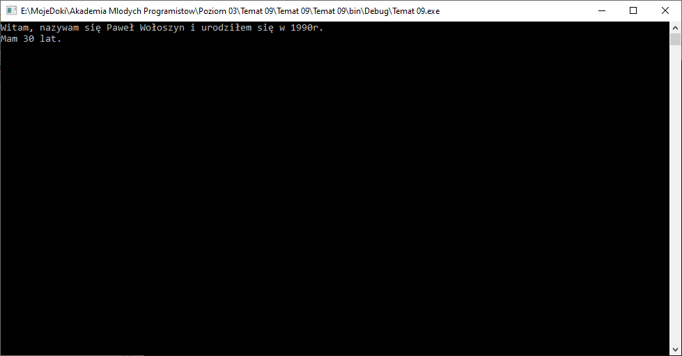
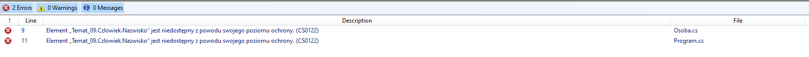

# Hermetyzacja - zaawansowane modyfikatory dostępu

## Projekt

### Zadanie 1

Stwórzmy porjekt aplikacji konsolowej. Dodajmy do niej nową klasę `Czlowiek`:

```csharp
public class Czlowiek
{
    public string Imie;
    public string Nazwisko;
    public int RokUrodzenia;
    public Czlowiek()
    {

    }
    public void PrzedstawSie()
    {
        Console.WriteLine("Witam, nazywam się {0} {1} i urodziłem się w {2}r.", Imie, Nazwisko, RokUrodzenia);
    }
}
```

Jak widać klasa ma publiczne pola jej konstruktor jest pusty a oprócz tego ma jedną publicznie dostępną metodę `PrzedstawSie`. Dodajmy kolejną klasę `Osoba`, która bedzie dziedziczyła po `Czlowieku`:

```csharp
public class Osoba : Czlowiek
{
    public Osoba()
    {
    }

    public void PodajWiek()
    {
        int wiek = DateTime.Now.Year - RokUrodzenia;
        Console.WriteLine("Mam {0} lat.", wiek);
    }
}
```

Jako, że klasa `Osoba` dziedziczy z `Czlowiek` to bedzie ona miała dostępne wszystkie pola z tej klasy oraz metodę `PrzedstawSie`. Zatem poniższy kod w funkcji `main` (uzupełnij kod swoimi danymi):

```csharp
public static void Main(string[] args)
{
    Osoba osoba1 = new Osoba();
    osoba1.Imie = "Paweł";
    osoba1.Nazwisko = "Wołoszyn";
    osoba1.RokUrodzenia = 1990;
    osoba1.PrzedstawSie();
    osoba1.PodajWiek();
    Console.ReadKey(true);
}
```

Pozwoli na wyświetlenie niniejszego ekranu:



### Wnioski

Mimo, że klasa `Osoba` dziedziczy z klasy `Czlowiek` to możemy zapisywać dane w polach klasy `Czlowiek`.

## Ochrońmy nazwisko człowieka - modyfikator: protected

Załóżmy, że nie chcemy, aby ktoś z poza klas dziedziczących z `Czlowiek` mógł modyfikować pole `Nazwisko` - chcemy je chronić przed światem zewnętrznym, ale dać możliwość zmiany w klasach dziedziczących po `Czlowiek`. Taką klasą dziedziczącą jest na przykład klasa `Osoba`, chcielibyśmy zatem np w konstruktorze wpisać wartość do pola `Nazwisko` należącego do klasy `Czlowiek`, ale zabrać możliwość zmiany tego pola po utworzeniu obiektu `Osoba`.

Po ostatnich zajęciach zapewne nasuwa się od razu że moglibyśmy zastosować `private`. Sprawdźmy to!

### Zadanie 2

Chcemy aby klasa dziedzicząca z `Czlowiek` (czyli nasza klasa `Osoba`) mogła modyfikować nasze nazwisko, zatem możemy znaleźć konstruktor kasy `Osoba`, który obecnie wygląda tak:

```csharp
public Osoba()
{

}
```

Jako, że za chwilę zabronimy możliwości modyfikacji pola `Nazwisko` z zewnątrz to niech powyższy kostruktor będzie miał taką formę:

```csharp
public Osoba(string nazwisko)
{
    Nazwisko = nazwisko;
}
```

Przed uruchomieniem musimy wrócić jeszcze do głównego programu (do funkcji `Main`) i w pierwszej linijce, gdzie tworzyliśmy obiekt typu `Osoba`:

```csharp
Osoba osoba1 = new Osoba();
```

musimy teraz wpisać parametr do konstruktora, za tem powyższą linijkę zmieniamy na:

```csharp
Osoba osoba1 = new Osoba("Wołoszyn");
```

---

Używamy już pola klasy `Czlowiek` wewnątrz klasy `Nazwisko`, ale w funkcji main mamy taka linijkę:

```csharp
osoba1.Nazwisko = "Wołoszyn";
```

Program działa, a my chcieliśmy uchronić naszą aplikację przed taką możliwością. Na pewno nikt z nas za pół roku nie bedzie pamiętał, że nie modyfikujemy tego pola ręcznie. Musimy to zabezpieczyć już teraz.

Pole `Nazwisko` jest w klasie `Czlowiek`, na poprzednich zajęciach poznaliśmy już modyfikator dostępu, który ukrywał pola klasy przed użytkiem na zewnątrz.

### Zadanie 3

Sprawdźmy zatem czy modyfikacja pola `Nazwisko` w klasie `Czlowiek` z:

```csharp
public string Nazwisko;
```

na

```csharp
private string Nazwisko;
```

---

Po modyfikacji i próbie uruchomienia mamy dwa błędy:



Zapomnieliśmy usunąć z głównego programu z funkcji `Main` linijkę:

```csharp
osoba1.Nazwisko = "Wołoszyn";
```

Usuńmy ją.

ALE CO TO! Dalej pozostaje błąd:


Bład jest w pliku z klasą `Osoba`, no tak przecież w konstruktorze używamy pola `Nazwisko`, ALE CHCEMY TO ROBIĆ! Jaki jest wniosek: modyfikator private nie nadaje się do takiej operacji ponieważ całkowicie ukrywa takie pole wewnątrz siebie. W celu udostępnienia dla klas dziedziczących takiego pola musimy na nim zastosować modyfikator `protected`, czyli oznaczyć dane pole jako chronione - daje to możliwości na jakich nam zależy.

### Zadanie 4

Wróćmy do klasy `Czlowiek` i zmodyfikujmy:

```csharp
private string Nazwisko;
```

na:

```csharp
protected string Nazwisko;
```

Uruchamiamy!

Działa!

WNIOSEK: modyfikator `protected` w klasie `Czlowiek` pozwolił klasie `Osoba` modyfikować pole oznaczone owym modyfikatorem.

## Wyślij efekty pracy

Rozwiązane zadania wyślij z uzyciem instrukcji, którą znajdziesz [tutaj](https://pawwol90.github.io/amp/ZdalneInstrukcja#wysyłanie-projektu-aplikacji-konsolowej).

Adres email: [pawel.woloszyn@akademiamlodychprogramistow.pl](mailto:pawel.woloszyn@akademiamlodychprogramistow.pl)

Temat: `Zajęcia zdalne - 06.06.2020 - Hermetyzacja zaawansowane`
