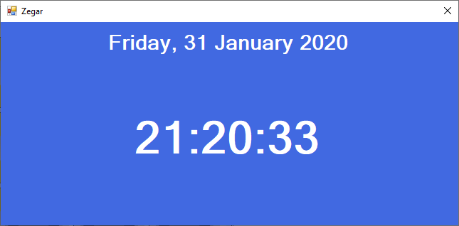

# Temat 19 - zegarek

## [Materiały](Timer_Materialy.pdf)

## Zadanie

Wykonaj projekt aplikacji zegarka z datownikiem. 

Najpierw podstawowa wersja bazująca na dosępnych właściwościach:

1. Na okno pustego projektu aplikacji okienkowej dodaj dwa labelki i sformatuj według obrazka.



2. Pierwszy z nich niech nazywa się: `data`. Ustaw odpowiednią wielkość czcionki oraz ustaw tak aby tekst pojawiał się na środku etykiety i okna.
3. Drugi niech nosi nazwę: `zegar`. Ustaw odpowiednią wielkość czcionki oraz ustaw tak aby tekst pojawiał się na środku etykiety i okna.
4. Dodaj do aplikacji timer i nazwij go: `czas` oraz ustaw go jako automatycznie uruchomiony. Ustaw interwał na 1sek (1000ms).
5. Dodaj obsługę zdarzenia do timera.
6. NOWOŚĆ: Aby pobrać aktualną datę z systemu użytkownika należy użyć zmiennej typu DateTime w poniższy sposób:
```DateTime dt = DateTime.Now;```
7. Z zmiennej `dt` można wyciągnąć poszczególne składowe daty i czasu, które zostały przedstawione w materiałach.
8. Na początku pokażmy samą godzinę, jakie właściwości DateTime będą nam potrzebne:
   1. Hour
   2. Minute
   3. Second
9. Spróbujmy wyświetlić czas w postaci tekstu: `zegar.Text = dt.Hour + ":" + dt.Minute + ":" + dt.Second`
10. Po uruchomieniu widzimy, że czas wyświetla się nieco inaczej niż zwykle na zegarze cyfrowym - brakuje tzw. zer wiodących.
11. Dodaj za pomocą metody `.ToString("00");` zera wiodące.
12. OK! Mamy wspaniale wyświetlony czas, ale jego zapis jest dość skomplikowany.
13. Można to skrócić. Metoda `.ToString();` użyta bezpośrednio dla zmiennej dt (a nie dla jej właściwości) umożliwa formatowanie czasu. 
14. Aby wyświetlić godzinę można skrócić zapis: `zegar.Text = dt.ToString("HH:mm:ss");`.
15. Spróbujmy z datą! Jakie właściwości będą nam potrzebne:
    1.  DayOfWeek
    2.  Day
    3.  Month
    4.  Year
16. Pierwszy na ekranie pojawia się dzień tygodnia. W celu wyświetlenia dnia tygodnia sprawdzamy co znajduje się wewnątrz `dt.DayOfWeek` właściwość ta przechowuje wartości, które można porównać z enum'em o tej samej nazwie: `DayOfWeek`. W tym celu stwórzmy sobie switch'a który sprawdzi nam dzien tygodnia i wpisze jego polską nazwę do zmiennej:
```
string dzienTygodnia = "";
switch(dt.DayOfWeek)
{
    case DayOfWeek.Monday:
        dzienTygodnia = "Poniedziałek";
        break;
    case DayOfWeek.Tuesday:
        dzienTygodnia = "Wtorek";
        break;
    case DayOfWeek.Wednesday:
        dzienTygodnia = "Środa";
        break;
    case DayOfWeek.Thursday:
        dzienTygodnia = "Czwartek";
        break;
    case DayOfWeek.Friday:
        dzienTygodnia = "Piątek";
        break;
    case DayOfWeek.Saturday:
        dzienTygodnia = "Sobota";
        break;
    case DayOfWeek.Sunday:
        dzienTygodnia = "Niedziela";
        break;
}
```
17. Wyświetlamy nowo utworzoną zmienną w etykiecie: `data.Text = dzienTygodnia;`
18. Nastepnie wyświetlamy dzień miesiąca: `data.Text = dzienTygodnia + ", " + dt.Day;`
19. Dzień miesiąca znów nie ma zera wiodącego, dokładamy `ToString("00");`
20. Następnie należy ustalić nazwę miesiąca. W tym celu tworzymy kolejnego switch'a i sprawdzamy kolejne numery miesięcy:
```
string miesiac = "";
switch(dt.Month)
{
    case 1:
        miesiac = "Styczeń";
        break;
    case 2:
        miesiac = "Luty";
        break;
    case 3:
        miesiac = "Marzec";
        break;
    case 4:
        miesiac = "Kwiecień";
        break;
    case 5:
        miesiac = "Maj";
        break;
    case 6:
        miesiac = "Czerwiec";
        break;
    case 7:
        miesiac = "Lipiec";
        break;
    case 8:
        miesiac = "Sierpień";
        break;
    case 9:
        miesiac = "Wrzesień";
        break;
    case 10:
        miesiac = "Październik";
        break;
    case 11:
        miesiac = "Listopad";
        break;
    case 12:
        miesiac = "Grudzień";
        break;
}
```
21. OK, dodajmy nazwę miesiąca do wyświetlanej daty: `data.Text = dzienTygodnia + ", " + dt.Day.ToString("00") + " " + miesiac;`
22. Dodajmy rok: `data.Text = dzienTygodnia + ", " + dt.Day.ToString("00") + " " + miesiac + " " + dt.Year;`
23. Super MAMY DATE I GODZINĘ!
24. Zapis daty możemy skrócić za pomocą funkcji `ToString()` z opdowiednim formatowaniem: `data.Text = aktualnaData.ToString("dddd, dd MMMM yyyy");`
25. Wyczyść kod ze zbędnego już ustalania dnia miesiaca i nazwy miesiąca - to będzie działo się już automatycznie.
26. Zegarki często mają funkcję migania dwukropków - cykl zaświecenie i zgaszenie odbywa się raz na sekundę. Możemy to zasymulować:
    1.  Nad funkcją obsługującą timer dodaj zmienną `bool PokazDwukropki = false;`
    2.  Aktualne miejsce gdzie wyświeltamy jest czas należy zmodyfikować:
    
    ```
    if(PokazDwukropki)
	{
		zegar.Text = aktualnaData.ToString("HH:mm:ss");
	}
	else
	{
		zegar.Text = aktualnaData.ToString("HH mm ss");
	}
	PokazDwukropki = !PokazDwukropki;
    ```

    3. Dwukropek powinien pojawić się i zniknąć w czasie 1sek, należy zmienić interwał timera na 500ms, tak aby zmiania odbywała się co 0,5sek.