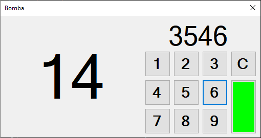
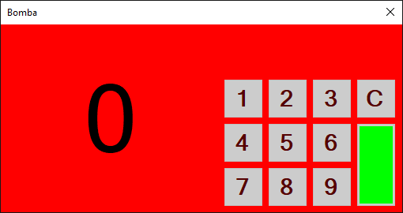

# Test - Kontrolki RichTextBox + Timer

## Test
[Wykonaj test](http://bit.ly/AkademiaMP_P2T4)

## Zadanie - Bomba



Napisz program symulujący bombę, którą zdeaktywyje poprawnie podany kod pin (4-ro cyfrowy):

1. Po lewej stronie umieśc label, w którym będziesz odliczał sekundy do 0.
2. Po prawej stronie umieść panel z przyciskami (cyfry 1-9 oraz przycisk C i zielon) oraz Label nad przyciskami, który wyświetli kod PIN.

Stan aplikacji po uruchomieniu:
1. Timer odlicza sekundy
2. Label z pinem jest pusty
3. Użytkownik może wpisywać cyfry

Akcje przycisków:
1. Po wciśnięciu przycisku z dowolną cyfrą do tekstu labela nad przyciskami powinna dopisać się wciśnięta przez użytkownika cyfra. np.:

    ```pin.Text += "1"```
    
    dla przycisku z cyfrą `1`.
2. Po wciśnieciu zielonego przycisku należy sprawdzić proprawność kodu pin wpisanego do kontrolki Label z pin'em. Jeżeli pin jest poprawny:
   1. Zablokuj przyciski (`button.Enabled = false;`)
   2. Zmień kolor tła na zielony
   3. Zatrzymaj timer
3. Po wciśnięciu przycisku kasującego `C` label z pin'em powinien zostać wyczyszczony

Timer:
1. Powinien być ustawiony na odliczanie 1sek
2. Powinien uruchomić się automatycznie po starcie
3. Akcja timera:
   1. Odejmuje 1 sekundę ze zmiennej, w której pamiętamy ile pozostało sekund do końca
   2. Jeżli czas dojdzie do `0` to:
      1. Zablokuj przyciski (`button.Enabled = false;`)
      2. Zmień kolor tła na czerwonyu
      3. Zatrzymaj timer

