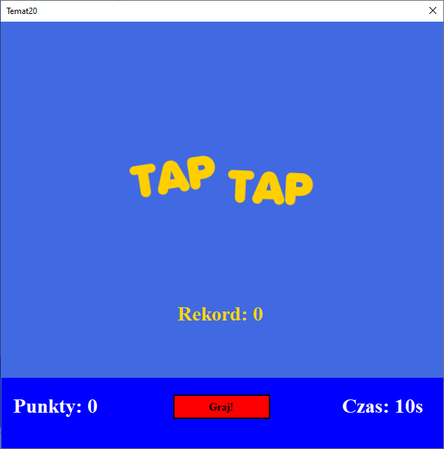

# Temat 20 - Gra Tap Tap

Zadania bazują na wiedzy z poprzednich zajęć.

## Implementacja



1. Stwórzmy puste okno, nadajmy my jakiś ciekawy kolor tła.
2. Ustawmy właściwości okna:
   1. `MinimizeBox = false` - wyłączamy minimalizację okna
   2. `MaximizeBox = false` - wyłączamy maksymalizację okna
   3. `ShowIcon = false` - ukrycie ikonki okna 
3. Ustwmy rozmiar okna - tak aby miało ono kształt kwadratu i zablokujmy przed zmianą rozmiaru:
   1. `Size = 650,650` - rozmiar domyślny
   2. `MinimumSize = 650,650` - rozmiar minimalny
   3. `MaximumSize = 650,650` - rozmiar maksymalny
4. Stwórzmy grafikę z logiem naszej gry w dowolnym programie graficznym
 - Rozmiar obrazka: 300px x 100px.
5. Dodajmy plik resources, a do niego załadujmy plik z grafiką, aby można było ją użyć.
6. Dodajemy na samym dole okna kontrolkę Panel - jest to kontrolka która pozwoli nam na zrobienie dolnej części okna z przyciskami i innymi informacjami.
7. Zmieniamy kolor tła naszego panelu tak, aby odróżnić go od pozostałej części okna.
8. Na środek pozostałej części ustawiamy kontrolkę PictureBox i ładujemy do niej nasze logo. Warto użyć `SizeMode = AutoSize` ponieważ dostosuje ono wielkość naszej kotrolki do obrazka.
9.  Dodajemy 4 kontrolki label odpowiednio dla
    1.  Aktualnego wyniku
    2.  Czasu pozostałego do konca rozgrywki
    3.  Najlepszego wyniku (patrz obrazek na górze dokumentu - `Rekord: 0`)
10. Dla każdego labela ustawiamy: domyślny text, nazwę - (Name), kolor czcionki - jednolita dla wszystkich labeli powinny być krój czcionki i jej rozmiar.
11. Dodaj przycisk `Graj!` do aplikacji - ustaw mu kolor, odpowiednią wielkość czcionki. Aby kolor przycisku zajął cały jego obszar ustaw: `FlatStyle = Flat`.
12. Dodajmy timer do naszej aplikacji, skonfugurujmy go tak, aby odliczał 1s.
13. Dodajemy do aplikacji panel w dowolnym miejscu. Ustawiamy w panelu:
    1.  `(Name) = kostka`
    2.  `Visible = false`
    3.  `Size = 40,40` - ustawi rozmiar kwadracika na 40px x 40px
    4.  `Location = 0,0` - ustawi lokalizacje kwadracika na lewy górny róg
    5.  Ustawiamy kolor tła na taki, który będzie go wyróżniał od pozostałych elementów okna.
14. Dodajmy zdarzenie kliknięcia przycisku, który:
    1.  Ukryje logo - PictureBox
    2.  Ukryje aktualny rekord.
    3.  Ustawi tekst przycisku na "Stop"
    4.  Ustawi nowo utworzoną zmienną `int` (poza funkcją przycisku): `CzasGry` na 10;
    5.  Uruchomi timer
    6.  Pokaże panel `kostka`.
15.  Dodajemy zdarzenie timera - TimerTick, w którym:
    7.  Wyświetlamy aktualny czas z zmiennej `CzasGry` w odpowiednim labelu.
    8.  Zmniejszamy wartość czasu tak, aby czas upływał do końca.
16. Po uruchomieniu i kliknięciu graj zegarek na dole powinien ruszyć, ale obecnie odlicza on również `ujemne` sekundy - naprawmy to:
    1.  W zdarzeniu timera sprawdźmy czy aktualny czas jest wiekszy od 0 i jeśli tak to wykonajmy poprzednio napisany fragment kodu.
    2.  W przeciwnym wypadku - kończymy naszą grę:
        1.  Zatrzymujemy timer
        2.  Ustawiamy tekst przycisku na `Graj!`
        3.  Pokazujemy schowane przy starcie kontrolki.
        4.  Ukrywamy panel `kostka`.
17. Zaznaczamy panel, który dodaliśmy w lewym górnym rogu (`kostka`) w zakładce Properties przełączamy sie na zdarzenia (Symbol pioruna) następnie klikamy dwukrotnie w `Click`.
18. Zdarzenie kliknięcia powinno: 
    1.  Zwiększyć nowo utworzoną zmienną `int` (poza funkcją kliknięcia): `AktualnyWynik` o 1.
    2.  Zmienić tekst labela z punktami tak aby wyświetlał on aktualny stan punktów gracza w formacie `Punkty: X`, gdzie `X` to aktualny stan.
19. Po uruchomieniu programu i rozgrywki, każde kliknięcie na kostkę na ekranie powinna zwiększać liczbę punktów. 
20. A może by tak zmieniać po każdym kliknięciu pozycję kostki w oknie?

## Location i Size

### Location

Każda kontrolka na oknie ma zapisaną informację o tym gdzie się znajduje. Są to współrzędne względem lewego górnego rogu ekranu. 

Pamietasz? Przypisywaliśmy właściwości `Location`, naszej kostki, wartość `0,0`, która spowodowała, że znalazła się ona dokładnie w rogu ekranu.

Lokalizacja wskazuje na miejsce gdzie pojawi się lewy górny róg kontrolki.

Zmieniając lokalizację obiektów należy uwzględnić rozmiar okna - jeżeli ustawimy kontrolkę poza widocznym obszarem to zniknie ona z pola widzenia użytkownika.

### Size

Jeżeli znamy już miejsce początkowe rysowania naszej kontrolki to program musi wiedzieć jeszcze dokąd powinna sięgać nasza kontrolka - jak duża powinna być. W tym celu każda kontrolka posiada właściwość: Size, która ma zapisaną informację o rozmiarze w pikselach. 

W celu ustawienia rozmiaru okna, tak aby miało ono kształt kwadratu używaliśmy właściwości `Size`, która znajduje się w wszystkich pozostałych kontrolkach dostępnych w naszym środowisku. 


## Gra - część druga

1. Obecnie po naciśnięciu naszej `kostki` na ekranie zostaja zliczone punkty. Chcemy aby `kostka` po każdym kliknięciu zmieniła swoją pozycję w ramach okna.
2. Sprawdzamy jaką lokalizację na oknie ma panel z przyciskiem i stanem gry (ten na dole okna). Zapamietujemy wartość `X` tej lokalizacji - będzie to nasz orientacyjny minimalny punkt na osi X naszego okna, w którym można narysować kwadrat.
3. Szrokość naszego okna ustawiliśmy na początku zadania, wartość `width` z właściwości `Size` okna to nasza maksymalna pozycja na osi Y.
4. Pamiętaj, że lokalizacja każdej kontrolki to jej lewy górny róg, a to oznacza, że maksymalna pozycja na osi X i Y musi być pomniejszona o rozmiar naszej kostki. W zadaniu ustaliliśmy, że będzie to 40px.
5. Teraz pora na obliczenia naszej maksymalnej lokalizacji w oknie:
```
Max_x=x-h;
Max_y=y-w;
```
gdzie:
```
x - ustalona w punkcie 2 lokalizacja panelu na dole ekranu (ten z punktami i czasem)
y - ustalona w punkcie 3 szerokość okna
h - wysokość kontrolki z kostką, w którą klikamy
w - szerokość kontrolki z kostką, w którą klikamy
```
6. Po wykonaniu obliczeń, pod aktualnymi zmiennymi globalnymi (`Czas gry` i `AktualnyWynik`) dodaj kolejne dwie zmienne typu `int` gdzie zapiszesz maksymalną lokalizację (prawy dolny róg) naszej kostki, np.:
```
int MaxX = 610;
int MaxY = 470;
```
7. Przechodzimy do funkcji obsługującej kliknięcie na panel z kostką. Pod aktualnie istniejącym kodem dopisujemy logikę:
   1.  Tworzymy obiekt do losowania: `Random rnd = new Random()`
   2.  Losujemy nową lokalizację kostki - dla X liczymy od 0 do MaxX a dla Y od 0 do MaxY
   3.  Dodajemy na górze pliku `using System.Drawing;` a w funkcji piszemy `kostka.Location = new Point(nowyX, nowyY)`, gdzie `nowyX` i `nowyY` to zmienne typu `int`, które przechowują wynik losowania z punktu 2.

## Zapamiętajmy i pokażmy najlepszy wynik.

1. Najlepszy wynik powinien pojawiać się w dwóch przypadkach:
   1. Podczas uruchamiania aplikacji
   2. Po zakończeniu rozgrywki - tutaj również powinna się zapisać jeżeli wynik rozgrywki był wyższy niż poprzedni rekord.
2. Aby przechować wynik użyjemy pliku ustawień aplikacji. W tym celu:
   1. Dodaj plik ustawiń aplikacji
   2. W pliku ustawień stwórz zmienną o nazwie `NajlepszyWynik` i typie danych INT oraz o domyślnej wartości: `0`
3. W celu pokazania najlepszego wyniku po starcie naszej aplikacji wykonaj poniższe działania:
   1. Wejdź do edytora okna i kliknij dwukrotnie na pasek tytułu okna.
   2. W utworzonym zdarzeniu ustaw tekst labela z rekordem tak aby wyświetlał odpowiedni tekst oraz odczytany z ustawień wynik.
   
   `rekord.Text = "Rekord: " + Settings1.Default.NajlepszyWynik;`
4. Aby poprawiony rekord zapisywał się w ustawieniach wróć do miejsca gdzie znajduje się obsługa timer'a. Tam odnajdź miejsce gdzie obsługiwane jest zakończenie rozgrywki (wewnątrz `else`). W tym miejscu:
   1. Sprawdź czy aktualny wynik jest wiekszy od rekordu i jeśli tak to wpisz wartość aktualnego rekordu do ustawień i zapisz ustawienia.
   2. Ustaw tekst z rekordem ponownie - tak jak w przypadku ładowania okna.


## Zadania ekstra

1. Zrób tak aby rozmiar kostki zmniejszał się po każdym kliknięciu np. o 2px (`Size`) kostki: `kostka.Size = new Size(kostka.Size.Width - 3, kostka.Size.Height - 3);`
2. Zrób tak aby kolor kostki zmieniał się po każdym kliknięciu na inny - losowy. `kostka.BackColor = Color.FromArgb(rnd.Next(0, 256),rnd.Next(0, 256), rnd.Next(0, 256));`
3. 