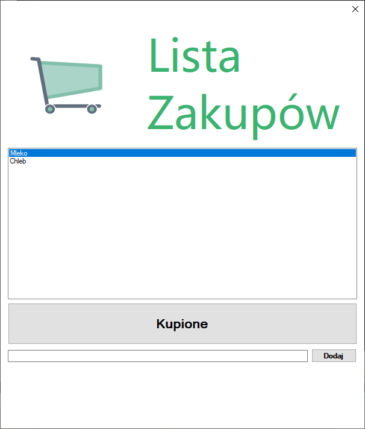

# Temat 21 - Lista zakupów

Lista zakupów może być zorganizowana w formie tablicy string. 


```csharp
string[] zakupy = new string[] { "mleko", "szynka", "ser" };
```

jeśli chcielibyśmy elemnty z tablicy dodać do kontrolki ListBox wykonalibyśmy poniższą operację:

```csharp
for(int i=0; i<zakupy.Length; i++)
{
    MessageBox.Show(zakupy[i]);
}
```

Co jeśli chcielibyśmy dodać do takiej listy zakupów jakiś element?

### Zadanie 1 - przypomnienie tablic
W ramach testów stwórz projekt pustej aplikacji okienkowek, w której przy starcie wyświelt okna komunikatów z listą zakupów zapisaną w tablicy.

## Lista

W programowaniu oprócz tablic mamy jeszcze takie kolekcje jak Listy. Udostępniają one takie funkcje jak:

`Add()` - dodająca element
`Clear()` - czyszcząca listę


Na dzisiejszych zajęciach użyjemy tego typu kolekcji oraz ich funkcji.

Po każdej kolekcji (zarówno tablicy jak i liście) można poruszać się przy pomocy specjalnego typu pętli, która działa bardzo podobnie do pętli FOR:

```csharp
foreach(string zakup in zakupy)
{
    MessageBox.Show(zakup);
}
```

## Listy w plikach ustawień (settings)

Stwórzmy nowy projekt z programem do listy zakupów:



Grafikę wózka pobierz [stąd](Grafiki/t21_wozek.jpg) <-Kliknij na bezpośredni link!.


Dodaj pobrany obrazek do pliku zasobów (Projekt->Add->New Item->Po lewej: Misc ->Empty Resources File), zapisz. Następnie do okna dodaj picture box i załaduj do niego obrazek a także ustaw właściwość `Size Mode` = `Stretch Image`

Obok obrazka dodaj Label z nazwą aplikacji, tak jak na pierwszym poglądowym obrazku, dostosuj rozmiar i kolor czcionki.

Następnie dodaj do okna pod istniejącymi elementami listę: kontrolka ListBox.

Dodaj duży przycisk z napisem `Kupione`, który usunie z listy wybrany element:

```csharp
object wybrany = listBox1.SelectedItem;
if(wybrany != null)
{
    listBox1.Items.Remove(wybrany);
}
```

Pod przyciskiem dodaj pole tekstowe `TextBox` oraz przycisk z napisem `Dodaj`. Obsługa dodawania elementów do listy:

```csharp
listBox1.Items.Add(textBox1.Text);
```

Po zamknięciu programu nasza lista znika. Zróbmy tak, aby nasz program zapamiętywał listę. W tym celu dodajmy plik ustawień (Project -> Add -> New Item... ->Po lewej: Misc->Po prawej: Settings

W ustawieniach dodajemy nowe pole o nazwie (kolumna name): `listaZakupow`, type (kolumna Type): `StringCollection`, Scope pozostawiamy bez zmian oraz Value zostawiamy puste. Wciskamy CTRL+S i zamykamy edycję ustawień.

Kolejny etap to zapis istniejącej w aplikacji listy zakupów - w tym celu wykorzystamy zdarzenie okna: `FormClosing` - klikając na pasek tytułu na górze zakładki properties klikamy na symbol pioruna i wybieramy odpowiednią akcję przez dwuklik.

Wewnątrz dodanej funkcji tworzymy zapis z wykorzystaniem nowo poznanej pętli:

```csharp
Settings1.Default.listaZakupow.Clear();
foreach(string zakup in listBox1.Items)
{
	Settings1.Default.listaZakupow.Add(zakup);
}
Settings1.Default.Save();
```
Po uruchomieniu aplikacji dodaniu elementów do listy, zamknięciu i ponownym uruchomieniu porogramu lista nadal się nie pojawia. Musimy stworzyć ładowanie zapisanych zakupów.

W tym celu ponownie klikamy na pasek tytułowy dwukrotnie w celu stworzenia zdarzenia `FormLoad`. To zdarzenie wywoływane jest raz podczas uruchamiania aplikacji - to bardzo dobre miejsce na załadowanie listy z ustawień:

```csharp
foreach(string zakup in Settings1.Default.listaZakupow)
{
	listBox1.Items.Add(zakup);
}
```