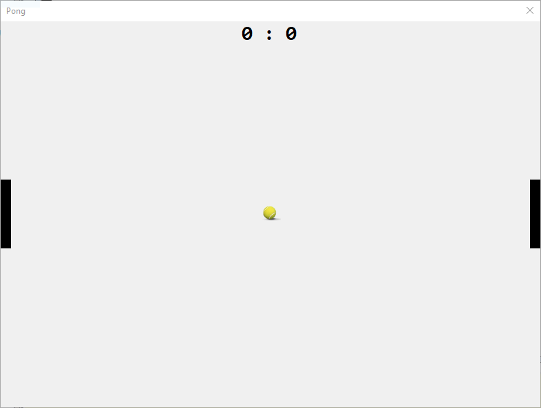

# Temat - Gra PONG - Etap 1



## Przygotowanie okna gry

Na początek przygotuj projekt okna - stwórz nowy projekt aplikacji windows, a następnie:

1. Ustaw właściwości okna:
   1. `Text` (tytuł) = Pong
   2. `AutoScaleMode` = None
   3. `MaximumSize` = 800, 600
   4. `MinimumSize` = 800, 600
   5. `Size` = 800, 600
   6. `MaximizeBox` = false
   7. `MinimizeBox` = false
   8. `ShowIcon` = false
2. Dodaj do okna kontrolkę panel, który stanie się tłem naszej rozgrywki, ustaw jej właściwości:
   1. `(Name)` = background
   2. `Dock` = Fill - środkowy prostokąt
3. Dodaj do okna pole tekstowe, które posłuży do wyświetlania wyniku. Następnie skonfiguruj jego właściwości:
   1. `Text` = "0 : 0"
   2. `TextAlign` = MiddleCenter - środkowy prostokąt
   3. `(Name)` = talicaWynikow
   4. `Dock` = Top - górny prostokąt
4. Dodaj do projektu plik z zasobami (resource: Project -> Add -> New Item... -> Misc (po lewej) -> Empty Resource File)
   1. Do otwartego pliku zasobów załaduj obrazek piłki [stąd](Grafiki/pilka.png):

    

   2. Zapisz plik i zamknij jego edycję
5. Dodaj do okna kontrolkę PictureBox - ustaw ją mniej/więcej na środku. Ustaw właściwości kontrolki:
   1. `BackColor` = Transparent (Web -> Transparent - na samej górze)
   2. `Image` - Wybierz załadowaną do resources grafikę piłki.
   3. `SizeMode` = StretchImage
   4. `(Name)` = pilka
   5. `Size` = 30, 30
6. Dodaj do okna kolejny panel i ustaw jego właściwości:
   1. `BackColor` = Black
   2. `(Name)` = gL - jak gracz lewy (ten po lewej stronie)
   3. `Location` = 0, 0
   4. `Size` = 15, 100
7. Skopiuj własnie utworzony i skonfigurowany panel:
   1. Zaznacz panel
   2. ctrl+c
   3. ctrl+v
   4. Ustaw właściwość: `(Name)` = gP - jak gracz prawy (ten po prawej stronie)
   5. Przenieś panel maksymalnie do prawej krawędzi okna
8. Dodaj do okna timer. Skonfiguruj go:
   1. `(Name)` = gra
   2. `Interval` = 40 - **Wyjaśnienie:** 1sek = 1000ms, aby ruch piłki sprawiał wrażenie płynnego w ciągu sekundy musi zmienić się jej pozycja na ekranie minimum 24razy. 1000/24=41.(6), a wartość 40 to 25 klatek.

## Etap 1: Ustawmy wszystko poprawnie na ekranie

Kliknij dwukrotnie na pasek tytułu okna. Do kodu doda się funkcja obsługująca zdarzenie `MainFormLoad` - funkcja posłuży nam do ustawienia wszystkich elementów dokładnie w pozycji startowej.

Wewnątrz funkcji dodaj poniższy kod:
```csharp
ResetPilki();
ResetGraczy();
```

### Funkcja: ResetPilki
Funkcja powinna ustawić piłkę na środku ekranu - w tym calu użyjemy rozmiaru panelu `background`, który został stworzony na pierwszym etapie. Nie możemy użyć rozmiaru samego okna, ponieważ uwzględnia on wymiary pozostałych elementów (paska tytułowego, obramowania itp).

Piłka powinna znaleźć się dokładnie na środku ekranu. W celu wyznaczenia środka pola po którym porusza się piłka należy podzielić jego wysokość i szerokość przez 2.

```csharp
int x = (background.Size.Width / 2);
int y = (background.Size.Width / 2);
```

Zakładając że Width i Height ma 500px to powyższe obliczenia dadzą nam wartość `250`. Ustawiając wartość Location dla piłki dokładnie w tym miejscu spowodujemy, że lewy górny róg piłki znajdzie się dokładnie w środku. 

Chcemy, aby to środek piłki był na środku obszaru rozgrywki. W tym celu musimy przesunąć lewy górny róg piłki w lewo i w górę o połowę wysokości i szerokości piłki.

Zmodyfikujmy powyżej przedstawiony kod tak aby punkty X i Y przedstawiały realną lokalizację lewego górnego rogu piłki uwzględniając chęć umieszczenia środka piłki w środku obszaru rozgrywki:

```csharp
int x = (background.Size.Width / 2) - (pilka.Size.Width / 2);
int y = (background.Size.Width / 2) - (pilka.Size.Width / 2);
```

Następnie ustawmy poprawnie jej lokalizację:
```csharp
pilka.Location = new Point(x, y);
```

Cała funkcja powinna prezentować się w poniższy sposób:
```csharp
void ResetPilki()
{
	int x = (background.Size.Width / 2) - (pilka.Size.Width / 2);
	int y = (background.Size.Height / 2) - (pilka.Size.Height / 2);
	pilka.Location = new Point(x, y);
}
```

### Funkcja ResetGraczy

Gracze są rozstawieni po bokach ekranu. Po uruchomieniu gry chcemy ustawić graczy tak, aby znajdowali się dokładnie na środku wysokości ekranu przy swoich bokach.

#### Gracz po lewej stronie 

Lewy górny róg (Lacation) gracza znajduje się na osi X dokładnie na wartości 0 i się nie zmienia - gracz względm osi X jest cały czas w jednym miejscu. Natomiast pozycja na osi X to połowa wysokości obszaru gry. Należy tu również uwzględnić, że mówimy o lewym górnym rogu kontrolki, więc rzeczywista lokalizacja będzie wyżej na ekranie dokładnie o połowę wysokości paletki gracza. Zatem:

```csharp
gL.Location = new Point(0, (background.Size.Height / 2) - (gL.Size.Height / 2));
```

#### Gracz po prawej stronie 

Gracz po prawej stronie, jeśli chodzi o lokalizacji względem osi Y powinien być w tym samym miejscu. Czyli: `background.Size.Width - gP.Size.Width`

Natomiast na osi X nie będzie już maksymalnie przy lewej krawędzi (nie będzie to 0 tak jak w przypadku gracza po lewej stronie ekranu), lecz przy prawej. Współrzędne prawej krawędzi na osi X to szorokość okna pomniejszona o szerokość "paletki", czyli: `(background.Size.Height / 2) - (gP.Size.Height / 2)`

Tym samym domyślna lokalizacja gracza po prawej stronie to:

```csharp
gP.Location = new Point(background.Size.Width - gP.Size.Width, (background.Size.Height / 2) - (gP.Size.Height / 2));
```

### Kompletna funkcja
Cała funkcja powinna jednocześnie ustawiać lokalizacje obu graczy. Będzie ona wyglądała w poniższy sposób:

```csharp
void ResetGraczy()
{
	gL.Location = new Point(0, (background.Size.Height / 2) - (gL.Size.Height / 2));
	gP.Location = new Point(background.Size.Width - gP.Size.Width, (background.Size.Height / 2) - (gP.Size.Height / 2));
}
```

### Koniec pierwszego etapu

W tym momencie po uruchomieniu programu mamy ustawione paletki graczy po swoich stronach na środku względem boków widoku oraz piłkę dokładnie na środku.