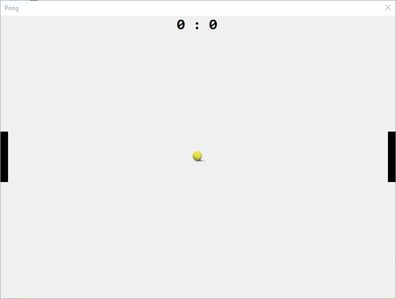

# Temat - Gra PONG



## Etap 3 - Ruch piłki

### Kierunek ruchu piłki

Piłka może poruszać się w 4-rech kierunkach:
* W górę i w prawo
* W górę i w lewo
* W dół i w prawo
* W dół i w lewo

Stwórzmy zatem reporezentację tych kierunków w formie struktury enum:
```csharp
enum KierunekPilki 
{
	GoraPrawo,
	DolPrawo,
	GoraLewo,
	DolLewo
}
```

Na ekranie widnieje tylko jedna piłka, więc możemy zapisać jej akutalny stan do zmiennej. Pod zmiennymi informującymi o prędkości graczy dodaj zmienną `KierunekPilki` z aktualnym jej kierunkiem:

```csharp
KierunekPilki AktualnyKierunekPilki;
```

### Domyślny kierunek piłki

Po uruchomieniu gry program powinien wiedzieć w jakim kierunku ma się udać piłka po starcie. Jej startową pozycję ustawiamy w funkcji `ResetPilki` użyjmy jej do wylosowania kierunku w jakim uda się ona po starcie gry. Dodajmy poniższy kod na końcu funkcji `ResetPilki`:

```csharp
Random rnd = new Random();
AktualnyKierunekPilki = (KierunekPilki)rnd.Next(0, 4);
```
W efekcie funkcja `ResetPilki` powinna wyglądać następująco:

```csharp
void ResetPilki()
{
	int x = (background.Size.Width / 2) - (pilka.Size.Width / 2);
	int y = (background.Size.Height / 2) - (pilka.Size.Height / 2);
	pilka.Location = new Point(x, y);
	Random rnd = new Random();
	AktualnyKierunekPilki = (KierunekPilki)rnd.Next(0, 4);
}
```

### Wprawmy piłkę w ruch

#### Prędkość

Piłka po wciśnięciu spacji powinna poruszać się po planszy sama z zadaną prędkością. Na samym początku stwórzmy globalną zmienną która będzie posiadała informację o prędkości piłki:

```csharp
int predkoscPilki = 5;
```

Zmienną najlepiej stworzyć obok tych dotyczących pozycji piłki oraz prędkości graczy. 

#### Ruch

W celu wprawienia piłki w ruch wykorzystamy nasz timer. Kliknij dwukrotnie na timer. Wewnątrz funkcji wywołaj nie istniejącą funkcję `RuchPilki`:

```csharp
void GraTick(object sender, EventArgs e)
{
    RuchPilki();
}
```

Obsługa timera będzie rozszerzana w kolejnych krokach, na razie zajmijmy się ruchem pilki. Stwórzmy wywołaną funkcję:

```cshapr
void RuchPilki()
{

}
```

Piłka porusza się w zależności od obranego kierunku (zmienna: `AktualnyKierunekPilki`). Zatem należy sprawdzić to w jakim kierunku powinna się ona poruszać i odpowiednio zmieniać jej lokalizację o zadaną prędkość. Najpierw jednak rozpoznajmy w jakim kierunku powinna się ona udać, w tym celu znów posłużymy sie konstrukcją switch-case, która świetnie się do tego nada:

```csharp
switch(AktualnyKierunekPilki)
{
	case KierunekPilki.DolLewo:

		break;
	case KierunekPilki.DolPrawo:

		break;
	case KierunekPilki.GoraLewo:

		break;
	case KierunekPilki.GoraPrawo:

		break;
}
```
Ruchy w lewo i w prawo odbywają się względem osi X. W prawo wartości na osi X rosną, natomiast w lewo maleją do 0.

Ruchy w górę i w dół odbywają się względem osi Y. W dół wartości na osi Y rosną, a w górę maleją do 0.

#### 1. Ruch - Dół Lewo

Ruch w lewo to poruszanie się w kierunku 0 na osi X. Zatem nowa lokalizacja na osi X to:

```csharp
pilka.Location.X - predkoscPilki
```

Wszystkie ruchy w dół to poruszanie się coraz niżej względem osi Y, zatem wartość na osi Y będzie rosła, więc:

```csharp
pilka.Location.Y + predkoscPilki
```

Aby wykonać ruch należy ustawić nową lokalizację piłki:

```csharp
pilka.Location = new Point(pilka.Location.X - predkoscPilki, pilka.Location.Y + predkoscPilki);
```

#### 2. Ruch - Dół Prawo

Względem poprzedniego przykładu zmieni się jedynie kierunek na osi X na przeciwny (zamiast w lewo to w prawo), zatem aby wykonać ten ruch zastosujemy poniższy kod:

```csharp
pilka.Location = new Point(pilka.Location.X + predkoscPilki, pilka.Location.Y + predkoscPilki);
```

#### 3. Rcuh - Góra Lewo i Góra Prawo

W przypadku obu ruchów w górę można skopiować kod z obu ruchów w dół i zamienić znak dla osi Y.
Góra Lewo:
```csharp
pilka.Location = new Point(pilka.Location.X - predkoscPilki, pilka.Location.Y - predkoscPilki);
```

Góra Prawo
```csharp
pilka.Location = new Point(pilka.Location.X + predkoscPilki, pilka.Location.Y - predkoscPilki);
```

Gotowa funkcja `RuchPilki`:

```csharp
void RuchPilki()
{
    switch(AktualnyKierunekPilki)
    {
    	case KierunekPilki.DolLewo:
    		pilka.Location = new Point(pilka.Location.X predkoscPilki, pilka.   Location.Y + predkoscPilki);
    		break;
    	case KierunekPilki.DolPrawo:
    		pilka.Location = new Point(pilka.Location.X predkoscPilki, pilka.   Location.Y + predkoscPilki);
    		break;
    	case KierunekPilki.GoraLewo:
    		pilka.Location = new Point(pilka.Location.X predkoscPilki, pilka.   Location.Y - predkoscPilki);
    		break;
    	case KierunekPilki.GoraPrawo:
    		pilka.Location = new Point(pilka.Location.X predkoscPilki, pilka.   Location.Y - predkoscPilki);
    		break;
    }
}
```

### Koniec etapu trzeciego 
Po uruchomieniu i wciśnięciu spacji piłka powinna zacząć się ruszać w losow wybranym kierunku a następnie zniknąć za obszarem gry. Oprócz tego z poprzednich etapów mamy zainicjalizowaną grę oraz ruchy graczy.