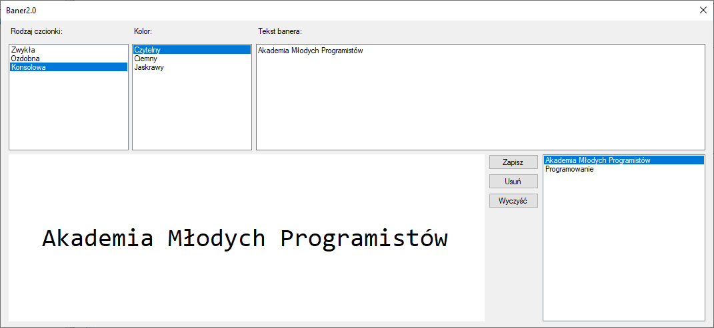

# Test - Kontrolki ListBox

## Rozwiąż test

Wykonaj: [Test](http://bit.ly/AkademiaMP_P2T3)

## Wykonaj zadanie - Baner 2.0

Sposób działania programu możesz sprawdzić pobierając [ten plik](Download/Test_Baner2.0.zip)

Wykonaj program banner:



1. Program ma za zadanie:
   1. Wyświetlić baner (kontrolka `Label` na dole po lewej), na podstawie tekstu który znajdzie się w kontrolce Tekst Banera (`TextBox` - po prawej u góry)
   2. Do formatowania tekstu powinny służyć dwie kontrolki typu `ListBox`:
      1. Rodzaj Czcionki - ustawia czcionkę banera w zależności od wybranej opcji
      2. Kolor - ustawia kolor tła i tekstu czcionki w zależności od wybranego w liście elementu.
   3. Po prawej stronie na dole - obok banera - powinna znaleźć się kontrolka `ListBox` oraz 3 przyciski (`Button`) służace do:
      1. Zapisania wprowadzonego tekstu banera - zawartość kontrolki `Tekst banera`
      2. Usunięcia wybranego na liście tekstu 
      3. Wyczyszczenia zapamiętanych tekstów
   4. Po kliknięciu na wybrany element listy zapisanych tekstów  zaznaczony tekst powinien zostać wpisany do kontrolki zawierającej `Tekst banera`
   5. Każda zmiana tekstu (Zdarzenie: `TextChanged`) na kontrolce TextBox `Tekst Banera` powinna powodować przepisanie ustawienie wprowadzonego tekstu do kontrolki Label banera na dole.


2. Przydatne informacje:
   1. W celu rozpoznania wybranego formatowania banera `Rodzaj czcionki`, `Kolor` użyj właściwości `SelectedItem` z kontrolki ListBox.
        ```csharp
        string rodzajWybrany = listBox1.SelectedItem.ToString();
        ```
        W powyższy sposób uzyskasz tekst odpowiadający zaznaczonemu elementowi z wybranej kontrolki ListBox.

   2. Pamiętaj, że listę dostępnych w danej kontrolce elementów możesz uzyskać przez `listBox1.Items` i kolejne operacje:
      1. Dodawanie: 
            ```csharp
            listBox1.Items.Add("Jakis element");
            ```
            Zamiast tekstu `"Jakis element"` może na przykład dodać tekst z innej kontrolki.

      2. Usuwanie: 
            ```csharp
            object wybrany = listaTekstow.SelectedItem;
            if(wybrany != null)
            {
                listBox1.Items.Remove(wybrany);
            }
            ```

      3. Czyszczenie: 
            ```
            listBox1.Items.Clear();
            ```
   3. Aby ustawić wybraną czcionkę należy posłużyć się poniższym przykładem: 
   
   ```csharp
   baner.Font = new Font("Microsoft Sans Serif", 28);
   ```
        
## Punktacja stosowana przy ocenianiu:
1. Poprawne ustawianie kontrolki banera w zależności od kontrolki z wyranym tekstem. `(2pkt)`
2. Poprawne ustawianie właściwości czcionek w zależności od wybranych elementów z list.`(2pkt)`
3. Obsługa zapisu danych do listy. `(2pkt)`
4. Obsługa usunięcia i czyszczenia z listy. `(2pkt)`
5. Czysty, kompilujący się kod, bez zbędnego kodu i nadmiarowych operacji. `(2pkt)`