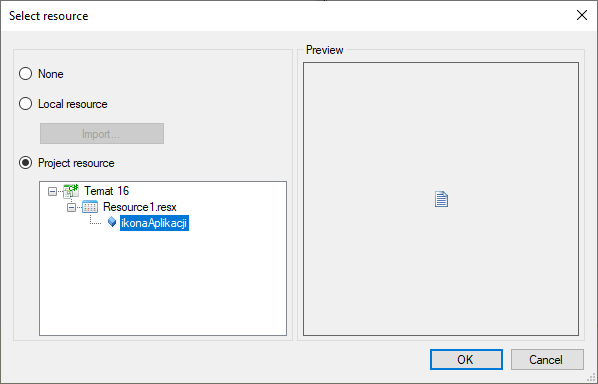
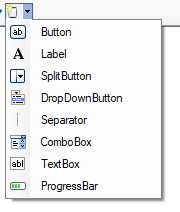

# Temat 16 - RichTextBox - Notatnik eksperta

Podczas najbliższej serii zajęć stworzymy program Notatnik, który rozszerzy nieco podstawowy systemowy notatnik. W tym celu poznamy dodatkowo kilka kontrolek, które umożliwią nam między innymi pokazanie górnego menu na oknie, panelu narzedzi, pasek statusu czy zaawansowany textbox. 


# [Materiały](T16_Materiały.pdf)

# Część 1

## Stworzenie projektu

Stwórz projekt o nazwie: `NotatnikEksperta`
Ustaw właściwość Text okna na: `Notatnik Eksperta`

Dodaj 

## MenuStrip

Pierwszą z kontrolek jaką poznamy jest kontrolka MenuStrip. Kontrokka służy do wyświetlenia paska menu na ekranie. 

Na początek dodajmy ją do aplikacji, przez przeciągnięcie odpowiedniego symbolu z narzędzi na okno:


W ten sposób uzyskaliśmy taki widok na ekranie edytora okna:


Klikająć na etykietę `Type here` można dodawać kolejne menu do aplikacji. Tym zajmiemy się za chwilę. 

## ToolStrip

Pasek narzędzi - jest to kontrolka, która pozwala dodawać pasek z przyciskami. Do poszczególnych elementów paska można dodać akcję kliknięcia. 

Aby dodać pasek przycisków znajdź odpowiednią kontrolkę (`ToolStrip`):


Przeciągnąć i upuścić w dowolnym miejscu okna. Kontrolka powinna sama się `przypiąć` do górnej części okna. 

Całość powinana wyglądać następująco:


## StatusStrip

Pasek statusu - jest to kontrolka do której można dodać kilka rodzajów kontrolek. Najczęściej spotykaną tutaj jest zazwyczaj pole tekstowe lub pasek postępu. My będziemy używali tylko pierwszej.

W celu dodania paska statusu należy odnaleźć symbol kontrolki `StatusStrip` w pasku narzędzi:


W celu dodania należy również przeciągnąć kontrolkę i upuścić na dowolne miejsce okna. Kontrolka sama przypnie się u dołu okna:


## RichTextBox

Kontrolka rozszerzonego pola tekstowego - jest to pole tekstowe, które udostępnia dodatkowe funkcjonalności. W celu dodania tej kontrlki należy przeciągnąć i upuścić ja na obszar okna:


Aby pole tekstowe wypełniło pozostały obszar okna należy ustawić właściwość `Dock` na wartość `Fill`. Oprócz tego 

W ten sposób powstał zarys notatnika:


## Dodawanie resources do projektu

Pobierz paczkę ikon przycisków i aplikacji [stąd](Download/NotatnikEksperta_Ikony.zip). Rozpakuj ją w dowolnym miejscu (zapamiętaj gdzie zostały rozpakowane pliki).

Dodaj do projektu plik zasobów (resources - Project -> Add -> New Item... -> Po lewej: Misc -> Po prawej: Empty Resource File). Do pliku zasobów załaduj wszystkie obrazki z pobranej paczki. 

## Ikona aplikacji

W pierwszej kolejności przed dodaniem jakiejkolwiek funkcjonalności do programu załadujemy ikonkę do programu. 

Kliknij na pasek tytułowy, aby zaznaczyć okno aplikacji i w właściwościach okna znajdź opcję `Icon`. Kliknij w edycję (trzy kropki na końcu pola), powinno wyświetlić się poniższe okno:


Przełącz na `Project resource` i wybierz opcję: `ikonaAplikacji`. Jest to ikonka załadowana do pliku z zasobami. W ten sposób będziemy wybierali wszystkie pozostałe grafiki przycisków, które już są załadowane do pliku z zasobami.



Po uruchomieniu ikonka powinna być widoczna na pasku tytułu.

## Plik - pierwsze menu

Zaznacz kontrolke MenuStrip (ta na samej górze obszaru roboczego okna - dodana jako pierwsza). Powinna być tam dostępna opcja z napisem `Type here`:


Kliknij w napis `Type here` i zacznij pisać, pierwsze menu to: `Plik`, wpisz właśnie jego nazwę i wciśnij Enter.

Podczas wpisywania pod polem z nazwą menu pojawiło się puste opcji menu z możliwością wpisania pierwszej opcji. Dodaj do menu pierwszą opcję, klikając dwukrotnie na pole z napisem `Type here` poniżej nazwy `Plik` i wpisz tekst przycisku: `Nowy`.


Dodaj dwie kolejne opcje menu: `Otwórz` i `Zapisz`. 

Kolejnym elementem menu plik będzie pozioma kreska oddzielająca. Aby ją dodać należy w miejscu wpisywania wpisać symbol myślnika (minusa): `-` i zatwierdzić przyciskiem Enter. 

Ostatnią opcją w tym menu będzie `Zakończ` - dodaj ją.

## Obsługa przycisków menu

Aby dodać obsługę przycisku menu wystarczy na niego kliknąć dwukrotnie. W ten sposób w kodzie aplikacji zostanie wygenerowana funkcja obsługująca kliknięcie. 

### Nowy
Dodaj akcję (przez kliknięcie dwukrotnie) do przycisku `Nowy`, który został dodany wcześniej. 

Stworzenie nowego pliku w notatniku to praktycznie wyczyszczenie zawartości pola tekstowego. Kontrolka RichTextBox posiada możliwość szybkiego wyczyszczenia zawartości za pomocą funkcji `Clear()`. 

Zaimplementujmy funcjonalność przycisku `Nowy`:

```csharp
void NowyToolStripMenuItemClick(object sender, EventArgs e)
{
	richTextBox1.Clear();
}
```

### Otwórz

Standardowo w aplikacjach po kliknieciu przycisku `Otwórz` pojawia się okno wyboru pliku. Takie okno w aplikacjach jaką tworzymy nosi nazwę `OpenFileDialog`. W celu użycia tego typu okna należy przeciągnąć w zakładce `Designer` je z paska narzedzi na okno:


Pojawi się ono na żółtym pasku poniżej okna:


Zaznacz dodane okienko otwierania plików i przejdź do właściwości, ustaw:
1. `DafaultExt` = `txt`
2. `Filter` = `Pliki tekstowe|*.txt|Wszystkie Pliki|*.*`


Wartość właściwości `Filter` przedstawiona powyżej to tekst, który składa się z: `Nazwa rozszerzenia|Filtr Wyszukujący`, każda kolejna para oddzielona jest znakiem `|`. Jak widać w naszym filtrze (patrz punkt 2 powyżej) pojawią się dwie opcje:
1. `Pliki tekstowe`, których nazwa pliku to `*.txt`, gdzie `*` to dowolny ciąg znaków.
2. `Wszystkie pliki`, które mają dowolne roszerzenie `*.*`, gdzie `*` to dowolny ciąg znaków.

Efekt finalny ustawienia filtru otwierania pliku:


Skonfigurowaliśmy otwieranie pliku, wiemy jak bedzie wyglądało, teraz dodajmy akcję przycisku menu `Otwórz` i ją obsłużmy - robimy to dokłądnie tak jak przy przycisku nowy. 

`OpenFileDialog` to okno dialogowe, tak jak w przypadku MessageBox'a można sprawdzić jaki przycisk na oknie wcisnął użytkownik. Aby wyświetlić okno dialogowe należy wykonać poniższą operację:

```csharp
openFileDialog1.ShowDialog()
```
Wynik działania powyższej funkcji można porównać z enum'em `DialogResult`. Jeśli wynik działania funkcji będzie równy `DialogResult.OK` wtedy mamy pewność, że użytkownik kliknął `Otwórz` na oknie dialogowym. Zatem zapiszmy w kodzie otwierania pliku:

```csharp
if(openFileDialog1.ShowDialog() == DialogResult.OK)
{

}
```

`OpenFileDialog` posiada właściwość: `FileName`, która przechwuje informację o wybranym do otworzenia pliku.

Wewnątrz instrukcji IF możemy odczytać informację z pliku. Kontrolka `RichTextBox` posiada funkcję ładującą tekst z wskazanej lokalizacji: `LoadFile()`. Funkcja posiada dwa parametry: lokalizacja pliku i format wybrany z enum'a `RichTextBoxStreamType`. 

```csharp
richTextBox1.LoadFile(openFileDialog1.FileName, RichTextBoxStreamType.UnicodePlainText);
```

Cała obsługa otwierania pliku powinna wyglądać następująco:

```csharp
void OtwórzToolStripMenuItemClick(object sender, EventArgs e)
{
	if(openFileDialog1.ShowDialog() == DialogResult.OK)
	{
		richTextBox1.LoadFile(openFileDialog1.FileNameRichTextBoxStreamType.UnicodePlainText);
	}
}
```

### Zapisz

Zapisywanie pliku odbywa się analogicznie do otwierania, z kilkoma różnicami:
1. Do zapisu stosujemy `SaveFileDialog`
2. `RichTextBox` udostępnia funkcję `SaveFile`

Na poczatku dodaj do okna kontrolkę `SaveFileDialog`:


Ustaw właściwości dodanej kontrolki:

1. `DefaultExt` = `txt`
2. `Filter` = `Pliki tekstowe|*.txt|Wszystkie Pliki|*.*`

Dodajmy akcję przycisku `Zapisz`. Obsługa w kodzie powinna wyglądać bardzo podobnie do obsługi otwierania plików:

```csharp
void ZapiszToolStripMenuItemClick(object sender, EventArgs e)
{
	if(saveFileDialog1.ShowDialog() == DialogResult.OK)
	{
		richTextBox1.SaveFile(saveFileDialog1.FileNameRichTextBoxStreamType.UnicodePlainText);
	}
}
```

### Zamknij

Ostatni przycisk to `Zamknij`. Jego obsługę ograniczymy jedynie do obsług zamykania aplikacji, czyli wywołania funkcji `Close()`:

```csharp
void ZakończToolStripMenuItemClick(object sender, EventArgs e)
{
	Close();
}
```

## Dodawanie ikon do przycisków

W załadowanym zestawie ikon mamy ikonki:
1. nowy
2. otworz
3. zapisz
4. wyjscie

Powyższe ikonki posłużą nam do przypisania ich do przycisków.

Aby to zrobić otwórz edytor okna (`Desing`) zaznacz konkretną pozycję w menu. Np. `Nowy` następnie w zakładce z właściwościami (`Properties`) znajdź właściwość: `Image`, kliknij na nią. Pojawi się przycisk z trzema kropkami, wejdź w niego, następnie przełącz opcję na `Project resource` i z listy wybierz `nowy`. Po kliknięciu OK w menu powinna pojawić się ikona. 

Dodaj ikony do pozstałych przycisków.

## Skrót klawiaturowy

Oprócz ikonek w menu możemy przypisać również skrót klawiaturowy dla konkretnego przycisku.

Zaznaczając opcję w menu i przechodząc do zakładki `Properties` na końcu listy znajdziesz opcję `ShortcutKeys`, po rozwinieciu dostępnych opcji uzyskasz dostęp do menu:


Na obrazku zostało przedstawione jak zrobić kombinację klawiszy `Ctrl+N`. Jest to kombinacja dla przycisku `Nowy`. 

 Dodaj poniżesze skróty dla opcji w menu:

1. Nowy - Ctrl+N
2. Otwórz - Ctrl+O
3. Zapisz - Ctrl+S
4. Zakończ - Alt+F4

## Dodawanie przycisków na pasku narzędzi

Do okna dodaliśmy również panel z przyciskami:


Znajduje się on poniżej paska menu, po zaznaczeniu paska narzedzi pojawi się na nim ikonka. Po kliknięciu na listę rozwijaną tej ikony mamy do wyboru możliwość wstawienia różnych opcji.



My dodamy trzy przyciski przez kolejno wybieranie z owej listy trzy razy opcji `Button`. 

Pierwszy przycisk będzie działał identycznie co przycisk `Nowy`, w tym celu zaznaczmy go i:
1. Dodajmy ikonkę: własciwość `Image` - tak jak w przypadku przycisków w menu
2. Przypiszmy akcję, która istnieje:
   1. Przy zaznaczonym przisku klikamy na symbol pioruna:

    

   2. Następnie znajdujemy akcję `Click` (pierwsza od góry) i z menu rozwijanego wybieramy z listy akcję o nazwie: `NowyToolStripMenuItemClick` - jest to akcja dla przycisku z menu rozwijanego, która odpowiada kliknięciu `Nowy` w menu `Plik`. 

Pozostałe dwa przyciski powinny być przypisane do funkcji otwierania i zapisywania. Zadbaj również o to aby miały dokładnie tą samą ikonkę.


# Wyślij swoją pracę

W celu zaliczenia obecności wyśli projekt aplikacji na podstawie opisu [stąd](../ZdalneInstrukcja#wysyłanie-projektu-aplikacji-okienkowej).

W tytule maila proszę podać: `Zajęcia Zdalne - Notatnik eksperta - Część 1`