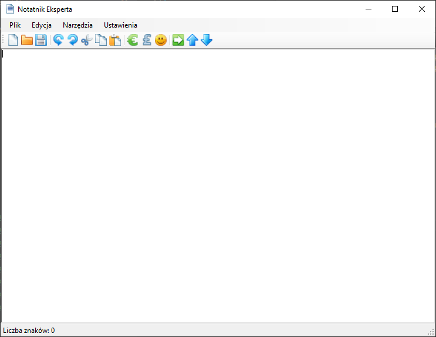

# 24.03.2020 - RichTextBox - Część 2

Na dzisiejszych zajęciach dodamy kolejne możliwości do naszego projektu `Notatnika Eksperta`. 



Pobierz aktualną wersję programu [stąd](Download/NotatnikEksperta_24.03.2020.zip)

## [Materiały](T16_Materiały.pdf)

## Edycja - Cofnij i ponów

Nasze górne menu posiada obecnie tylko opcję `Plik`, ale obok możemy wpisać kolejną nazwę dla nowego menu:


Wybierzmy tą opcję i wstawmy obok istniejącego menu `Plik`, nowe menu o nazwie `Edycja`.

### Cofnij

Jako pierwszy przycisk w nowo postałym menu dodaj `Cofnij`. Dodajmy akcję do tej opcji klikając ją dwukrotnie. 

W poprzedniej części realizacji zajęć można było dostrzec, że `RichTextBox` to nie zwykła kontrolka, która pozwala na przechowywanie tekstu ale również dodatkowa funkcjonalność, która umożliwa zarządzanie danymi w kontrolce. Tak jak odczyt czy zapis danych z kontrolki `RichTextBox`, tak też cofanie wprowadzonego tekstu odbywa się prostą funkcją:

```csharp
richTextBox1.Undo();
```

Dodaj ją w kodzie nowo utworzonej funkcji tak, aby jej kod wyglądał podobnie do tego poniżej:

```csharp
void CofnijToolStripMenuItemClick(object sender, EventArgs e)
{
	richTextBox1.Undo();
}
```

#### Ikona przycisku i klawisz skrótu

Wróć do edycji okna, dodaj do przycisku obrazek o nazwie `cofnij`. Należy w tym celu zaznaczyć w menu odpowiednią opcję a następnie z paska `Properties` ustawić wybraną ikonę za pomocą właściwości `Image`.

Dodatkowo dodaj klawisz skrótu za pomocą właściwości `ShortcutKeys`. Dla Cofnij przypisz kombinację klawiszy: `CTRL+Z`

#### Podziałka i ikona na pasku narzedzi

Poniżej menu znajduje się dodany na poprzednich zajęciach pasek narzędzi. Na nim oprócz przycisków można dodać kilka innych opcji na przykład separator. Jest to pionowa kreska, która graficznie oddziela na pasku przyciski od siebie. Dodaj taki separator po istniejących, z poprzednich zajęć, przyciskach. A następnie dodaj przycisk z obrazkiem symbolizujący operację `Cofnij`.

Pamiętaj o podpięciu zdarzenia, w tym celu zaznacz przycisk na pasku. W zakładce `Properties` wybierz symbol pioruna: 


Na liście znajdź zdarzenie: `Click` i z listy rozwijanej wybierz opcję `CofnijToolStripMenuItemClick`, czyli nazwa funkcji zdarzenia dla przucisku `Cofnij` z menu rozwijanego.

### Ponów

Do menu `Edycja` dodaj kolejny przycisk z napisem `Ponów` oraz z odpowiednim dla niego obrazkiem. 

Funckja odpowiadająca za ponowienie operacji (odwrotna do jej cofnięcia) to `Redo`. Do obsługi przycisku zatem możemy użyć poniższy kod:

```csharp
richTextBox1.Redo();
```

Dodaj powyższy kod do odpowiednio wygenerowanej funkcji, a następnie dodaj do paska narzędzi przycisk z odpowiednim obrazkiem. Przypisz kombinację klawiszy: `CTRL+Y`. Na koniec połącz stworzoną funkcję z operacją kliknięcia na przycisk na pasku narzedzi. 

## Edycja - wytnij, kopiuj, wklej

Na początku dodaj do menu `Edycja` poziomą kreskę przez wstawienie znaku `-` jako nowy "przycisk" w tym menu. 

Tak jak w przypadku operacji cofnij i ponów można również przeprowadzić operacje wycinaniam, kopiowania i wklejania.

### Zadanie 1
Spójrz do poniższej tabeli, dodaj do menu `Edycja` trzy nowe przyciski i oprogramuj je. Zrób to analogicznie do przycisków `Cofnij` i `Ponów`.

|Operacja|Funkcja|Przykładowy kod|Kombinacja klawiszy
|-|-|-|-|
|Wytnij|`Cut`|`richTextBox1.Cut();`|`CTRL+X`|
|Kopiuj|`Copy`|`richTextBox1.Copy();`|`CTRL+C`|
|Wklej|`Paste`|`richTextBox1.Paste();`|`CTRL+V`|

Dodaj do przycisków w menu odpowiednie grafiki oraz przypisz klawisze skrótu.

### Zadanie 2

Dodaj do paska narzedzi trzy przyciski (wytnij, kopiuj, wklej) wraz z grafikami i przypisz do ich akcji odpowiednie funkcje tak jak w poprzednich przykładach.

# Wyślij swoją pracę

W celu zaliczenia obecności wyśli projekt aplikacji na podstawie opisu [stąd](../ZdalneInstrukcja#wysyłanie-projektu-aplikacji-okienkowej).

W tytule maila proszę podać: `Zajęcia Zdalne - Notatnik eksperta - Część 2`