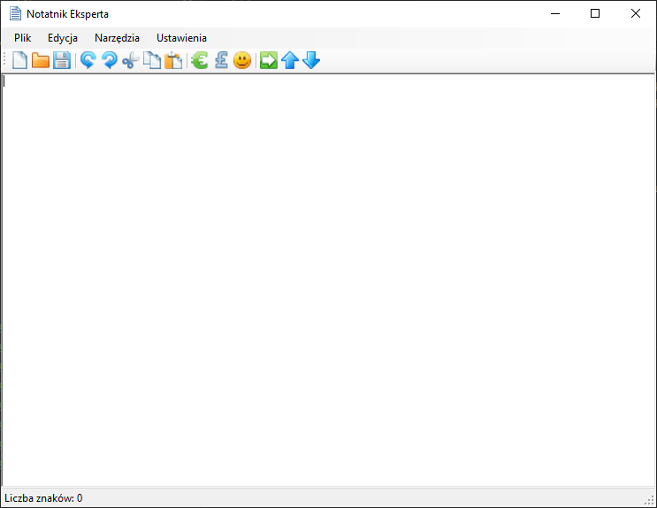
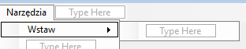

# 24.03.2020 - RichTextBox - Część 3

Na dzisiejszych zajęciach dodamy kolejne możliwości do naszego projektu `Notatnika Eksperta`. 



Pobierz aktualną wersję programu [stąd](Download/NotatnikEksperta_31.03.2020.zip)

## [Materiały](T16_Materiały.pdf)

# Narzędzia

W poprzednich częściach dodawaliśmy do naszego programu tylko jednopoziomowe menu. Jeśli jednak otworzymy dowolne menu w edytorze (w zakładce `Design`) i zaznaczymy dowolną opcję to po jej prawej stronie pojawia się możliwość wpisania nowej pozycji. Jest to możliwość dodawania menu wielopoziomowego. 

## Menu: Narzędzia

Obok pozycji `Edycja` dodaj nowe menu: `Narzędzia`. 

## Podmenu: Wstaw

Dodaj do menu narzędzia pozycję o nazwie `Wstaw`. Zaznacz POJEDYNCZYM KLIKNIĘCIEM nowo wstawioną opcję i po prawej powinna pojawić się możliwość wpisania kolejnej opcji jako kolejny poziom w menu. 



Na tym poziomie menu (podmenu dla opcji `Wstaw`) dodaj 3 przyciski:
1. `Euro` - przycisk wstawi symbol euro: &#x20AC;
2. `Funt` - przycisk wstawi symbol funta: &#x00A3;
3. `Uśmiech` - przycisk wstawi symbol uśmiechu: &#x263A;

### Kody Unicode, czyli jak za poziomu kodu aplikacj wstawić dowolny symbol niedostępny na klawiaturze

#### Trochę historii

Pierwsze komputery, jakie połączone były z urządzeniem, które mogło prezentować dane (np. monitorem) wyświetlały tylko i wyłącznie tekst. Możliwe było to dzięki opracowaniu układu, który dzisiaj jest częścią karty graficznej, odpowiedzialnego za renderowanie poszczególnych znaków. Układ taki miał zaprogramowaną tablicę znaków i dostawał informację który znak powinien znaleźć się na ekranie w wybranym miejscu.

Z czasem na świecie powstawały pewne standardy tablic znaków, które mogły być wyświetlane. Dzięki temu można było zapisywać dokumenty, które zapisywały tekst w wybranym formacie możliwym do wyświetlenia przez urządzenia stosujące konkretny standard.

#### Tablice UNICODE

Jednym z tego typu standardów jest standard kodowania Unicode. Jest to standard opracowany przez wile wiodących firm komputerowych i stosowany z powodzeniem w obecnych komputerach. Jest on mocno rozbudowany i zapamiętanie wszystkich znaków jakie w nim są jest niepotrzebne i niemożliwe. 

W tym celu stosujemy [wyszukiwarkę znaków](http://www.fileformat.info/info/unicode/char/search.htm).

Tego typu tablice są zapisane w domyślnie w karcie graficznej komputera, obecnie sposób porzetwarzania obrazu i wyświetlania go na ekranie komputera różni się drastycznie od tego co było dawniej, ale tablice pozostały, choć w mocno rozszerzonej wersji. 

Zaczynając od symbolu waluty `Euro`, który jest pierwszą opcją w naszym menu szukamy za pomocą wyszukujemy właśnie słówka `euro` i w wynikach (sekcja `Results`) powiniśmy zobaczyć kolumnę preview - tam szukamy pierwszego symbolu, który prezentuje oczekiwany symbol: &#x20AC;. 

Po wejściu na stronę symbolu łatwo zauważyć symbol szesnastkowy naszego znaku: `U+20AC`. Jest to numer znaku w tablicy zapisany szesnastkowo, symbol `U+` oznacza, że to kod Unicode. Pozostała część to numer indeksu w tablicy przechowującej wszystkie znaki. Przeliczając liczbę szesnastkową `20AC` na wartość dziesiętną otrzymamy `8364` i to numer symbolu w tablicy. Dla nas ważna jest owa wartość szesnastkowa (`20AC`), ponieważ to jej użyjemy do wstawienia symboli w tekst.

### Wstawianie symboli - RichTextBox - obsługa zapisu znaków w formacie szensastkowym

Wrócmy do SharpDevelopa, ustaliliśmy, że szesnastkowy (hexadecymalny) zapis naszego symbolu Euro to `20AC`.

#### Wstawianie dowolnego tekstu

Jeśli chcielibyśmy wstawić do zwykłej kontrolki TextBox dowolny tekst obok istniejącego, na przykład `"Hello World"` moglibyśmy wykorzystać poniższy kod:

```csharp
textBox1.Text += "Hello World"
```

Korzystamy jednak z kontrolki RichTextBox, która udostępnia nam taką właściwość jak `SelectedText` w momencie kiedy karetka (Ten migający symbol w miejscu gdzie coś piszemy)


jest na końcu tekstu to przyrównanie do tej właściwości (`SelectedText`) jakiegś tekstu np. `"Hello World"` spowoduje, że wpisze się ten tekst w miejscu gdzie stoi wspomniana karetka. 

```csharp
richTextBox1.SelectedText = "Hello World";
```

Natomiast jeśli zaznaczymy jakiś tekst to powyższy kod zamieni zaznaczony tekst na przykładowy `"Hello World"`.

#### Wstawianie symbolu

W teorii wiemy jak wstawić tekst za pomocą kodu do kontrolki RichTextBox. Aby nasz program wiedział, że to co znajduje się w `" "` to symbol unicode w formie szesnastkowej i należy go przetworzyć na symbol Unicode musimy zapisać go w odpowiednim formacie. Format ten wygląda następująco:

```csharp
"\x20AC"
```

gdzie:
1. `\x` to znacznik informujący że zapis jest hexadecymalny (szesnastkowy).
2. `20AC` to numer, który pasuje do symbolu Euro w Unicode zapisany szesnastkowo odczytany ze strony podanej wyżej.

#### Obsługa przycisku

Dodajmy zatem obsługę przycisku `Euro` z naszego menu (kliknij dwukrotnie w zakładce design na przycisk `Euro` w menu). Implementacja powinna wyglądać następująco:

```csharp
void EuroToolStripMenuItemClick(object sender, EventArgs e)
{
	richTextBox1.SelectedText = "\x20AC";
}
```

### Funt - &#x00A3;

Kod dla symbolu Funta to: `00A3`

#### Zadanie 
Dodaj w programie obsługę przycisku wstawiającego sybol funta.

### Uśmiech - &#x263A;

Kod dla symbolu Uśmiechu to: `263A`

#### Zadanie 
Dodaj w programie obsługę przycisku wstawiającego sybol uśmiechu. Następnie do trzech nowych przycisków dodaj odpowiednie grafiki. Na koniec dodaj do paska narzędzi, który stworzyliśmy pod paskiem z menu, trzy nowe przyciski z identycznymi grafikami i połącz akcję kliknięcia na przycisk z istniejącymi akcjami dla przycisków w menu.

## Narzędzia -> Wstaw Linie

Kolejnym elementem menu `Narzędzia` będzie przycisk `Wstaw linię`. Aby w konsoli wpisać nową linię dodawaliśmy znacznik `\n`, tutaj postąpimy jednak nieco inaczej.

#### Zadanie
Spróbuj za pomocą wyszukiwarki symboli znaleźć odpowiedni kod dla nowej linii (wpisz: new line) i postępując analogicznie do symboli: euro, funt i uśmiechu - wstaw symbol nowej linii. Następnie podłącz grafikę nowej linii do przycisku. Do paska narzędzi dodaj separator i za separatorem przycisk z ikonką nowej linii wraz z połączoną do akcji kliknięcia odpowiednią funkcją. 

## Narzędzia -> Litery

Ostatnią opcją w menu narzędzia bedzie podmenu `Litery` z dwoma opcjami:

1. `Zmień na duże` - spowoduje, że wszystkie litery w tekście będą duże
2. `Zmień na małe` - spowoduje, że wszystkie litery w tekście będą małe

### Zmień na duże

Aby zmienić litery na duże w zwykłej zmiennej typu string należałoby wykonać poniższy kod:

```csharp
string napis = "hello world";
napis = napis.ToUpper();
```

Po wykonaniu takiego kodu zmienna napis będzie przechowywać taki napis: `HELLO WORLD`.

My chcemy aby to zawartość tekstowa kontrolki `RichTextBox` zmieniła wszystkie litery na duże w tym celu musimy przepisać tekst na nowo z uzyciem wyżej przedstawionej funkcji:

```csharp
richTextBox1.Text = richTextBox1.Text.ToUpper();
```

#### Zadanie
Z użyciem wyżej przedstawionego kodu oprogramuj przycisk `Zmień na duże`. Dodaj odpowiednią grafikę, a następnie do paska narzędzi dodaj przycisk z grafiką i podłącz akcję kliknięcia do istniejącej funkcji.

### Zmień na małe

Zmiana na małe działa analogicznie do zmiany na duże z tym, że należy użyć funkcji `ToLower`. 

```csharp
richTextBox1.Text = richTextBox1.Text.ToLower();
```

#### Zadanie
Z użyciem wyżej przedstawionego kodu oprogramuj przycisk `Zmień na małe`. Dodaj odpowiednią grafikę, a następnie do paska narzędzi dodaj przycisk z grafiką i podłącz akcję kliknięcia do istniejącej funkcji.

# Wyślij swoją pracę

W celu zaliczenia obecności wyśli projekt aplikacji na podstawie opisu [stąd](../ZdalneInstrukcja#wysyłanie-projektu-aplikacji-okienkowej).

W tytule maila proszę podać: `Zajęcia Zdalne - Notatnik eksperta - Część 2`