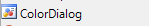

# 07.04.2020 - RichTextBox - Część 4

Na dzisiejszych zajęciach dodamy kolejne możliwości do naszego projektu `Notatnika Eksperta`. 


Pobierz aktualną wersję programu [stąd](Download/NotatnikEksperta_07.04.2020.zip)

## [Materiały](T16_Materiały.pdf)

# Ustawienia

Na ostatnich zajęciach wykonaliśmy ćwiczenia, dzięki którym nauczyliśmy się tworzyć wielopoziomowe menu.

W ten sposób powstało menu `Narzędzia` którego struktura została zaprezentowana poniżej:


Jeżeli struktura tego menu w Twoim programie nie przedstawia tej przedstawionej na obrazkach proszę popraw to teraz.

## Właściwości tekstu - Ustawienia notatnika

Ostatnim menu jakie stworzomy będzie menu `Ustawienia`.

### Zawijanie wierszy

Otwierając zwykły notatnik Systemu Windows, posiada opcję zawijanie wierszy:


Opcja ta obecnie jest w stanie wyłączonym, to znaczy: zawijanie wierszy nie działa. Tekst w notatniku wygląda następująco:


Jeśli zmienimy tą opcję, przez kliknięcie:


To łatwo można zauważyć, że suwak na dole okna zniknął natomiast tekst został "pozawijany" tak aby mieścił się w widoczny obszarze możliwie w całości:


#### Dodajmy zawijanie wierszy do naszej aplikacji

W zwykłym notatniku po włączeniu opcji `Zawijanie wierszy` obok przycisku w menu pojawia się symbol zaznaczenia: &#x2713;. 

Tego typu opcję w menu dodajemy jak każdą inną, ponieważ każda z nich posiada właściwość `Checked`, która przyjmuje wartość: `true` - wtedy jest zaznaczona, lub `false` - wtedy nie ma &#x2713; obok  tej opcji (to jest domyślny stan).

#### Zadanie 1

Dodaj do okna menu: `Ustawienia`

W powyższym menu dodaj: `Zawijanie wierszy`

Dodaj zdarzenie kliknięcia na powyższą opcję w menu i wprowadź poniższy kod:

```csharp
zawijanieWierszyToolStripMenuItem.Checked = !zawijanieWierszyToolStripMenuItem.Checked;
```

Po uruchomieniu i kliknięciu na `Ustawienia -> Zawijanie Wierszy` i ponownym otworzeniu tego menu powinno pojawić się zaznaczenie, kolejne kliknięcie spowoduje wyłączenie zaznaczenia i tak w nieskończoność.

#### Sterowanie zawijaniem wierszy

Kontrolka `RichTextBox`, która zastosowaliśmy w naszej aplikacji pozwala na zmianę opcji `Zawijanie wierszy`. Właściwość ta przyjmuje również wartość `true` jeśli zawijanie wierszy jest włączone i `false` jeśli wyłączone. Domyślnie opcja jest włączona.

Właściwość odpowiadająca za zawijanie wierszy to `WordWrap`:

```csharp
richTextBox1.WordWrap
```

Wiemy, że kod z zadania 1 odwraca po każdym kliknięciu stan zaznaczenia, wystarczy teraz ten stan po zmianie ustawić w właściwości `WordWrap`:

```csharp
richTextBox1.WordWrap = zawijanieWierszyToolStripMenuItem.Checked;
```

#### Zadanie 2

Dodaj do obsługi przycisku kolejną linijkę która zmieni stan zawijania wierszy w konktrolce RichTextBox w zależności od zmiany zaznaczenia opcji `Zawijanie wierszy`. 

#### Pierwsze kliknięcie na `Zawijanie wierszy` nic nie zmienia

Po wykonaniu zadania 2 i pierwszym kliknięciu na polu tekstowym zawijanie wierszy się nie zmienia - dzieje się tak ponieważ nasz przycisk domyślnie ma `Checked` ustawione na `false` natomiast właściwość `WordWrap` kontrolki `RichTextBox` jest `true`. Pierwsze kliknięcie niejako synchronizuje nam stan przycisku z stanem faktycznym kontrolki. My jednak możemy zrobić takm, aby opcja w menu od samego początku odzwierciedlała stan faktyczny.

#### Zadanie 3

Wejdź do zakładki `Design` i kliknij dwukrotnie na pasek tytułowy edytowanego okna. Powinno to wygenerować w kodzie pustą funkcję 

```csharp
void MainFormLoad(object sender, EventArgs e)
{

}
```

Uzupełnij funkcję i dodaj kod, który ustawi zaznaczenie `Checked` przycisku w menu tak, aby było równoznaczne ze stanem opcji `WordWrap` w kontrolce `RichTextBox`.

```csharp
zawijanieWierszyToolStripMenuItem.Checked = richTextBox1.WordWrap;
```

W efekcie wykonania zadania opcja `Zawijanie wierszy` powinna być zaznaczona po starcie i kliknięcie na nią spowoduje wyłączenie zawijania wierszy.

### Kolor tekstu i tła

Dotychczas kolor tekstu zmienialiśmy z poziomu edycji okna. Tymczasem istnieje możliwość dodania do programu możliwości wyboru kolorów przez użytkownika. W tym celu używamy kontrolki `ColorDialog`, którą znajdziemy w naszych narzędziach:



Kontrolka `ColorDialog` zachowuje się identycznie jak `SaveFileDialog` czy `OpenFileDialog` poznane na pierwszych zajęciach dotyczących notatnika eksperta. Jak wiemy z tamtych zajęć, aby wyświetlić taką konrolkę należy dodać ją do okna (przez przeciągnięcie jej z `Narzędzi`) a następnie można w kodzie wyświetlić ją w następujący sposób:

```csharp
colorDialog1.ShowDialog()
```

Należy jednak pamiętać, że okno to ma kilka przycisków:


Należy przed ustawieniem koloru na podstawie informacji z `ColorDialog` sprawdzić czy wynik operacji `ShowDialog` na oknie wyboru koloru to `OK`, robiliśmy dokłądnie to samo robiliśmy w przypadku okienek do zapisu i odczytu pliku:

```csharp
if(colorDialog1.ShowDialog() == DialogResult.OK)
{
	//TUTAJ MOŻEMY USTAWIĆ KOLOR KOTNROLKI
}
```

Aby odczytać kolor wybrany w kontrolce kolor dialog wykorzystujemy właściwość `Color` tej kontrolki.

```csharp
colorDialog1.Color
```

W ten sposób możemy na przykład ustawić kolor czcionki:

```csharp
if(colorDialog1.ShowDialog() == DialogResult.OK)
{
	richTextBox1.ForeColor = colorDialog1.Color;
}
```

W taki sam sposób możemy postąpić z kolorem tła naszego okna: `richTextBox1.BackColor`.

#### Zadanie 4

Do aplikacji dodaj kontrolkę `ColorDialog` - powinna pojawić się na dolnym pasku edytora okna (`Design`)

Do menu `Ustawienia` dodaj dwa przyciski:

1. `Kolor czcionki` - po kliknięciu powinno otworzyć się okno dialogowe z wyborem koloru, a po zatwierdzeniu przez użytkownika wyboru przez kliknięcie `OK` na oknie wyboru koloru, powinien zmienić się kolor czcionki kontrolki `RichTextBox`.
2. `Kolor tła` - po kliknięciu powinno otworzyć się okno dialogowe z wyborem koloru, a po zatwierdzeniu przez użytkownika wyboru przez kliknięcie `OK` na oknie wyboru koloru, powinien zmienić się kolor tła kontrolki `RichTextBox`.

### Czcionka

Tak ja w przypadku wyboru koloru, możemy również wybrać czcionkę widoczną na ekranie. Aby tego dokonać należy wykorzystać kontrolkę `FontDialog`:


Kontrolka ta działa dokładnie w taki sam sposób jak kontrolka z wyborem koloru. Tym samym, aby być pewnym, że użytkownik wybrał i zatwierdził czcionkę poprawnie należy wykonać poniższy kod:

```csharp
if(fontDialog1.ShowDialog() == DialogResult.OK)
{
	//TUTAJ MOŻEMY USTAWIĆ CZCIONKĘ WYBRANEJ KOTNROLKI
}
```

Aby zmienić czcionkę kontrolki należy wykorzystać właściwość `Font` kontrolki `fontDialog1` i przypisać ją do właściwości `Font` wybranej kontrolki. Na przykład:

```csharp
richTextBox1.Font = fontDialog1.Font;
```

#### Zadanie 5 

Dodaj do menu `Ustawienia` opcję `Czcionka` oraz do okna dodaj kontrolkę `FontDialog`. Oprogramuj przycisk `Czcionka` tak, aby wyświetlał okno dialogowe z wyborem czcionki, a po kliknięciu `OK` przez użytkownika na oknie dialogowym wybrana czcionka została ustawiona w kontrolce `RichTextBox` naszego okna.

Po wykonaniu powyższego zadania jeśli użytkownik wybierze czcionkę za pomocą nowej opcji w menu zmieni się ona na wybraną w tekście wpisanym przez użtkownika w oknie notatnika.

## Koniec

Właśnie zakończyliśmy tworzenie projektu: `Notatnik eksperta`.

Co możemy usprawnić?

1. Kiedy klikamy na opcję `Zamknij` w menu `Plik`, aplikacja nie pyta nas, o to czy zapisać plik.
2. Brakuje kilku ikonek - spróbuj odnaleźć je w sieci (na przykład tutaj: http://www.softicons.com/ wyszukiwanie ikon odbywa się w języku angielskim) - pamiętaj, aby pobierać ikonki w rozmiarze 16x16px.

#### Zadanie 6*
Spróbuj dokonać kilku usprawnień z listy powyżej lub innych jakie dostrzegasz w aplikacji.

#### Zadanie 7*
Dodaj kilka nowych funkcji do programu według swojego uznania.

# Wyślij swoją pracę

W celu zaliczenia obecności wyśli projekt aplikacji na podstawie opisu [stąd](../ZdalneInstrukcja#wysyłanie-projektu-aplikacji-okienkowej).

W tytule maila proszę podać: `Zajęcia Zdalne - Notatnik eksperta - Część 2`