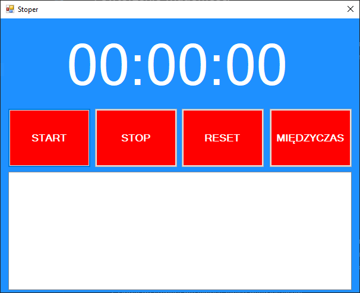

# Temat 18 - Stoper

## Powtórzenie wiadomości

Na poprzednich zajęciach poznaliśmy jak działa timer.

1. W celu dodania timera należy przeciągnąć symbol kontrolki timera na okno.
2. Timer obsługuje się za pomocą jego zdarzenia `Tick`, które uruchamiane jest po każdym odliczeniu zdefiniowanego we właściwościach kontrolki czasu.

## Program - Stoper



### Zadanie 1

Stwórzmy prosty stoper z funkcjami: start, stop i reset:

1. Dodaj do okna label, który będzie wyświetlał czas
2. Dodaj do okna 3 przyciski:
   1. Start -  powinien uruchomić timer
   2. Stop -  powinien zatrzymać timer
   3. Reset - powinien zresetować wartość zliczonych sekund i pokazać czas w labelce.
3. Dodaj do okna timer z interwałem 1s (1000ms)
4. W kodzie okna dodaj jako globalną zmienną (poza wszystkimi funkcjami): `int sekudny = 0;`
5. Do pokazywania czasu stwórz osobną funkcję, ponieważ używana ona będzie w kilku miejscach - czas wyświetlaj w formacie `Godziny:Minuty:Sekundy` - najpierw bez zer wiodących. Pamiętaj, aby dobrze obliczyć czas na podstawie zliczonych sekund - patrz `Podpowiedź 2`.
6. Po każdym odliczeniu 1 sekundy zwiększ wartość zmiennej `sekundy` która będzie naszym licznikiem sekund. Następnie użyj funkcji wyświetlającej czas - patrz punkt wcześniejszy.
7. Jeżeli twój timer dobrze liczy czas zmodyfikuj wyświetlanie czasu tak, aby widoczne były zera wiodące - patrz `Podpowiedź 1`.

### Zadanie 2

Dodaj do stopera możliwość zapisu międzyczasów:

1. Dodaj do okna przycisk "Międzyczas".
2. Dodaj do okna kontrolkę ListBox do której będziesz dodawał(a) międzyczasy.
3. Po przyciśnięciu nowego przycisku dodawaj do listy aktualny czas wraz z numerkiem odpowiadającym konkretnemu międzyczasowi.
4. Zmodyfikuj przycisk Reset tak, aby czyścił listę międzyczasów.

### Podpowiedź 1

Aby wyświetlić liczbę zapisaną w zmiennej: `int liczba = 4;` z zerami wiodącymi należy wykonać poniższy kod:

```csharp
liczba.ToString("d2");
```

### Podpowiedź 2

Zapisując w zmiennej skundy należy je dobrze przeliczyć.

Przykład:
Program zliczył 3723 sekundy i zapisał do zmiennej `sekundy` - każde zdarzenie `tick` wykonało operację `sekundy++;` 3723 razy. Tym samym program policzył 1godzina, 2minuty i 3sekundy, więc wynik widoczny na ekranie powinienbyć taki rezultat:

`01:02:03`

Aby wyświetlić wynik w taki spósób należy odpowiednio przeliczyć zliczone sekundy.

1. Najpierw należy obliczyć sekundy (czyli tyle czasu ile zostało policzone od ostatniej pełnej minuty). W tym celu musimy poznać resztę z dzielenia przez 60 ze zliczonych sekund.Obliczamy ją następująco:

    ```csharp
    int sekundyDoWyswietlenia = sekundy % 60;
    ```

   Idąc za przykładem: `3723 / 60 = 62` i reszty `33` (`62 x 60 = 3720`, `3723 - 3720 = 3`). Licząc resztę z dzielenia (symbol - `%` oznacza resztę z dzielenia) uzyskujemy wynik `3`.

2. Kolejnym krokiem jest obliczenie minut. Wiemy, że każda minuta ma 60sek. Zatem najpierw zliczone sekundy należy przeliczyć na pełne minuty:

   ```csharp
   int minuty = sekundy / 60;
   ```

   W ten sposób policzyliśmy wszystkie pełne minuty jakie zostały zliczone. Idąc za przykładem: `3723 / 60 = 62` - policzyliśmy w sumie w całym czasie trwania mierzenia czasy 62minuty, to jest 1h i 2min.

   Następnie (uwzględniając fakt iż nasz stoper liczy również godziny), należy wyciągnąć pozostałe minuty, które nie mieszczą się w pełnych godzinach, tak aby pełne godziny mogły wpaść na kolejną pozycję naszego "wyświetlacza". Aby dowiedzieć się ile minut zostało policzonych ponad pełne godziny, należy policzyć resztę z dzielenia przez ilość minut w godzinie, czyli resztę z dzielenia przez 60:

   ```csharp
   int minutyDoWyswietlenia = minuty % 60;
   ```

   Idąc za przykładem, obliczyliśmy, że 3662sek to 61min, a ponad pełną godzinę mamy `62 / 60 = 1 reszty 2`. Licząc resztę z dzielenia (symbol - `%` oznacza resztę z dzielenia) uzyskujemy wynik `2`.

3. Ostatnim etapem jest przedstawienie odpowiedniej liczby godzin.
  
   W 1 godzinie mamy 60 minut po 60sekund, więc możemy podzielić liczbę zliczonych sekund przez wynik mnożenia `60min x 60sek = 3600sek` - zatem w 1h mieści się 3600 sekund. Zatem akutalną liczbę sekund możemy podzielić przez tą wartość:

   ```csharp
   int godziny = sekundy / 3600;
   ```

   Idąc za przykładem: `3723 / 3600 = 1` i reszty `123`. Spójrz reszta z dzielenia to `123` sek, które są liczbą minut (`2`) i sekund (`3`) w postaci sumy sekund (`(2 x 60sek) + 3sek) = 120sek + 3sek = 123sek`). Suma ta jest przedstawiona na obliczonych wcześniej polach.

   Wyświetlenie czasu na labelce powinno być następujące:

   ```csharp
   label1.Text = godziny.ToString() + ":" + minutyDoWyswietlenia.ToString() + ":" + sekundyDoWyswietlenia.ToString();
   ```

   Powyższy kod wraz odpowiednim użyciem formatowania dla "ToString()" z `Przykładu 1` da bardzo dobry rezultat w trakcie działania programu.

## Wyślij swoją pracę

W celu zaliczenia obecności wyśli projekt aplikacji na podstawie opisu [stąd](../ZdalneInstrukcja#wysyłanie-projektu-aplikacji-okienkowej).

W tytule maila proszę podać: `Zajęcia Zdalne - Timer cz. 2`.
