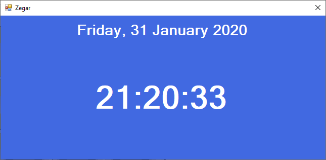

# Temat 19 - zegarek

Na zajęciach stworzymy zegarek. Sposób działania programu można podejrzeć [tutaj](Download/T19_Zegar.zip).

## Zadanie

Wykonaj projekt aplikacji zegarka z datownikiem.

Najpierw podstawowa wersja bazująca na dosępnych właściwościach:

1. Na okno pustego projektu aplikacji okienkowej dodaj dwa labelki i sformatuj według obrazka.



2. Pierwszy z nich niech nazywa się: `data`. Ustaw odpowiednią wielkość czcionki oraz ustaw tak aby tekst pojawiał się na środku etykiety i okna.
3. Drugi niech nosi nazwę: `zegar`. Ustaw odpowiednią wielkość czcionki oraz ustaw tak aby tekst pojawiał się na środku etykiety i okna.
4. Dodaj do aplikacji timer i nazwij go: `czas` oraz ustaw go jako automatycznie uruchomiony. Ustaw interwał na 1sek (1000ms).
5. Dodaj obsługę zdarzenia `Tick` do timera ( po prostu kliknij dwukrotnie na dodany timer). Kolejne kroki to implementacja obsługi owego zdarzenia.
6. NOWOŚĆ: Aby pobrać aktualną datę z systemu użytkownika należy użyć zmiennej typu DateTime w poniższy sposób:

   ```csharp
   DateTime dt = DateTime.Now;
   ```

   Po takiej operacji w zmiennej `dt` będziemy posiadali informacje o aktualnym stanie zegara systemowego (aktualny w momencie wykonania powyższej linijki.).

7. Z zmiennej `dt` można wyciągnąć poszczególne składowe daty i czasu, które zostały przedstawione w materiałach.
8. Na początku pokażmy samą godzinę, jakie właściwości DateTime będą nam potrzebne:
   1. Hour
   2. Minute
   3. Second
9. Spróbujmy wyświetlić czas w postaci tekstu:

   ```csharp
   zegar.Text = dt.Hour + ":" + dt.Minute + ":" + dt.Second;
   ```

   całość fukcji `Tick` timera na tym etapie powinna być następujaca:

   ```csharp
   DateTime dt = DateTime.Now;
   zegar.Text = dt.Hour + ":" + dt.Minute + ":" + dt.Second;
   ```

10. Po uruchomieniu widzimy, że czas wyświetla się nieco inaczej niż zwykle na zegarze cyfrowym - brakuje tzw. zer wiodących.
11. Aby dodać zera wiodące można użyć funkcji: `.ToString("00")` wtedy każdą liczbę formatujemy tak, aby składała się zawsze z 2 cyfr w tym z zer wiodących. Ostatnią linijkę z punktu 9 należy zmodyfikować zatem w następujący sposób:

    ```csharp
    zegar.Text = dt.Hour.ToString("00") + ":" + dt.Minute.ToString("00") + ":" + dt.Second.ToString("00");
    ```

12. OK! Mamy wspaniale wyświetlony czas z zerami widącymi, ale jego zapis jest dość skomplikowany. Całość wygląda następująco:

    ```csharp
    DateTime dt = DateTime.Now;
    zegar.Text = dt.Hour.ToString("00") + ":" + dt.Minute.ToString("00") + ":" + dt.Second.ToString("00");
    ```

13. Zapis ten można skrócić, ponieważ metoda `.ToString();` użyta bezpośrednio dla zmiennej `dt` (czyli dla samej daty i czasu, a nie dla jej właściwości, która jest najczęściej liczbą typu `int`) umożliwa formatowanie czasu. Chcąc zatem wyświetlić godzinę można skrócić zapis ostatniej liniki następująco:

    ```csharp
    zegar.Text = dt.ToString("HH:mm:ss");
    ```

    W ten sposób przerobiliśmy na string (ciąg znaków) zmienną przechowującą datę i czas (Typ danych `DateTime`), a cała obsługa zdarzenia `Tick` dla timera powinna wyglądać teraz następująco:

    ```csharp
    DateTime dt = DateTime.Now;
    zegar.Text = dt.ToString("HH:mm:ss");
    ```

    Prawda, że krótko? :)

14. Spróbujmy z datą! Jakie właściwości typu `DateTime` będą nam potrzebne? Poniżej znajduje się lista:

    1. DayOfWeek - dzień tygodnia
    2. Day - numer dnia miesiąca
    3. Month - numer miesiąca
    4. Year - rok

15. Pierwszy na ekranie pojawia się dzień tygodnia. W celu wyświetlenia dnia tygodnia sprawdzamy co znajduje się wewnątrz `dt.DayOfWeek` właściwość ta przechowuje wartości, które można porównać z enum'em o tej samej nazwie: `DayOfWeek`. W tym celu stwórzmy sobie switch'a który sprawdzi nam dzien tygodnia i wpisze jego polską nazwę do zmiennej. Poniższy kod dodaj pod tym, który powstał w punkcie 13:

    ```csharp
    string dzienTygodnia = "";
    switch(dt.DayOfWeek)
    {
        case DayOfWeek.Monday:
            dzienTygodnia = "Poniedziałek";
            break;
        case DayOfWeek.Tuesday:
            dzienTygodnia = "Wtorek";
            break;
        case DayOfWeek.Wednesday:
            dzienTygodnia = "Środa";
            break;
        case DayOfWeek.Thursday:
            dzienTygodnia = "Czwartek";
            break;
        case DayOfWeek.Friday:
            dzienTygodnia = "Piątek";
            break;
        case DayOfWeek.Saturday:
            dzienTygodnia = "Sobota";
            break;
        case DayOfWeek.Sunday:
            dzienTygodnia = "Niedziela";
            break;
    }
    ```

16. Następnie po ustaleniu dnia tygodnia i zapisaniu tej informacji do `dzienTygodnia` należy nowo utworzoną zmienną zapisać w etykiecie `data`:

    ```csharp
    data.Text = dzienTygodnia;
    ```

    Powyższy kod wstaw zaraz po switch'u, który powstał w poprzednim kroku. Po uruchomieniu oprócz aktualnego czasu powinna pojawić się nazwa dnia tygodnia na odpowiednim labelku.

17. Nastepnie wyświetlamy dzień miesiąca, przez zmodyfikowanie linijki z powyższego fragmentu:

    ```csharp
    data.Text = dzienTygodnia + ", " + dt.Day;
    ```

    całość funkcji `Tick` powinna obecnie wyglądać następująco:

    ```csharp
    DateTime dt = DateTime.Now;
    zegar.Text = dt.ToString("HH:mm:ss");
    string dzienTygodnia = "";
    switch(dt.DayOfWeek)
    {
        case DayOfWeek.Monday:
            dzienTygodnia = "Poniedziałek";
            break;
        case DayOfWeek.Tuesday:
            dzienTygodnia = "Wtorek";
            break;
        case DayOfWeek.Wednesday:
            dzienTygodnia = "Środa";
            break;
        case DayOfWeek.Thursday:
            dzienTygodnia = "Czwartek";
            break;
        case DayOfWeek.Friday:
            dzienTygodnia = "Piątek";
            break;
        case DayOfWeek.Saturday:
            dzienTygodnia = "Sobota";
            break;
        case DayOfWeek.Sunday:
            dzienTygodnia = "Niedziela";
            break;
    }
    data.Text = dzienTygodnia + ", " + dt.Day;
    ```

18. Po uruchomieniu zauważysz łatwo, że dzień miesiąca tak jak godzina nie ma zera wiodącego, zatem poprawiamy:

    ```csharp
    data.Text = dzienTygodnia + ", " + dt.Day.ToString("00");
    ```

19. Następnie powinniśmy wyświetlić nazwę miesiąca. W tym wypadku, tak jak z dniami tygodnia należy ustalić nazwę miesiąca, lecz tutaj na podstawie jego numeru od 1 do 12. W tym celu tworzymy kolejnego switch'a, którego wstawiamy **PRZED** PONIŻSZĄ LINIJKĄ:

    ```csharp
    data.Text = dzienTygodnia + ", " + dt.Day.ToString("00");
    ```

    A wewnątrz switcha sprawdzamy wartość `dt.Month` dla kolejnych numerów miesięcy:

    ```csharp
    string miesiac = "";
    switch(dt.Month)
    {
        case 1:
            miesiac = "Styczeń";
            break;
        case 2:
            miesiac = "Luty";
            break;
        case 3:
            miesiac = "Marzec";
            break;
        case 4:
            miesiac = "Kwiecień";
            break;
        case 5:
            miesiac = "Maj";
            break;
        case 6:
            miesiac = "Czerwiec";
            break;
        case 7:
            miesiac = "Lipiec";
            break;
        case 8:
            miesiac = "Sierpień";
            break;
        case 9:
            miesiac = "Wrzesień";
            break;
        case 10:
            miesiac = "Październik";
            break;
        case 11:
            miesiac = "Listopad";
            break;
        case 12:
            miesiac = "Grudzień";
            break;
    }
    ```

20. Na koniec dodajemy nazwę miesiąca do wyświetlanej daty. Modyfikując linijkę ustawiającą tekst daty:

    ```csharp
    data.Text = dzienTygodnia + ", " + dt.Day.ToString("00") + " " + miesiac;
    ```

21. Z rokiem sprawa jest prosta, więc możemy go dodać bezpośrednio do wyświetlanego tekstu:

    ```csharp
    data.Text = dzienTygodnia + ", " + dt.Day.ToString("00") + " " + miesiac + " " + dt.Year;
    ```

22. Super MAMY DATE I GODZINĘ! Zegarek działa, ale sposób wyświetlania daty jest badzo skomplikowany. Cała funkcja `Tick` wygląda teraz następująco:

    ```csharp
    DateTime dt = DateTime.Now;
    zegar.Text = dt.ToString("HH:mm:ss");
    string dzienTygodnia = "";
    switch(dt.DayOfWeek)
    {
        case DayOfWeek.Monday:
            dzienTygodnia = "Poniedziałek";
            break;
        case DayOfWeek.Tuesday:
            dzienTygodnia = "Wtorek";
            break;
        case DayOfWeek.Wednesday:
            dzienTygodnia = "Środa";
            break;
        case DayOfWeek.Thursday:
            dzienTygodnia = "Czwartek";
            break;
        case DayOfWeek.Friday:
            dzienTygodnia = "Piątek";
            break;
        case DayOfWeek.Saturday:
            dzienTygodnia = "Sobota";
            break;
        case DayOfWeek.Sunday:
            dzienTygodnia = "Niedziela";
            break;
    }
    string miesiac = "";
    switch(dt.Month)
    {
        case 1:
            miesiac = "Styczeń";
            break;
        case 2:
            miesiac = "Luty";
            break;
        case 3:
            miesiac = "Marzec";
            break;
        case 4:
            miesiac = "Kwiecień";
            break;
        case 5:
            miesiac = "Maj";
            break;
        case 6:
            miesiac = "Czerwiec";
            break;
        case 7:
            miesiac = "Lipiec";
            break;
        case 8:
            miesiac = "Sierpień";
            break;
        case 9:
            miesiac = "Wrzesień";
            break;
        case 10:
            miesiac = "Październik";
            break;
        case 11:
            miesiac = "Listopad";
            break;
        case 12:
            miesiac = "Grudzień";
            break;
    }
    data.Text = dzienTygodnia + ", " + dt.Day.ToString("00") + " " + miesiac + " " + dt.Year;
    ```

23. Zapis daty możemy również skrócić za pomocą funkcji `ToString()` wywołanej dla zmiennej z datą i czasem. Stosując opdowiednie formatowanie:

    ```csharp
    data.Text = dt.ToString("dddd, dd MMMM yyyy");
    ```

    Zmieniając ostatnią linijkę funkcji `Tick` na powyższą wyświetlanie daty ograniczy się tylko do jednej linijki.

24. Teraz możemy wyczyść kod z już zbędnego ustalania dnia miesiaca i nazwy - to będzie działo się już automatycznie. Zatem funkcja `Tick` będzie wyglądała teraz następująco:

    ```csharp
    DateTime dt = DateTime.Now;
    zegar.Text = dt.ToString("HH:mm:ss");
    data.Text = dt.ToString("dddd, dd MMMM yyyy");
    ```

25. Zegarki często migają dwukropkami - cykl zaświecenie i zgaszenie odbywa się w przeciągu 1 sekundy. Możemy to zasymulować:

    1. Poza funkcją obsługującą timer dodaj zmienną:

       ```csharp
       bool PokazDwukropki = false;
       ```

    2. Linijkę, która wyświtla czas:

       ```csharp
       zegar.Text = dt.ToString("HH:mm:ss");
       ```

       Zmieniamy na poniższy kod:

       ```csharp
       if(PokazDwukropki) //Jeżeli zmienna PokazDwukropki będzie TRUE
       {
           zegar.Text = aktualnaData.ToString("HH:mm:ss"); //Pokaz dwukropki na zegarku
       }
       else
       {
           zegar.Text = aktualnaData.ToString("HH mm ss"); //Jeżeli będzie false to nie pokazuj
       }
       PokazDwukropki = !PokazDwukropki; //Negujemy aktualną wartość PokazDwukropki - jeżeli przed tą operacją będzie tam FALSE to zmieni się ona na TRUE.
       ```

    3. Dwukropek powinien pojawić się i zniknąć w czasie 1sek, należy zmienić interwał timera na 500ms, aby zmiana odbywała się co 0,5sek.

## Ciekawostka 1

Pobierz spakowaną aplikację [stąd](Download/T19_Bin.zip). Spróbuj odgadnąć jaki rodzaj zegarka został zaprezentowany w tej aplikacji. Jeśli znajdziesz odopwiedź proszę umieść ją w mailu razem z rozwiązaniem zadania z zajęć.

## Wyślij zadanie

W celu zaliczenia obecności wyśli projekt aplikacji powstałej w ramach zajęć. W tym celu użyj opisu [stąd](../ZdalneInstrukcja#wysyłanie-projektu-aplikacji-okienkowej).

W tytule maila proszę podaj: `Zajęcia Zdalne - Zegarek`.
