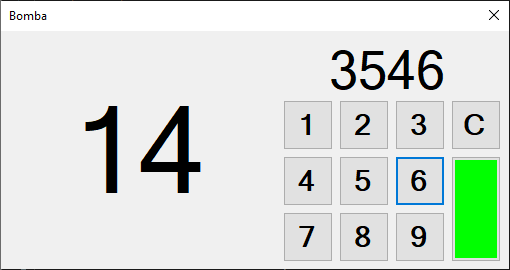
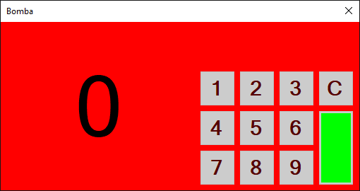

# Test - Kontrolki RichTextBox + Timer

## Test

[Wykonaj test](http://bit.ly/AkademiaMP_P2T4)

## Zadanie - Bomba



Napisz program symulujący bombę, którą zdeaktywuje poprawnie podany kod pin (4-ro cyfrowy):

1. Po lewej stronie umieśc label, w którym będziesz odliczał sekundy np od 20 do 0.
2. Po prawej stronie umieść cyfrową klawiaturę ekranową zbudowaną z zwykłych przycisków, gdzie znajdą się:
   1. Cyfry 1-9.
   2. Przycisk C do czyszczenia wpisanego kodu.
   3. Przycisk z kolorem zielonym do sprawdzania poprawności kodu PIN.
3. Dodaj label nad przyciskami, który wyświetli kod PIN.
4. Pamiętaj że oprócz widocznych na ekranie elementów powinieneś dodać timer, który będzie służył do odliczania czasu pozostałego do wybuchu.

Stan aplikacji po uruchomieniu:

1. Timer odlicza sekundy
2. Label z pinem jest pusty
3. Użytkownik może wpisywać cyfry - przyciski mają właściwość `Enabled = true` - domyślnie jest `true`.

Akcje przycisków:

1. Po wciśnięciu przycisku z dowolną cyfrą do labela z aktualnie wpisywanym pinem nad przyciskami powinna dopisać się wciśnięta przez użytkownika cyfra. np.:

   `pin.Text += "1"`

   po przyciśnięciu przez użytkownika przycisku z cyfrą `1`.

2. Po wciśnieciu zielonego przycisku należy sprawdzić proprawność kodu pin wpisanego do kontrolki Label z pin'em. Jeżeli pin jest poprawny (Poprawny PIN powinieneś wymyślić samodzielnie) to:
   1. Zablokuj wszystkie przyciski (`button.Enabled = false;`).
   2. Zmień kolor tła apkiacji na zielony.
   3. Zatrzymaj timer żeby nie odliczał już czasu.
3. Po wciśnięciu przycisku kasującego (tego z literką `C`) tekst label'a z pin'em powinien zostać wyczyszczony.

Zadania timera:

1. Powinien być ustawiony na odliczanie 1sek
2. Powinien uruchomić się automatycznie po starcie
3. Akcja timera:

   1. Odejmuje 1 sekundę ze zmiennej, w której pamiętamy ile pozostało sekund do końca - zmienna ta na początku powinna mieć wartość np 15 jeśli chcemy odliczać od 15 do 0. Odejmowanie o 1 można realizować na conajmniej 3 sposoby:

      ```csharp
      czas--;
      ```

      ```csharp
      czas -= 1;
      ```

      ```csharp
      czas = czas - 1;
      ```

      **UWAGA** powyżej zanotowano tylko przykłady, skopiowanie tego nic nie da - należy to traktować jako przykład.

   2. Jeżli czas dojdzie do `0` (czyli wartość zmiennej z pozostałym do wybuchu czasem `== 0`) to:
      1. Zablokuj wszystkie przyciski na klawiaturze (`button.Enabled = false;`)
      2. Zmień kolor tła na czerwony
      3. Zatrzymaj timer


