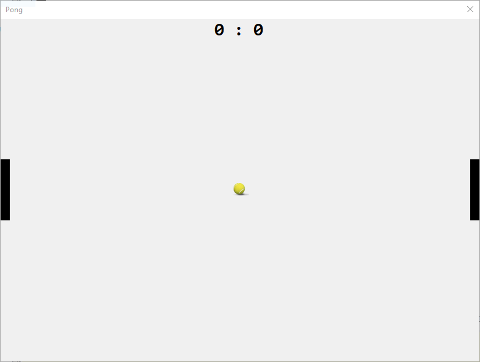

# Gra PONG



## Etap 3 - Ruch piłki

### Kierunek ruchu piłki

Piłka może poruszać się w 4-rech kierunkach:

- W górę i w prawo
- W górę i w lewo
- W dół i w prawo
- W dół i w lewo

Stwórzmy zatem reporezentację tych kierunków w formie struktury enum:

```csharp
enum KierunekPilki
{
	GoraPrawo,
	DolPrawo,
	GoraLewo,
	DolLewo
}
```

Na ekranie widnieje tylko jedna piłka, więc możemy zapisać jej akutalny stan do zmiennej. Pod zmiennymi informującymi o prędkości graczy dodaj zmienną `KierunekPilki` z aktualnym jej kierunkiem:

```csharp
KierunekPilki AktualnyKierunekPilki;
```

### Domyślny kierunek piłki

Po uruchomieniu gry program powinien wiedzieć w jakim kierunku ma się udać piłka po starcie. Jej startową pozycję ustawiamy w funkcji `ResetPilki` użyjmy jej do wylosowania kierunku w jakim uda się ona po starcie gry. Dodajmy poniższy kod na końcu funkcji `ResetPilki`:

```csharp
Random rnd = new Random();
AktualnyKierunekPilki = (KierunekPilki)rnd.Next(0, 4);
```

W efekcie funkcja `ResetPilki` powinna wyglądać następująco:

```csharp
void ResetPilki()
{
	int x = (background.Size.Width / 2) - (pilka.Size.Width / 2);
	int y = (background.Size.Height / 2) - (pilka.Size.Height / 2);
	pilka.Location = new Point(x, y);
	Random rnd = new Random();
	AktualnyKierunekPilki = (KierunekPilki)rnd.Next(0, 4);
}
```

### Wprawmy piłkę w ruch

#### Prędkość

Piłka po wciśnięciu spacji powinna poruszać się po planszy sama z zadaną prędkością. Na samym początku stwórzmy globalną zmienną która będzie posiadała informację o prędkości piłki:

```csharp
int predkoscPilki = 5;
```

Zmienną najlepiej stworzyć obok tych dotyczących pozycji piłki oraz prędkości graczy.

#### Ruch

W celu wprawienia piłki w ruch wykorzystamy nasz timer. Kliknij dwukrotnie na timer. Wewnątrz funkcji wywołaj nie istniejącą funkcję `RuchPilki`:

```csharp
void GraTick(object sender, EventArgs e)
{
    RuchPilki();
}
```

Obsługa timera będzie rozszerzana w kolejnych krokach, na razie zajmijmy się ruchem pilki. Stwórzmy wywołaną funkcję:

```cshapr
void RuchPilki()
{

}
```

Piłka porusza się w zależności od obranego kierunku (zmienna: `AktualnyKierunekPilki`). Zatem należy sprawdzić to w jakim kierunku powinna się ona poruszać i odpowiednio zmieniać jej lokalizację o zadaną prędkość. Najpierw jednak rozpoznajmy w jakim kierunku powinna się ona udać, w tym celu znów posłużymy sie konstrukcją switch-case, która świetnie się do tego nada:

```csharp
switch(AktualnyKierunekPilki)
{
	case KierunekPilki.DolLewo:

		break;
	case KierunekPilki.DolPrawo:

		break;
	case KierunekPilki.GoraLewo:

		break;
	case KierunekPilki.GoraPrawo:

		break;
}
```

Ruchy w lewo i w prawo odbywają się względem osi X. W prawo wartości na osi X rosną, natomiast w lewo maleją do 0.

Ruchy w górę i w dół odbywają się względem osi Y. W dół wartości na osi Y rosną, a w górę maleją do 0.

#### 1. Ruch - Dół Lewo

Ruch w lewo to poruszanie się w kierunku 0 na osi X. Zatem nowa lokalizacja na osi X to:

```csharp
pilka.Location.X - predkoscPilki
```

Wszystkie ruchy w dół to poruszanie się coraz niżej względem osi Y, zatem wartość na osi Y będzie rosła, więc:

```csharp
pilka.Location.Y + predkoscPilki
```

Aby wykonać ruch należy ustawić nową lokalizację piłki:

```csharp
pilka.Location = new Point(pilka.Location.X - predkoscPilki, pilka.Location.Y + predkoscPilki);
```

#### 2. Ruch - Dół Prawo

Względem poprzedniego przykładu zmieni się jedynie kierunek na osi X na przeciwny (zamiast w lewo to w prawo), zatem aby wykonać ten ruch zastosujemy poniższy kod:

```csharp
pilka.Location = new Point(pilka.Location.X + predkoscPilki, pilka.Location.Y + predkoscPilki);
```

#### 3. Rcuh - Góra Lewo i Góra Prawo

W przypadku obu ruchów w górę można skopiować kod z obu ruchów w dół i zamienić znak dla osi Y.
Góra Lewo:

```csharp
pilka.Location = new Point(pilka.Location.X - predkoscPilki, pilka.Location.Y - predkoscPilki);
```

Góra Prawo

```csharp
pilka.Location = new Point(pilka.Location.X + predkoscPilki, pilka.Location.Y - predkoscPilki);
```

Gotowa funkcja `RuchPilki`:

```csharp
void RuchPilki()
{
    switch(AktualnyKierunekPilki)
    {
    	case KierunekPilki.DolLewo:
    		pilka.Location = new Point(pilka.Location.X predkoscPilki, pilka.   Location.Y + predkoscPilki);
    		break;
    	case KierunekPilki.DolPrawo:
    		pilka.Location = new Point(pilka.Location.X predkoscPilki, pilka.   Location.Y + predkoscPilki);
    		break;
    	case KierunekPilki.GoraLewo:
    		pilka.Location = new Point(pilka.Location.X predkoscPilki, pilka.   Location.Y - predkoscPilki);
    		break;
    	case KierunekPilki.GoraPrawo:
    		pilka.Location = new Point(pilka.Location.X predkoscPilki, pilka.   Location.Y - predkoscPilki);
    		break;
    }
}
```

### Koniec etapu trzeciego

Po uruchomieniu i wciśnięciu spacji piłka powinna zacząć się ruszać w losow wybranym kierunku a następnie zniknąć za obszarem gry. Oprócz tego z poprzednich etapów mamy zainicjalizowaną grę oraz ruchy graczy.

## Etap 4 - Kolizje

W poprzednim etapie udało nam się wprowadzić w ruch piłkę, ale niestety po wyjściu poza ekran piłka już na niego nie wracała.

Aby piłka odbijała się od krawędzi ekranu lub paletek graczy należy wykryć kolizje. Na początek zaczniemy od prostych kolizji, czyli odbicia od ścian zgodnie z zasadą: `kąt padania równa się kątowi odbicia`.

### Kolizje góra/dół - odbicie

Jak pewnie zauważyłeś piłka zazwyczaj w pierwszej kolejności powinna odbić się od górnej lub dolnej krawędzi.

Do funkcji obsługującej timer dodajmy wywołanie funkcji `KolizjeGoraDol`, tak aby w efekcie wyglądała ona w poniższy sposób:

```csharp
void GraTick(object sender, EventArgs e)
{
    KolizjeGoraDol();
    RuchPilki();
}
```

Następnie zdefiniujmy funkcjię `KolizjeGoraDol`:

```csharp
void KolizjeGoraDol()
{

}
```

#### Kolizja z górną krawędzią

Kolizja z górną krawędzią następuje wtedy, gdy lokalizacja piłki względem osi Y jest mniejsza od 0. Zatem w celu sprawdzenia czy piłka ma kolizję z górną krawędzią powinniśmy do nowej funkcji wstawić poniższy kod:

```csharp
if(pilka.Location.Y <= 0)
{

}
```

Po wykryciu kolizji powinniśmy zmienić kierunek piłki. Jeśli piłka kierowała się w górę powinna iść w dół. Kierunek lewo/prawo powinien zostać. Jak widać łatwo zaznaczyć tu konstrukcję switch, która odpowiednio zmieni wartość zmiennej `AktualnyKierunekPilki`. Całość powinna prezentować się w poniższy sposób:

```csharp
if(pilka.Location.Y <= 0)
{
	switch(AktualnyKierunekPilki)
	{
		case KierunekPilki.GoraLewo:
			AktualnyKierunekPilki = KierunekPilki.DolLewo;
			break;
		case KierunekPilki.GoraPrawo:
			AktualnyKierunekPilki = KierunekPilki.DolPrawo;
			break;
	}
}
```

#### Kolizja z dolną krawędzią

Piłka zpotka się z dolną krawędzią wtedy kiedy jej lokalizacja powiększona o wysokość będzie taka sama lub większa od wysokości obszaru rozgrywki (kontrolka `background`). Zatem należy pod if'a z poprzedniego punktu dodać poniższy kod:

```csharp
if(pilka.Location.Y + pilka.Size.Height >= background.Size.Height)
{

}
```

Jeżeli już nastąpi kolizja z dolną krawędzią najprawdopodobniej piłka poruszała się w dół. Należy skierować ją w górę z tym samym kierunkiem lewo/prawo. Tutaj znowu należy zastosować switcha, który sprawdzi gdzie porusza się piłka i odwróci jej kierunek. Cały fragment z warunkiem sprawdzającym dolną krawędź będzie wyglądał w poniższy sposób:

```csharp
if(pilka.Location.Y + pilka.Size.Height >= background.Size.Height)
{
	switch(AktualnyKierunekPilki)
	{
		case KierunekPilki.DolLewo:
			AktualnyKierunekPilki = KierunekPilki.GoraLewo;
			break;
		case KierunekPilki.DolPrawo:
			AktualnyKierunekPilki = KierunekPilki.GoraPrawo;
			break;
	}
}
```

#### Cały kod funkcji KolizjaGoraDol

```csharp
void KolizjeGoraDol()
{
	if(pilka.Location.Y <= 0)
	{
		switch(AktualnyKierunekPilki)
		{
			case KierunekPilki.GoraLewo:
				AktualnyKierunekPilki = KierunekPilki.DolLewo;
				break;
			case KierunekPilki.GoraPrawo:
				AktualnyKierunekPilki = KierunekPilki.DolPrawo;
				break;
		}
	}
	if(pilka.Location.Y + pilka.Size.Height >= background.SizeHeight)
	{
		switch(AktualnyKierunekPilki)
		{
			case KierunekPilki.DolLewo:
				AktualnyKierunekPilki = KierunekPilki.GoraLewo;
				break;
			case KierunekPilki.DolPrawo:
				AktualnyKierunekPilki = KierunekPilki.GoraPrawo;
				break;
		}
	}
}
```

Po uruchomieniu piłka powinna się odbić od górnej lub dolnej krawędzi, a następnie zniknąć za jedną z bocznych krawędzi.

### Kolizja lewo/prawo - odbicie

Naprawmy problem z brakiem odbicia od bocznych krawędzi w tym celu do funkcji timer'a dodajmy wywołanie funkcji `KolizjeLewoPrawo`, tak aby cała funcja timer'a wyglądała w poniższy sposób:

```csharp
void GraTick(object sender, EventArgs e)
{
    KolizjeGoraDol();
    KolizjeLewoPrawo();
    RuchPilki();
}
```

Definiujemy funkcję:

```csharp
void KolizjeLewoPrawo()
{

}
```

I wykrywamy kolejno kolizje analogicznie do kolizji z górną/dolną krawędzią, z tą różnicą że zamiast sprawdzać oś Y sprawdzamy X.

#### Kolizja z lewą krawędzią

Tutaj sytuacja ma się podobnie co z górną krawędzią, tutaj kierunek góra-dół pozostaje natomiast zmienia się kierunek lewo-prawo, natomiast w tym przypadku piłka zazwyczaj leci w lewo, więc sprawdzamy tylko kierunki góra dół dla lewo i odwracamy piłkę w prawo, drugi kierunek bez zmian:

```csharp
if(pilka.Location.X <= 0)
{
	switch(AktualnyKierunekPilki)
	{
		case KierunekPilki.GoraLewo:
			AktualnyKierunekPilki = KierunekPilki.GoraPrawo;
			break;
		case KierunekPilki.DolLewo:
			AktualnyKierunekPilki = KierunekPilki.DolPrawo;
			break;
	}
}
```

#### Kolizja z prawą krawędzią

W tym przypadku należy sprawdzić czy lokalizacja piłki powiekszona o jej szerokość jest wieksza lub równa szerokości obszaru gry. Następnie jeśli piłka poruszała się w dół to powinna poruszać się nadal w tym samym kierunku ale powinna zmienić kierunek na linii lewo-prawo - jak w zderzeniu z lewą krawędzią.

W tym przypadku rozpoatrujemy równeż tylko dwa kierunki (oba w prawo), ponieważ tylko wtedy piłka spotka się z prawą krawędzią i zmieni kierunek w lewo.

```csharp
if(pilka.Location.X + pilka.Size.Width >= background.Size.Width)
{
	switch(AktualnyKierunekPilki)
	{
		case KierunekPilki.GoraPrawo:
			AktualnyKierunekPilki = KierunekPilki.GoraLewo;
			break;
		case KierunekPilki.DolPrawo:
			AktualnyKierunekPilki = KierunekPilki.DolLewo;
			break;
	}
}
```

#### Cały kod funkcji KolizjaLewoPrawo

```csharp
void KolizjeLewoPrawo()
{
    if(pilka.Location.X <= 0)
    {
        switch(AktualnyKierunekPilki)
        {
            case KierunekPilki.GoraLewo:
                AktualnyKierunekPilki = KierunekPilki.GoraPrawo;
                break;
            case KierunekPilki.DolLewo:
                AktualnyKierunekPilki = KierunekPilki.DolPrawo;
                break;
        }
    }
    if(pilka.Location.X + pilka.Size.Width >= background.Size.Width)
    {
        switch(AktualnyKierunekPilki)
        {
            case KierunekPilki.GoraPrawo:
                AktualnyKierunekPilki = KierunekPilki.GoraLewo;
                break;
            case KierunekPilki.DolPrawo:
                AktualnyKierunekPilki = KierunekPilki.DolLewo;
                break;
        }
    }
}
```

Na tym etapie piłka powinna poruszać się już poprawnie po planszy i odbijać od wszystkich krawędzi. Jednak przy spotkaniu piłki z paletką dowolnego gracza jeszcze nic się nie dzieje.

### Kolizja z graczem - odbicie

W celu sprawdzenia czy piłka dotknie gracza posłużymy się obiektem `Rectangle`, który reprezentuje kwadrat w przestrzeni z swoją lokalizacją i rozmiarem. Gracz i paletka będą osobnymi kwadratami, które sprawdzimy czy się nachodzą za pomocą funkcji `Rectangle.Intersect(...)`. Na koniec sprawdzimy czy wynik funkcji jest pusty, jesli nie będzie on pusty to znaczy, że zadane kwadraty mają część wspólną. Wtedy sprawdziwmy w jakim kierunku porusza się piłka i zmienimy go na odpowiedni, zgodnie z zasadą `kąt padania równa się kontowi odbicia`.

Stworzymy funkcje `KolizjaGracz`, która przyjmie jako parametr `Panel` reprezentujący kontrolkę gracza na ekranie i pozwoli na sprawdzenie obu graczy za pomocą jednego kodu. Zatem:

```csharp
void KolizjaGracz(Panel gracz)
{

}
```

Wywołajmy funkcję dla obu graczy wewnątrz funkcji timera, tak aby wyglądała w poniższy sposób:

```csharp
void GraTick(object sender, EventArgs e)
{
    (gL);
    KolizjaGracz(gP);
    KolizjeGoraDol();
    KolizjeLewoPrawo();
    RuchPilki();
}
```

Następnie wewnątrz tej funkcji `KolizjaGracz` stwórzmy obiekt kwadratu reprezentujący gracza dla którego wywołujemy funkcję:

```csharp
Rectangle graczRect = new Rectangle(gracz.Location.X, gracz.Location.Y, gracz.Size.Width, gracz.Size.Height);
```

Stówrzmy obiekt kwadratu dla piłki. Jest ona tylko jedna więc używamy po prostu nazwy kontrolki z piłką:

```csharp
Rectangle pilkaRect = new Rectangle(pilka.Location.X, pilka.Location.Y, pilka.Size.Width, pilka.Size.Height);
```

Kolejnym krokiem jest stworzenie kwadratu, który będzie reprezentował część wspólną gracza i piłki:

```csharp
Rectangle wynikowyRect = Rectangle.Intersect(pilkaRect, graczRect);
```

Następnie sprawdzamy czy `wynikowyRect` nie jest pusty, jeśli nie jest to znaczy że piłka dotknęła wybranego gracza:

```csharp
if(!wynikowyRect.IsEmpty)
{

}
```

Jeśli powyższy warunek jest spełniony zmieniamy kierunek piłki. Sprawdzamy jaki jest aktualny kierunek i odppowiednio ustawiamy na nowo wartość zmiennej `AktualnyKierunekPilki`. Tutaj należy wziąć pod uwagę wszystkie kierunki:

```csharp
switch(AktualnyKierunekPilki)
{
	case KierunekPilki.DolLewo:
		AktualnyKierunekPilki = KierunekPilki.DolPrawo;
		break;
	case KierunekPilki.DolPrawo:
		AktualnyKierunekPilki = KierunekPilki.DolLewo;
		break;
	case KierunekPilki.GoraLewo:
		AktualnyKierunekPilki = KierunekPilki.GoraPrawo;
		break;
	case KierunekPilki.GoraPrawo:
		AktualnyKierunekPilki = KierunekPilki.GoraLewo;
		break;
}
```

Cała funkcja powinna wyglądać w poniższy sposób:

```csharp
void KolizjaGracz(Panel gracz)
{
	Rectangle graczRect = new Rectangle(gracz.Location.X, graczLocation.Y, gracz.Size.Width, gracz.Size.Height);
	Rectangle pilkaRect = new Rectangle(pilka.Location.X, pilkaLocation.Y, pilka.Size.Width, pilka.Size.Height);
	Rectangle wynikowyRect = Rectangle.Intersect(pilkaRectgraczRect);
	if(!wynikowyRect.IsEmpty)
	{
		switch(AktualnyKierunekPilki)
		{
			case KierunekPilki.DolLewo:
				AktualnyKierunekPilki = KierunekPilki.DolPrawo;
				break;
			case KierunekPilki.DolPrawo:
				AktualnyKierunekPilki = KierunekPilki.DolLewo;
				break;
			case KierunekPilki.GoraLewo:
				AktualnyKierunekPilki = KierunekPilki.GoraPrawo;
				break;
			case KierunekPilki.GoraPrawo:
				AktualnyKierunekPilki = KierunekPilki.GoraLewo;
				break;
		}
	}
}
```

Po uruchomieniu gry i rozgrywki kiedy któryś z graczy dotknie paletką piłki powinna ona się odbić od niej. Obecnie jednak odbija się ona od prawej i lewej krawędzi zamiast zaliczać punkt dla odpowiedniego gracza, zatrzymywać grę i ustawiać piłkę na środku.

### Kolizja lewo/prawo - modyfikcaja - punkty i koniec gry

### Zmienne do zapisu wyników

Stwórzmy globalne zmienne do zapisu aktualnego wyniku rozgrywki:

```csharp
int graczLPunkty = 0;
int graczPPunkty = 0;
```

### Funkcja KoniecGry

W celu zakończenia gry po kolizji piłki z prawą/lewą krawędzią stwózmy funkcję:

```csharp
void KoniecGry()
{

}
```

w pierwszej kolejności powinniśmy zatrzymać ruch piłki:

```csharp
gra.Stop();
```

Następnie powinniśmy ustawić piłkę na środku ekranu. Do tego posiadamy funkcję `ResetPilki`, która już istnieje w naszym kodzie, wywołajmy ją:

```csharp
ResetPilki();
```

i ustawiamy wyniki na naszej tablicy wyników:

```csharp
talicaWynikow.Text = graczLPunkty + " : " + graczPPunkty;
```

Funkcja jeszcze nie jest nigdzie wywoływana.

### Przeróbka funkcji - KolizjaLewoPrawo

Wróćmy jednak do funkcji `KolizjeLewoPrawo`, zmieńmy jej definicję tak aby mogła zwrócić `true` lub `false`. Zatem

```csharp
void  KolizjeLewoPrawo()
```

zamieniamy na:

```csharp
bool KolizjeLewoPrawo()
```

Obecnie jeśli piłka wyjdzie poza ekran z jednej lub drugiej strony to wykonujemy odbicie za pomocą konstrukcji switch-case. Usuń oba switch-case w funkcji `KolizjeLewoPrawo`, funkcja powinna obecnie wyglądać następująco:

```csharp
bool KolizjeLewoPrawo()
{
	if(pilka.Location.X <= 0)
	{

	}
	if(pilka.Location.X + pilka.Size.Width>= background.Size.Width)
	{

	}
}
```

Jeżeli piłka nie wyjdzie poza ekran z lewej/prawej strony to gra powinna toczyć się dalej wtedy zwrócimy `false` z naszej funkcji. Dodaj na końcu funkcji linijkę:

```csharp
return false;
```

Jeżeli piłka wyskoczy poza obszar gry z lewej strony to:

1. Punkt dla gracza z prawej strony
   ```csharp
   graczPPunkty++;
   ```
2. Kończymy grę przez wywołanie funkcji `KoniecGry`:
   ```csharp
   KoniecGry()
   ```
3. Zwracamy `true`:
   ```csharp
   return true;
   ```

Jeśli piłka wyskoczy z prawej strony robimy dokładnie te same operacje, ale zwiększamy liczbę punktów dla gracza z lewej strony.

Cała, zmieniona implementacja funkcji `KolizjeLewoPrawo`:

```csharp
bool KolizjeLewoPrawo()
{
	if(pilka.Location.X <= 0)
	{
		graczPPunkty++;
		KoniecGry();
		return true;
	}
	if(pilka.Location.X + pilka.Size.Width>= background.Size.Width)
	{
		graczLPunkty++;
		KoniecGry();
		return true;
	}
	return false;
}
```

Ostatnim etapem jest modyfikacja funkcji timera. Teraz należy uzależnić od wyniku działania funkcji `KolizjeLewoPrawo` ruch naszej piłki, w tym celu doprowadź funkcję timera do stanu poniżej:

```csharp
void GraTick(object sender, EventArgs e)
{
	KolizjaGracz(gL);
	KolizjaGracz(gP);
	KolizjeGoraDol();
	if(!KolizjeLewoPrawo())
	{
		RuchPilki();
	}
}
```

## Wyślij zadanie

W celu zaliczenia obecności wyśli projekt aplikacji powstałej w ramach zajęć. W tym celu użyj opisu [stąd](../ZdalneInstrukcja#wysyłanie-projektu-aplikacji-okienkowej).

W tytule maila proszę podaj: `Zajęcia Zdalne - Gra Pong`
